# LLM Lexical Stability and Canonical Ontology Testing Harness

Implementation specification for a reproducible, provider-agnostic evaluation system

Status: Ready for implementation

Specification version: 1.2.0

Date: 2026-07-20

## 1. Purpose

This document specifies an end-to-end testing harness for investigating a bounded behavioral and architectural hypothesis about language-model systems:

> For some agentic tasks, natural-language formulations that resolve to the same application-level meaning may produce repeatably different downstream model behavior. If that effect survives canonicalization of the underlying entity and operation, then stable model-facing terminology may be a separate reliability concern from the domain ontology itself.

The larger research question is:

> Where should linguistic flexibility end in an agentic system?

Accordingly, the harness must evaluate not only whether lexical normalization improves reliability, but where along the agent workflow natural-language interpretation should give way to stable procedural or formal representations such as canonical state, reusable skills, structured tool schemas, or MCP-exposed capabilities.

The harness must compare competing explanations rather than demonstrate that lexical normalization is necessary. A primary rival explanation is that many apparent lexical failures are actually request-quality failures: the user did not supply enough information to identify one entity, operation, argument set, or constraint. Another rival is that current frontier models handle lexical variation well enough that explicit normalization does not earn its added latency, cost, and operational complexity. A third is that the material reliability gain occurs somewhere else in the stack, such as clarification, reusable procedural guidance, or a typed tool interface.

The harness must let a researcher test these possibilities without making unsupported claims about model internals. It must distinguish at least five layers that are often collapsed into one:

1. Whether the available request and context contain enough information to support action.
2. How a user lexically expresses an intent.
3. How the application resolves semantic ambiguity.
4. How the application represents the resolved entity, operation, state, and arguments.
5. How the application describes that resolved meaning to a reasoning or execution model.
6. Whether downstream agents continue to reinterpret natural language or consume stable typed state.
7. Whether a reusable procedure or skill constrains how the resolved operation is performed.
8. Whether the final action crosses a typed tool or protocol boundary rather than relying on free-form action text.

The intended architectural maxim is:

> Flexible language. Stable ontology. Formal action.

That maxim is a design hypothesis, not a conclusion the harness is allowed to assume. The system must be capable of producing evidence against it.

Version 1.1 added request adequacy as an independent benchmark axis, a strong direct frontier-model baseline, an explicit overengineering falsifier, a dedicated intent-elicitation benchmark, and semantic-memory ablations. Version 1.2 adds progressive formalization and natural-language persistence as independent experimental dimensions. The primary lexical benchmark must not count missing information as evidence of lexical instability, and the broader architecture report must not attribute gains from procedures or typed tool interfaces to lexical normalization.

This specification is written so that Codex, Claude Code, or a human engineering team can implement the harness in a new repository without needing the conversation from which the design emerged.

## 2. Epistemic posture

The project begins from practitioner observations, not from an established theory of model cognition.

### 2.1 Direct observations that motivate the work

- Semantically similar terminology sometimes appears to change model behavior in editing, code-generation, and agentic workflows.
- A model may repeatedly supply one label for a concept even when a human user prefers another label.
- Humans can preserve conceptual intent while producing a plausible but lexically incorrect phrase, such as saying "resource augmented generation" while intending retrieval-augmented generation.
- Organizations routinely use local vocabulary, overloaded terms, jargon, and tacit distinctions that do not map cleanly onto one universal lexicon.
- Multi-step agent systems can turn a small early interpretation difference into a persistent state difference.

These observations justify experiments. They do not establish a general law.

### 2.2 Inferences to test

- Some lexical formulations may be more behaviorally reliable than other application-equivalent formulations.
- The relative reliability of formulations may be repeatable within a pinned model and version.
- Repeated lexical drift inside an agent loop may increase divergence or error propagation.
- Repeated free-form natural-language handoffs may increase reinterpretation opportunities even when the starting intent is fixed.
- Converting user language into canonical entities and operations may reduce variance.
- A stable model-facing rendering may improve reliability even after canonical entities and operations have already been fixed.
- Reusable procedural guidance or typed action interfaces may explain more practical reliability gain than lexical normalization.

### 2.3 Claims this project must not make without additional evidence

The harness must not encode or report any of the following as established fact:

- A model literally has a private vocabulary.
- A model has a single canonical internal ontology.
- A model internally translates one user term into a preferred term before reasoning.
- A particular word occupies a known "semantic attractor" in latent space.
- Concept identity and lexical identity correspond to specific, separable internal representations.
- A repeated behavioral preference reveals a specific causal mechanism.
- Reusable skill packaging or MCP exposure is inherently more reliable than equivalent inline procedures or local typed tools.

"Model-native vocabulary," "conceptual handle," and "semantic attractor" may be used as informal labels for observable behavior, but reports must mark them as metaphors or operational shorthand.

### 2.4 Operational definition of a candidate stable lexical handle

For this project, a candidate stable lexical handle is a label or short expression that satisfies both of the following:

1. **Lexical convergence:** A pinned model repeatedly generates the same normalized label when asked to name a concept from definitions or examples without being shown candidate labels.
2. **Behavioral advantage:** Fresh instances of that pinned model perform materially better, or with materially lower variance, when the convergent label is used in a controlled downstream task than when application-equivalent alternatives are used.

Lexical convergence alone is not enough. Performance alone is not enough if the supposedly equivalent alternatives were not semantically controlled.

## 3. Goals

The implementation must support the following goals.

### G1. Test behavioral non-equivalence under controlled lexical variation

Measure whether application-equivalent natural-language requests produce different tool choices, arguments, plans, trajectories, or final states while request adequacy and ambiguity are held constant. Primary H1 cases must be adequate and unambiguous.

### G2. Isolate boundary interpretation from model-facing representation

Run a dedicated post-canonical track in which gold canonical meaning is injected directly. This track must bypass runtime natural-language interpretation so that Architecture B versus Architecture C tests model-facing representation rather than canonicalizer accuracy.

### G3. Test clarification behavior

Measure whether inadequate or ambiguous requests trigger clarification and whether adequate, unambiguous requests avoid unnecessary clarification.

### G4. Test semantic discrimination

Measure whether the system changes behavior when a superficially similar request contains a real semantic difference. A system that maps every phrase to the most common operation must not receive a high robustness score.

### G5. Test agent-loop amplification

Locate the first divergent stage in multi-step workflows, measure whether the divergence propagates, and determine whether canonical IDs or stable renderings reduce downstream differences.

### G6. Support provider and model comparisons

Run the same frozen benchmark across multiple providers, model families, model versions, and sampling configurations without changing the benchmark artifacts.

### G7. Keep test authoring separate from test execution

Natural-language request generation, validation, and human editing must be a separate initialization workflow that emits versioned JSON or JSONL artifacts. The primary execution workflow must only consume approved, frozen artifacts.

### G8. Prefer objective evaluation

Use deterministic scoring, schema validation, tool simulators, unit tests, and final-state comparison whenever possible. Use LLM judges only when no adequate formal oracle exists.

### G9. Make every result reproducible and auditable

Pin benchmark versions, prompt versions, exact provider model identifiers, model parameters, code revision, schemas, environment metadata, and artifact hashes. Preserve raw responses and full traces.

### G10. Support exploration without contaminating measurement

Provide separate frozen benchmark, adaptive red-team, and regression workflows. Adaptive test generation may react to failures, but it must not change the benchmark whose headline result has already been measured.

### G11. Separate request inadequacy from lexical variation

Represent and evaluate request adequacy independently from lexical formulation and semantic ambiguity. Missing entities, operations, arguments, referents, or discriminating constraints belong in an intent-elicitation benchmark rather than the primary lexical-stability score.

### G12. Test whether added architecture earns its complexity

Compare every normalization, retrieval, canonicalization, lexical-adapter, reusable-procedure, or typed-interface architecture against a strong direct frontier-model baseline with equivalent domain context and an explicit clarification policy. Report quality, safety, latency, cost, call count, external dependencies, and operational burden.

### G13. Locate the useful formalization boundary

Measure the marginal reliability gain obtained by adding clarification policy, canonical intent, reusable procedural guidance, and a typed tool or protocol interface in a controlled progressive ladder. The harness must identify which transition, if any, materially improves outcomes.

### G14. Measure natural-language persistence

Measure how long free-form natural language remains the working representation inside a multi-stage workflow. Compare repeated prose handoffs with canonicalize-once, canonical-state-plus-procedure, and canonical-state-plus-procedure-plus-typed-tool conditions.

## 4. Non-goals

The first implementation is not intended to:

- Explain the internal mechanistic cause of lexical sensitivity.
- Establish universal lexical preferences shared by all language models.
- Prove that an organization should replace its domain terminology with model-selected terminology.
- Build a production customer-support system.
- Treat one synthetic support ontology as representative of every business domain.
- Use LLM agreement as a substitute for gold truth.
- Optimize prompts during the primary benchmark run.
- Let the model under test generate its own primary evaluation data, except in a deliberately isolated lexical-discovery phase.
- Treat average response similarity as a sufficient measure of operational correctness.
- Use RAGAS metrics when no retrieval step exists.
- Combine the separate future idea "intelligence as a stack of preferences" with this research program.
- Publish a cognitive or philosophical thesis from an anecdotal result.
- Assume that explicit lexical normalization is necessary.
- Assume that reusable skills or MCP-style interfaces solve the lexical or ontology problem.
- Count an inadequate or underspecified request as evidence for H1.
- Treat a small quality gain as sufficient justification for a more complex architecture without measuring cost, latency, and operational burden.

## 5. Testable hypotheses

Each hypothesis must map to a named experiment, a prespecified primary metric, and a falsifying or confidence-reducing outcome.

### H1. Controlled lexical non-equivalence

For at least some tasks, meaning-preserving lexical variants produce repeatably different operational outcomes from a pinned model under otherwise identical conditions, even when every included request is independently labeled adequate and unambiguous.

Primary metrics:

- Full-call accuracy by lexical condition.
- Operational invariance rate by canonical case.
- Worst-variant accuracy.

Confidence rises if the same variant classes repeatedly change operational accuracy across canonical cases. Confidence falls if differences disappear with repetitions, human validation, or evaluator correction.

### R1. Rival hypothesis: request inadequacy dominates

Many apparent natural-language failures are primarily caused by missing, contradictory, or context-dependent information rather than lexical variation. When request adequacy and ambiguity are independently controlled, the remaining lexical effect may be small.

Primary metrics:

- Error attribution by adequacy and ambiguity stratum.
- False-action rate on inadequate requests.
- Accuracy on adequate, unambiguous noncanonical requests.
- Difference between inadequacy-associated error and lexical-variation-associated error.

The report must treat R1 as a genuine competitor to H1, not as an error category designed to be dismissed.

### H2. Boundary canonicalization benefit

Mapping flexible external language into canonical entities, operations, and arguments before action improves end-to-end reliability relative to sending raw user language directly to the acting model.

Primary comparison:

- Architecture A1-Direct-Clarify versus Architecture B-Runtime in the boundary track.

Primary metrics:

- Final-state accuracy.
- False-action rate.
- Clarification precision and recall.

### H3. Post-canonical lexical representation effect

After application-level meaning is fixed, a stable model-facing lexical rendering improves reasoning or execution relative to canonical IDs and definitions alone.

Primary comparison:

- Architecture B-Gold versus Architecture C-Gold in the post-canonical track.

Primary metrics:

- Paired difference in full-call accuracy.
- Paired difference in final-state accuracy.
- Difference in operational invariance rate.

This is the load-bearing hinge for the most distinctive article. If B-Gold and C-Gold are effectively equivalent, the evidence may support canonical ontology design but not a separate model-facing lexicon layer.

### H4. Agent-loop amplification

Lexical variation that causes a small early-stage difference can produce a larger final-state difference in a multi-stage agent workflow.

Primary metrics:

- First-divergence stage.
- Conditional propagation rate after first divergence.
- Final-state delta relative to single-stage accuracy delta.

### H5. Model-selected terminology advantage

Terms on which a pinned model repeatedly converges during blind naming produce better downstream performance than equally valid human-selected or organization-specific alternatives.

Primary metrics:

- Lexical convergence rate and entropy.
- Downstream accuracy by rendering category.

### H6. Portability and version dependence

Any observed lexical advantage is either shared across models, model-family-specific, or version-specific. The rank ordering of renderings will reveal which pattern is present.

Primary metrics:

- Cross-model rank correlation of rendering performance.
- Interaction between model identity and rendering condition.

### H7. Modality and plausible substitution

Typed input, human-spoken input, human transcripts, and automatic speech recognition transcripts can produce different lexical artifacts from the same intended concept, and a canonicalization layer can recover some but not all of those differences.

Primary metrics:

- Stage at which lexical or canonical identity first changes.
- Canonical resolution accuracy by modality artifact.
- Clarification behavior on plausible substitutions.

H7 is adjacent to H1 through H6. It must not be presented as evidence that human language production, speech recognition, and LLM inference share the same mechanism.

### H8. Intent-elicitation quality

For inadequate or ambiguous requests, an explicit clarification policy reduces false action relative to direct execution without that policy. A separate adequacy gate may further improve safety or resolution efficiency, but it must also beat the strong integrated A1 baseline to justify its complexity.

Primary metrics:

- Adequacy classification accuracy.
- Clarification precision and recall.
- False-action rate.
- Turns to uniquely resolved intent.
- Abandonment or unresolved rate.

Primary comparisons:

- A0-Direct versus A1-Direct-Clarify, which isolates the value of an integrated clarification policy.
- A1-Direct-Clarify versus B-External-Gate, which tests whether a separate assessor earns its additional call and failure surface.
- B-External-Gate versus B-External-Gate-Gold, which isolates adequacy-classification error.

### H9. Semantic-memory value

Static organization glossaries, retrieved semantic memory, explicit canonical resolution, or personalized confirmed mappings may improve boundary interpretation, but the gain may be negligible relative to a strong direct baseline with the same relevant information.

Primary metrics:

- Canonical resolution and final-state accuracy.
- Retrieval quality when retrieval exists.
- False-action rate.
- Incremental latency, cost, calls, and operational dependencies.

### H10. Overengineering null

A strong direct frontier-model baseline with complete domain and tool context plus an explicit clarification policy performs within a prespecified practical equivalence margin of more complex normalization architectures. If H10 is supported, the additional architecture is not justified for the tested domain even if its point estimate is slightly higher.

Primary decision rule:

- Quality and safety differences remain inside prespecified equivalence margins.
- More complex conditions have materially higher cost, latency, call count, or operational burden.
- No high-consequence subgroup shows a safety advantage large enough to override the aggregate equivalence result.

### H11. Progressive-formalization effect

Reliability may improve at different transitions in the agent stack: explicit clarification, canonical intent resolution, reusable procedural guidance, or a typed action interface. The largest practically meaningful marginal gain identifies where formalization earns its keep for the tested task family.

Primary comparisons:

1. Raw direct execution versus direct execution with an explicit clarification policy.
2. Direct clarification versus canonical intent resolution.
3. Canonical intent versus canonical intent plus a frozen reusable procedure.
4. Canonical intent plus procedure versus the same condition with a typed tool or MCP-style interface.

Primary metrics:

- Paired final-state accuracy delta at each transition.
- False-action and policy-violation delta.
- Procedure-adherence delta.
- Output-parse and tool-validation error delta.
- Marginal latency, cost, calls, and operational burden.

H11 is supported only as a statement about where observed gains occur. It does not imply that the same boundary is optimal in every domain.

### H12. Natural-language-persistence effect

After user intent is resolved, repeatedly passing free-form prose through downstream agents creates more reinterpretation opportunities and behavioral divergence than passing stable canonical state. Adding a frozen procedural handle may reduce procedural variance further.

Primary comparisons:

- Gold-resolved intent re-expressed through every natural-language handoff versus the same gold intent preserved once as typed canonical state.
- Raw user language preserved through every handoff versus canonicalize once as a practical end-to-end secondary comparison.
- Canonicalize once versus canonical state plus reusable procedure.
- Canonical state plus procedure using a generic action proposal versus the same state and procedure using a typed tool interface.

Primary metrics:

- Final-state accuracy.
- First-divergence stage.
- Reinterpretation count and representation-change count.
- Invalid or inconsistent intermediate-state rate.
- Procedure adherence and tool-validation success.

### R2. Rival hypothesis: procedure or interface dominates

Most practical reliability gains may come from clarification, reusable procedures, or typed action interfaces rather than lexical normalization or canonical intent mapping.

R2 gains support when the direct-to-canonical transition is practically negligible after context parity, while the procedure or typed-interface transitions produce materially larger paired improvements. The report must attribute each gain to the tested layer and must not use a cumulative ladder result to claim that an earlier layer caused a later improvement.

## 6. Terminology

### Application-level meaning

The domain entity, operation, arguments, constraints, and expected state transition that the application treats as the intended request.

### Canonical ontology

The engineered representation of domain entities, relationships, states, operations, preconditions, and permitted transitions. It belongs to the application, not to the model.

### Canonical entity

A stable entity type or entity instance identifier, such as `INCIDENT` or `INC-1047`.

### Canonical operation

A stable operation identifier, such as `ESCALATE_INCIDENT`, with explicit arguments, preconditions, and effects.

### Natural-language request

An experimental stimulus expressing, ambiguously expressing, or contrasting with a canonical case. A request is not itself the gold truth.

### Request adequacy

Whether the request, together with the context available to every compared architecture, contains enough noncontradictory information to identify the intended entity, operation, required arguments, and constraints at the point of action.

Adequacy is independent from lexical conventionality. "Kick incident INC-1047 upstairs to Tier 2" can be adequate and noncanonical. "Escalate this" can be canonically worded but inadequate when the entity or destination cannot be recovered from shared context.

### Semantic ambiguity

Whether more than one canonical interpretation remains reasonable after all available context has been considered. A request can be inadequate because a required argument is missing even when the operation itself is unambiguous.

### Expected behavior

The gold response class at the current turn: `EXECUTE`, `CLARIFY`, or `REFUSE`.

### Canonical case

The atomic test definition containing the intended entity, operation, arguments, initial state, and expected result.

### Invariance request

A request human reviewers have approved as adequate, unambiguous, and requiring exactly the same entity, operation, arguments, constraints, and resulting state as the canonical case.

### Clarification request

A request that is inadequate or semantically ambiguous at the current turn. The gold behavior is to ask a targeted question that obtains the missing or discriminating information and not act.

### Contrast request

A request that resembles an invariance request but contains a real semantic change. The expected action must therefore differ.

### Model-facing rendering

The wording used by the system to present an already-resolved canonical meaning to the reasoning or execution model. It is stored separately from user requests.

### Candidate stable lexical handle

An empirically discovered term meeting the operational definition in Section 2.4.

### Lexical drift

A change in the labels used for the same canonical entity or operation as information moves through an agent workflow.

### Progressive formalization

A cumulative architecture comparison that introduces explicit clarification policy, canonical state, reusable procedural guidance, and a typed action interface one layer at a time. Its purpose is to measure the marginal contribution of each layer rather than to assume that more formalization is always better.

### Formalization boundary

The point in a workflow after which free-form user language no longer governs downstream interpretation and the system instead relies on a more constrained representation such as canonical state, a procedure identifier, typed arguments, or a registered tool contract.

### Natural-language persistence depth

The number of downstream model-to-model handoffs after initial intent resolution that still carry free-form prose as an authoritative or reinterpretable representation of the task.

### Reusable procedure or skill

A frozen, versioned instruction artifact that defines how a class of resolved operations should be planned or performed. It may be implemented as a local skill, prompt module, workflow definition, or equivalent mechanism. For this harness, the procedure is an experimental artifact and must not silently add domain facts unavailable to comparison conditions.

### Procedural handle

A stable procedure identifier, such as `SKILL_ESCALATE_SUPPORT_V1`, paired with a versioned procedure definition. It is distinct from both the canonical operation ID and a model-facing lexical label.

### Typed action interface

A machine-validated operation boundary with registered action names, argument schemas, and explicit validation behavior. Native tool calling and MCP-exposed capabilities are examples. The protocol brand is not itself the experimental variable unless explicitly named.

### Generic action proposal

The common structured output contract used in progressive-formalization controls before the typed-tool condition. It lets the harness score proposed action name and arguments deterministically without giving those conditions the registered tool interface being tested.

### Plausible substitution

A lexically incorrect or noncanonical expression that remains locally coherent enough to evade obvious error detection.

### Model under test, or MUT

The execution model whose behavior is being measured.

### Authoring model

A model used before benchmark execution to propose synthetic requests, coverage gaps, or adversarial variants.

### Judge model

An optional evaluation model used only when deterministic or human-authored rules cannot adequately score an output.

### Frozen benchmark

An immutable, versioned set of approved cases, requests, renderings, prompts, and manifest hashes used for reproducible measurement.

### Adaptive red team

A separate workflow that uses observed failure patterns to generate new candidate tests. Its outputs do not retroactively change the frozen benchmark.

### Regression suite

A curated set of previously observed, human-validated failures promoted into permanent tests for later code, prompt, model, or provider versions.

## 7. System principles

The implementation must enforce these principles in code and artifact boundaries.

1. **Gold truth is external to all models.** Models may propose or review test data, but canonical cases and accepted labels are versioned application artifacts.
2. **Creativity happens before freezing.** Request generation may be agentic. Benchmark execution is dataset-driven.
3. **The MUT never grades itself.** It may participate in the isolated lexical-discovery experiment, but a fresh execution context must be used for validation.
4. **Deterministic evaluation comes first.** Model judges are fallback instruments, not the primary oracle.
5. **Conditions are blinded where possible.** Optional judges and human reviewers scoring outputs must not see architecture labels, provider identity, or the hypothesis-favored condition.
6. **Requests and renderings are separate variables.** User wording must not be stored in the same field or artifact as system-generated model-facing wording.
7. **Canonicalization accuracy and post-canonical reasoning accuracy are measured separately.** Gold-injected runs are mandatory.
8. **Adequacy and ambiguity are separate first-class labels.** The benchmark must not count missing information as lexical sensitivity, and it must reward clarification while penalizing silent guessing.
9. **Meaning-preserving variants require validation.** A synthetic generator cannot declare its own output equivalent.
10. **No silent benchmark mutation.** Every accepted dataset change creates a new version and hash.
11. **No silent semantic retries.** Primary benchmark runs do not let a failed answer trigger a second model attempt unless the retry policy is itself an explicit experimental condition.
12. **First attempts remain observable.** Transport retries and parse-repair attempts must be separately recorded.
13. **The primary lexical stratum is adequate and unambiguous.** Inadequate or ambiguous requests are scored in the intent-elicitation track.
14. **The direct baseline is strong.** It receives the same domain, tool, state, and relevant context available to more complex architectures.
15. **Complexity must earn its place.** Every additional model call, retrieval dependency, persisted memory, and mutable stage is recorded and compared with a prespecified practical-equivalence rule.
16. **Cumulative gains require component attribution.** A progressive ladder may show practical end-to-end value, but component ablations are required before attributing the gain to clarification, canonical state, procedural guidance, or the action interface.
17. **Procedures and interfaces are frozen experimental artifacts.** Skills, workflow procedures, tool schemas, and MCP-style capability definitions must be versioned and hashed like prompts and renderings.
18. **Natural-language persistence is observable.** Every stage records whether free-form prose, canonical typed state, a procedural handle, or a typed action contract governed its decision.

## 8. Recommended implementation stack

The harness should be implemented in Python 3.12 or later.

Recommended components:

- LangGraph for explicit workflow state, conditional routing, loops, and checkpointing.
- Pydantic v2 for runtime schemas and validation.
- JSON Schema Draft 2020-12 for language-neutral artifact validation.
- Typer or Click for the command-line interface.
- PyYAML for human-readable configuration.
- `jsonlines` or equivalent for JSONL streaming.
- DuckDB plus Parquet for analytical result storage, with CSV and JSON exports.
- SciPy, statsmodels, or an equivalent statistical package for confidence intervals and paired analyses.
- pytest for deterministic unit, integration, and regression tests.
- LangSmith as an optional tracing and experiment-comparison backend.
- Provider SDKs behind a common adapter interface.

LangGraph is recommended as orchestration infrastructure, not as an experimental conclusion. A simple procedural implementation may be kept as a baseline to verify that the graph itself does not create the observed effect.

## 9. Overall architecture

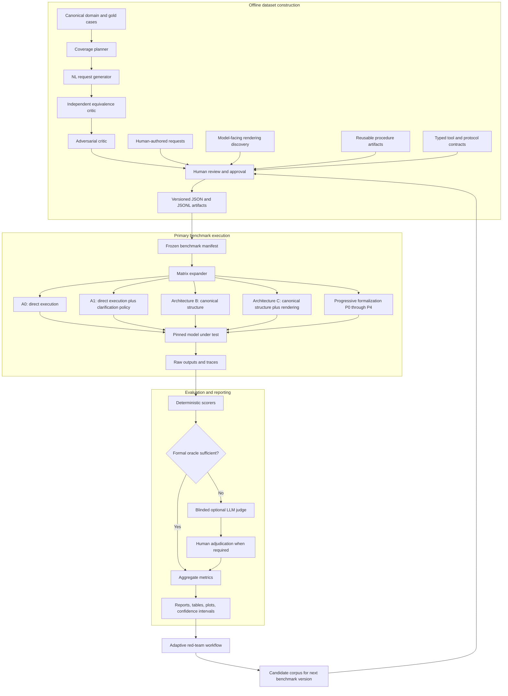

### 9.1 Experimental tracks

The harness must expose five top-level tracks.

#### Boundary track

Tests the full path from user wording through canonicalization to action.

```text
User request -> optional canonicalizer -> model under test -> tool simulator -> final state
```

This track answers whether boundary normalization improves the deployed system as a whole.

#### Intent-elicitation track

Tests requests that are inadequate, ambiguous, contradictory, or context-dependent at the current turn.

```text
User request and shared context -> adequacy or ambiguity decision -> targeted clarification -> updated request state -> execute or clarify again
```

This track answers whether the system recognizes that action is not yet justified and how efficiently it obtains the missing or discriminating information. Its results must be reported separately from the primary H1 lexical-stability score.

#### Post-canonical track

Injects the gold canonical case directly and bypasses natural-language interpretation.

```text
Gold canonical case -> selected model-facing representation -> model under test -> tool simulator -> final state
```

This track answers whether representation still matters after application meaning is fixed. It is mandatory for H3.

#### Semantic-memory track

Compares no memory, fixed glossary, retrieved organization memory, explicit canonical resolution, and confirmed personalized mappings.

```text
User request -> selected memory condition -> interpret or clarify -> action boundary
```

This track distinguishes the value of terminology information from the delivery mechanism used to supply it. It is defined fully in Experiment 9.

#### Progressive-formalization and persistence track

Introduces formalization layers cumulatively and separately varies how long natural language remains authoritative inside the workflow.

```text
User request
  -> optional clarification policy
  -> optional canonical intent
  -> optional reusable procedure
  -> generic action proposal or typed tool interface
  -> deterministic simulator
```

This track answers where reliability improves and whether repeatedly reinterpreting prose adds avoidable failure opportunities. Its cumulative ladder and component ablations must be reported separately.

### 9.2 Request adequacy matrix

Every request must occupy one cell in this first-class benchmark matrix:

| Request state | Canonical or conventional wording | Noncanonical or varied wording |
|---|---|---|
| Adequate and unambiguous | Control stratum | Primary H1 lexical stratum |
| Inadequate or ambiguous | Clarification control | Clarification plus lexical-stress stratum |

The top-right cell is the primary test of input-side lexical robustness. The bottom row tests request adequacy, ambiguity recognition, and intent elicitation. Results from the bottom row must not be counted as failures of lexical invariance.

For example:

```text
Adequate, conventional:
Escalate incident INC-1047 to Tier 2.

Adequate, varied:
Kick incident INC-1047 upstairs to Tier 2.

Inadequate, conventional:
Escalate this.

Inadequate, varied:
Kick this upstairs.
```

The last two requests are clean tests only when the frozen context artifact specifies whether `this` and the destination are recoverable. Context adequacy is part of the gold label.

### 9.3 Architecture conditions

#### Architecture A0-Direct: Direct execution without an explicit clarification policy

The MUT receives the full domain, state, tool, and user context and is asked to satisfy the request directly. It receives no special normalization layer. This is a policy ablation rather than the strongest baseline.

#### Architecture A1-Direct-Clarify: Strong direct frontier-model baseline

The MUT receives the approved user request, complete domain and tool definitions, all context available to the more complex conditions, and an explicit instruction to clarify rather than guess. This is the primary baseline against which added architecture must earn its complexity.

#### Architecture B-Runtime: Runtime canonicalization

A pinned canonicalizer receives the user request and outputs a canonical structure. The MUT receives canonical IDs and definitions, but no preferred natural-language rendering.

#### Architecture B-Gold: Gold canonical structure

The canonical structure comes directly from the case artifact. No model interprets the user request. This is the control for post-canonical reasoning.

#### Architecture C-Runtime: Runtime canonicalization plus stable rendering

The runtime canonicalizer resolves the request. The MUT receives the resulting canonical structure plus one selected model-facing rendering.

#### Architecture C-Gold: Gold canonical structure plus stable rendering

The gold case is injected directly and paired with one frozen model-facing rendering. This is the critical comparison against B-Gold.

#### Optional Architecture D: Definition only

The MUT receives a prose definition of the resolved operation without a short lexical label. This helps distinguish label effects from the benefit of an explicit definition.

#### Optional Architecture E: Organization terminology

The MUT receives the organization's preferred term, paired with the same canonical ID and definition. This tests an organization-specific adapter condition.

#### Intent-elicitation architectures

The intent-elicitation track additionally supports:

- `B_EXTERNAL_GATE`: a separate runtime adequacy assessor routes to clarification or canonical resolution.
- `B_EXTERNAL_GATE_GOLD`: frozen gold adequacy and ambiguity labels control routing, which isolates question generation and execution from adequacy-classification error.
- `HUMAN_ORACLE`: optional human-authored routing and clarification questions provide an upper-bound control.

These are intent-track conditions, not substitutes for B-Runtime or B-Gold in the canonicalization experiment.

#### Optional memory conditions M0 through M4

The boundary track may add:

- `M0_NO_MEMORY`: A1 with no extra glossary or retrieval.
- `M1_STATIC_GLOSSARY`: A1 plus a fixed organization glossary in context.
- `M2_RETRIEVED_MEMORY`: A1 plus retrieved organization mappings.
- `M3_CANONICAL_RESOLVER`: explicit canonical entity and operation resolution.
- `M4_PERSONALIZED_MEMORY`: retrieved, user-confirmed mappings scoped to one user or team.

These conditions are defined fully in Experiment 9. They must expose identical relevant information where possible so the comparison measures delivery architecture rather than information availability.

#### Progressive-formalization conditions P0 through P4

- `P0_RAW_PROPOSAL`: raw user language, no explicit clarification policy, generic action-proposal output.
- `P1_CLARIFY_PROPOSAL`: raw user language plus explicit clarification policy, generic action-proposal output.
- `P2_CANONICAL_PROPOSAL`: runtime canonical intent, generic action-proposal output.
- `P3_CANONICAL_PROCEDURE_PROPOSAL`: canonical intent plus one frozen reusable procedure, generic action-proposal output.
- `P4_CANONICAL_PROCEDURE_TOOL`: the same canonical intent and procedure with a registered typed tool or MCP-style capability interface.

P0 through P3 share the same generic action-proposal contract so their differences cannot be attributed to a changing final output channel. P4 intentionally changes only the action interface. The conditions and required ablations are defined fully in Experiment 10.

The companion persistence conditions are:

- `LP0_LANGUAGE_THROUGHOUT`
- `LP0G_GOLD_START_LANGUAGE`
- `LP1_CANONICAL_ONCE`
- `LP2_CANONICAL_PROCEDURE`
- `LP3_CANONICAL_PROCEDURE_TOOL`

### 9.4 Role isolation

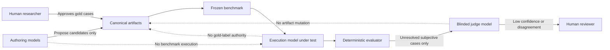

The implementation must express role isolation in configuration and validation. A run should fail before execution if a prohibited role combination is detected, unless an explicit `allow_role_overlap` research override is set and recorded.

## 10. Repository layout

The implementation should create a repository with this logical structure:

```text
lexical-stability-harness/
  README.md
  pyproject.toml
  uv.lock
  .env.example
  .gitignore
  Makefile

  config/
    models.example.yaml
    run.example.yaml
    logging.example.yaml
    thresholds.example.yaml

  schemas/
    domain.schema.json
    operation.schema.json
    case.schema.json
    context.schema.json
    request.schema.json
    rendering.schema.json
    semantic-memory.schema.json
    procedure.schema.json
    action-interface.schema.json
    action-proposal.schema.json
    complexity-profile.schema.json
    benchmark-manifest.schema.json
    run-manifest.schema.json
    invocation.schema.json
    score.schema.json

  dataset/
    domain/
      entities.json
      operations.json
      policies.json
      initial-state.json
    cases/
      support/
        ESCALATE_001.json
        REASSIGN_001.json
    requests/
      candidate/
      approved/
      frozen/
      rejected/
    contexts/
      frozen/
    renderings/
      candidate/
      approved/
      frozen/
    memory/
      glossaries/
      retrieval-corpora/
      personalized/
    procedures/
      approved/
      frozen/
    interfaces/
      generic-action-proposal.json
      typed-tools/
      mcp-capabilities/
    manifests/
      benchmark-v0.1.0.json
    splits/
      development.json
      validation.json
      test.json

  prompts/
    authoring/
      coverage-planner.v1.txt
      request-generator.v1.txt
      equivalence-critic.v1.txt
      adversarial-critic.v1.txt
      adequacy-critic.v1.txt
      ambiguity-classifier.v1.txt
    discovery/
      lexical-convergence.v1.txt
    execution/
      direct-executor.v1.txt
      direct-clarify-executor.v1.txt
      adequacy-assessor.v1.txt
      clarification-resolver.v1.txt
      canonical-executor.v1.txt
      rendered-executor.v1.txt
      action-proposal-executor.v1.txt
      procedure-executor.v1.txt
      language-handoff.v1.txt
      triage.v1.txt
      policy.v1.txt
      planner.v1.txt
      executor.v1.txt
    evaluation/
      semantic-equivalence-judge.v1.txt
      trajectory-judge.v1.txt
      grammar-correction-judge.v1.txt
    modality/
      canonicalizer.v1.txt

  src/lexstab/
    cli.py
    config.py
    hashing.py
    artifacts.py
    providers/
      base.py
      anthropic.py
      openai.py
      openrouter.py
      local.py
    graphs/
      authoring.py
      execution.py
      evaluation.py
      redteam.py
      intent_elicitation.py
      progressive_formalization.py
    architectures/
      direct.py
      canonical.py
      rendered.py
      memory.py
      procedure.py
      typed_interface.py
    evaluators/
      schema.py
      tool_call.py
      final_state.py
      clarification.py
      trajectory.py
      procedure_adherence.py
      action_interface.py
      code_execution.py
      llm_judge.py
    simulators/
      support_domain.py
    metrics/
      accuracy.py
      robustness.py
      clarification.py
      trajectory.py
      formalization.py
      statistics.py
    reporting/
      tables.py
      charts.py
      markdown.py
      html.py
    tracing/
      langsmith.py
      local.py

  tests/
    unit/
    integration/
    contract/
    regression/
    fixtures/

  runs/
    .gitkeep

  docs/
    RUNBOOK.md
    DATASET_AUTHORING.md
    RESULTS_GUIDE.md
    METHODOLOGY.md
```

The exact package names may change, but the boundaries among schemas, prompts, artifacts, graph logic, provider adapters, deterministic evaluators, and reports must remain.

## 11. Canonical domain model

The starter implementation should use a synthetic support-operations domain. A synthetic domain avoids confidential production data and lets the harness define exact state transitions. It must still be rich enough to contain related entities and operations that can be plausibly confused.

### 11.1 Required entity types

At minimum:

| Entity type | Example ID | Required state |
|---|---:|---|
| `INCIDENT` | `INC-1047` | status, severity, support tier, assigned team, information completeness |
| `CUSTOMER` | `CUS-0104` | status, risk flag, linked accounts |
| `ORDER` | `ORD-0077` | charge records, payment state, fulfillment state |
| `ACCOUNT` | `ACC-4002` | status, suspension state, owner |
| `APPROVAL_REQUEST` | `APR-0021` | operation requested, amount, status, approver role |

### 11.2 Required operation families

At minimum:

| Operation ID | Canonical tool | Primary contrast |
|---|---|---|
| `ESCALATE_INCIDENT` | `escalate_incident` | `REASSIGN_INCIDENT` |
| `REASSIGN_INCIDENT` | `reassign_incident` | `ESCALATE_INCIDENT` |
| `CLOSE_INCIDENT` | `close_incident` | `REQUEST_MORE_INFORMATION` |
| `REQUEST_MORE_INFORMATION` | `request_more_information` | `CLOSE_INCIDENT` |
| `REQUEST_APPROVAL` | `request_approval` | direct execution without approval |
| `REFUND_DUPLICATE_CHARGE` | `refund_duplicate_charge` | `REQUEST_MANAGER_REVIEW` |
| `REQUEST_MANAGER_REVIEW` | `request_manager_review` | `REFUND_DUPLICATE_CHARGE` |
| `SUSPEND_ACCOUNT` | `suspend_account` | `CLOSE_INCIDENT` |

### 11.3 Operation contract example

```json
{
  "schema_version": "1.2.0",
  "operation_id": "ESCALATE_INCIDENT",
  "display_name": "Escalate incident",
  "entity_type": "INCIDENT",
  "tool": "escalate_incident",
  "arguments": {
    "incident_id": {
      "type": "string",
      "required": true,
      "pattern": "^INC-[0-9]{4}$"
    },
    "destination_tier": {
      "type": "integer",
      "required": true,
      "minimum": 2,
      "maximum": 4
    }
  },
  "preconditions": [
    "incident.status == 'OPEN'",
    "destination_tier > incident.support_tier"
  ],
  "effects": [
    "incident.support_tier = destination_tier",
    "incident.escalation_count += 1",
    "incident.updated_at = run_clock"
  ],
  "invalid_when": [
    "incident.status == 'CLOSED'",
    "destination_tier <= incident.support_tier"
  ]
}
```

### 11.4 Formal operation schema

The implementation must include a JSON Schema equivalent to this core contract:

```json
{
  "$schema": "https://json-schema.org/draft/2020-12/schema",
  "$id": "https://example.invalid/schemas/operation.schema.json",
  "title": "Canonical operation",
  "type": "object",
  "additionalProperties": false,
  "required": [
    "schema_version",
    "operation_id",
    "display_name",
    "entity_type",
    "tool",
    "arguments",
    "preconditions",
    "effects"
  ],
  "properties": {
    "schema_version": { "type": "string" },
    "operation_id": { "type": "string", "pattern": "^[A-Z][A-Z0-9_]+$" },
    "display_name": { "type": "string", "minLength": 1 },
    "entity_type": { "type": "string", "pattern": "^[A-Z][A-Z0-9_]+$" },
    "tool": { "type": "string", "pattern": "^[a-z][a-z0-9_]+$" },
    "arguments": {
      "type": "object",
      "additionalProperties": {
        "type": "object",
        "additionalProperties": true,
        "required": ["type", "required"],
        "properties": {
          "type": { "enum": ["string", "integer", "number", "boolean", "array", "object"] },
          "required": { "type": "boolean" }
        }
      }
    },
    "preconditions": { "type": "array", "items": { "type": "string" } },
    "effects": { "type": "array", "items": { "type": "string" } },
    "invalid_when": { "type": "array", "items": { "type": "string" } }
  }
}
```

The production schema should replace unconstrained string expressions with a small safe expression language or typed transition functions. The harness must not execute arbitrary expressions from dataset files.

### 11.5 State simulator

The support-domain simulator must:

- Load a case-specific initial state.
- Apply only registered tool functions.
- Validate operation preconditions.
- Record each attempted call, accepted call, rejected call, and state transition.
- Use a deterministic run clock stored in the run manifest.
- Return a normalized final-state snapshot.
- Prevent external side effects.
- Support reset to the exact initial state before every repetition.

The simulator, rather than the generated prose, is the primary oracle for whether the requested operation succeeded.

## 12. Canonical case artifacts

A canonical case defines the gold meaning independently of any user wording.

### 12.1 Canonical case example

```json
{
  "schema_version": "1.2.0",
  "case_id": "ESCALATE_001",
  "domain": "support",
  "title": "Escalate an open incident from Tier 1 to Tier 2",
  "canonical": {
    "entity_type": "INCIDENT",
    "entity_id": "INC-1047",
    "operation_id": "ESCALATE_INCIDENT",
    "arguments": {
      "destination_tier": 2
    }
  },
  "initial_state": {
    "incidents": {
      "INC-1047": {
        "status": "OPEN",
        "severity": "SEV-2",
        "support_tier": 1,
        "assigned_team": "SERVICE_DESK",
        "information_complete": true,
        "escalation_count": 0
      }
    }
  },
  "gold": {
    "decision": "ACT",
    "tool": "escalate_incident",
    "arguments": {
      "incident_id": "INC-1047",
      "destination_tier": 2
    },
    "resulting_state": {
      "incidents": {
        "INC-1047": {
          "status": "OPEN",
          "severity": "SEV-2",
          "support_tier": 2,
          "assigned_team": "SERVICE_DESK",
          "information_complete": true,
          "escalation_count": 1
        }
      }
    }
  },
  "tags": [
    "single_turn",
    "tool_selection",
    "entity_operation_pair"
  ],
  "difficulty": "basic",
  "created_by": "human",
  "created_at": "2026-07-20T00:00:00Z"
}
```

### 12.2 Canonical case schema requirements

`case.schema.json` must require:

- `schema_version`
- globally unique `case_id`
- `domain`
- canonical entity type, entity ID, operation ID, and arguments
- complete initial state or a reference to a hashed state fixture
- gold decision of `ACT`, `CLARIFY`, or `REFUSE`
- gold tool and arguments when the decision is `ACT`
- expected final state or a deterministic state predicate
- tags and difficulty
- provenance

It must reject:

- unknown operations
- arguments not defined by the operation
- gold tools inconsistent with the operation contract
- initial states that violate the entity schema
- expected states that cannot result from the registered transition

### 12.3 Case families

The benchmark should group related cases into families. A family shares an operation but varies entity state, required arguments, and nearby contrasts. Family-level grouping is important for statistics because requests derived from the same canonical case are correlated.

Example family:

```text
ESCALATE_001: explicit Tier 1 to Tier 2
ESCALATE_002: explicit Tier 2 to Tier 3
ESCALATE_003: destination described by team authority
ESCALATE_004: invalid request on a closed incident
ESCALATE_005: ambiguous destination tier
```

## 13. Natural-language request dataset

Natural-language requests are versioned experimental stimuli. They must be constructed in a process separate from benchmark execution.

### 13.1 Request record example

```json
{
  "schema_version": "1.2.0",
  "request_id": "REQ-ESCALATE-001-0002",
  "case_id": "ESCALATE_001",
  "text": "Kick INC-1047 upstairs to Tier 2.",
  "language": "en-US",
  "source": {
    "type": "human",
    "creator": "phillip",
    "model_provider": null,
    "model_id": null,
    "prompt_id": null,
    "seed": null
  },
  "labels": {
    "semantic_role": "INVARIANT",
    "adequacy": "ADEQUATE",
    "ambiguity": "UNAMBIGUOUS",
    "expected_behavior": "EXECUTE",
    "lexical_equivalence": "INVARIANT",
    "missing_information": [],
    "context_id": null,
    "variation_axes": [
      "idiomatic",
      "operation_synonym",
      "conversational"
    ],
    "contains_canonical_entity_term": false,
    "contains_canonical_operation_term": false,
    "contains_model_discovered_term": false,
    "contains_organization_term": false,
    "lexical_distance_band": "HIGH"
  },
  "validation": {
    "status": "APPROVED",
    "semantic_equivalence": true,
    "adequacy_verified": true,
    "ambiguity_verified": true,
    "reviewers": [
      {
        "reviewer_id": "human-reviewer-1",
        "decision": "APPROVE",
        "notes": "Same entity, destination, operation, and final state."
      }
    ],
    "approved_by": "human-reviewer-1",
    "approved_at": "2026-07-20T00:00:00Z"
  },
  "provenance": {
    "created_at": "2026-07-20T00:00:00Z",
    "source_run_id": null,
    "parent_request_id": null,
    "content_hash": "sha256:replace-at-freeze-time"
  }
}
```

### 13.2 Independent request labels

Every request must carry independent labels for semantic role, adequacy, ambiguity, expected behavior, and lexical formulation.

#### Semantic role

- `INVARIANT`: same entity, operation, arguments, constraints, and resulting state as the linked canonical case.
- `CLARIFICATION`: information is missing, contradictory, or insufficiently discriminating. Gold behavior is clarification.
- `CONTRAST`: a real semantic difference requires a different operation, argument, or final state.
- `REFUSAL`: exactly one requested operation is understood, but a domain rule or state precondition prohibits it. Gold behavior is refusal without action.

#### Adequacy

- `ADEQUATE`: the request and frozen shared context contain enough noncontradictory information to identify one formal action and its required arguments, or to identify one policy-grounded refusal, at the current turn.
- `INADEQUATE`: at least one required entity, operation, argument, referent, discriminating fact, or constraint cannot be recovered from the available information.

#### Ambiguity

- `UNAMBIGUOUS`: exactly one canonical interpretation is reasonably supported.
- `AMBIGUOUS`: two or more canonical interpretations remain reasonably supported.

#### Expected behavior

- `EXECUTE`
- `CLARIFY`
- `REFUSE`

#### Lexical equivalence

- `INVARIANT`: wording varies while the fully specified application meaning stays fixed.
- `CONTRAST`: wording contains a real semantic change.
- `NOT_APPLICABLE`: the request is used primarily to test inadequacy, contradiction, or intent elicitation rather than lexical invariance.

Adequacy and ambiguity must not be collapsed. For example, a request may clearly identify `ESCALATE_INCIDENT` but omit the destination tier. It is inadequate because a required argument is missing, even if the operation itself is unambiguous.

### 13.3 Inadequate request example

```json
{
  "schema_version": "1.2.0",
  "request_id": "REQ-ESCALATE-001-INADEQUATE-0001",
  "case_id": "ESCALATE_001",
  "text": "Kick this upstairs.",
  "language": "en-US",
  "source": {
    "type": "human",
    "creator": "phillip"
  },
  "labels": {
    "semantic_role": "CLARIFICATION",
    "adequacy": "INADEQUATE",
    "ambiguity": "AMBIGUOUS",
    "expected_behavior": "CLARIFY",
    "lexical_equivalence": "NOT_APPLICABLE",
    "missing_information": [
      "entity_reference",
      "destination_tier"
    ],
    "context_id": "CTX-EMPTY-001",
    "variation_axes": [
      "idiomatic",
      "pronoun_or_coreference",
      "implicit_argument"
    ]
  },
  "validation": {
    "status": "APPROVED",
    "semantic_equivalence": null,
    "adequacy_verified": true,
    "ambiguity_verified": true,
    "reviewers": [
      {
        "reviewer_id": "human-reviewer-1",
        "decision": "APPROVE",
        "notes": "The frozen context identifies neither the referent nor destination."
      }
    ]
  }
}
```

### 13.4 Required variation axes

The initial controlled vocabulary should include:

- `canonical_terminology`
- `entity_synonym`
- `operation_synonym`
- `syntactic_paraphrase`
- `conversational`
- `formal`
- `organizational_jargon`
- `idiomatic`
- `indirect_request`
- `question_form`
- `passive_voice`
- `self_correction`
- `disfluency_preserved`
- `plausible_substitution`
- `pronoun_or_coreference`
- `implicit_argument`
- `missing_entity`
- `missing_operation`
- `missing_required_argument`
- `contradictory_constraints`
- `overloaded_term`
- `context_insufficient`
- `policy_prohibited`
- `high_lexical_distance`
- `minimal_semantic_contrast`
- `typed`
- `spoken_human_transcript`
- `spoken_asr_transcript`

New axes require a schema-compatible taxonomy version bump.

### 13.5 Request schema requirements

`request.schema.json` must:

- Require a valid `case_id` reference.
- Require nonempty request text.
- Require source and provenance.
- Require exactly one semantic role, adequacy label, ambiguity label, expected behavior, and lexical-equivalence label.
- Require at least one variation axis.
- Require `ADEQUATE`, `UNAMBIGUOUS`, `EXECUTE`, and lexical `INVARIANT` for every request selected into the primary H1 stratum.
- Require at least one structured `missing_information` item when adequacy is `INADEQUATE`, unless contradiction rather than absence is the reason.
- Validate consistency rules such as `AMBIGUOUS` implying `CLARIFY` unless the domain policy explicitly requires refusal.
- Require semantic role `REFUSAL` to use expected behavior `REFUSE`, identify the prohibited operation, and reference a policy or failed precondition.
- Require a frozen context reference whenever adequacy depends on conversational, user, organization, or retrieved context.
- Forbid `APPROVED` or `FROZEN` status without at least one reviewer decision.
- Require a content hash at freeze time.
- Preserve the original text exactly, including disfluencies and punctuation.
- Permit optional links to audio or human transcript artifacts without embedding audio bytes in JSONL.

### 13.6 Frozen context artifacts

Adequacy is always relative to available context. Store that context as a separate immutable artifact rather than describing it only in reviewer notes.

```json
{
  "schema_version": "1.2.0",
  "context_id": "CTX-INC-1047-IDENTIFIED-001",
  "messages": [
    {
      "role": "user",
      "content": "We are discussing incident INC-1047, which is currently assigned to Tier 1."
    }
  ],
  "visible_state": {
    "active_incident_id": "INC-1047"
  },
  "available_to_architectures": [
    "A0_DIRECT",
    "A1_DIRECT_CLARIFY",
    "B_RUNTIME",
    "C_RUNTIME",
    "B_EXTERNAL_GATE",
    "B_EXTERNAL_GATE_GOLD",
    "P0_RAW_PROPOSAL",
    "P1_CLARIFY_PROPOSAL",
    "P2_CANONICAL_PROPOSAL",
    "P3_CANONICAL_PROCEDURE_PROPOSAL",
    "P4_CANONICAL_PROCEDURE_TOOL",
    "LP0_LANGUAGE_THROUGHOUT",
    "LP0G_GOLD_START_LANGUAGE",
    "LP1_CANONICAL_ONCE",
    "LP2_CANONICAL_PROCEDURE",
    "LP3_CANONICAL_PROCEDURE_TOOL"
  ],
  "content_hash": "sha256:replace-at-freeze-time"
}
```

Every compared boundary architecture must receive equivalent context. If a memory or retrieval condition receives additional information, that difference must be the named experimental variable.

### 13.7 JSONL storage

Approved requests should be stored as one JSON object per line. JSONL supports streaming, diff-friendly append workflows, and easy selection by manifest. No benchmark run may scan a mutable `candidate` directory. It must load exact frozen files and validate their hashes.

## 14. Separate dataset-construction initialization process

The natural-language request process must be an independent executable workflow. A recommended command is:

```bash
lexstab author requests \
  --cases dataset/cases/support \
  --config config/models.authoring.yaml \
  --output dataset/requests/candidate/generated-2026-07-20.jsonl
```

This command is never invoked implicitly by `lexstab run`.

### 14.1 Authoring graph

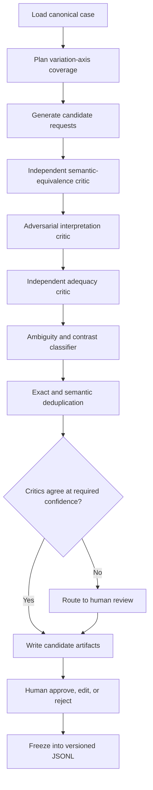

### 14.2 Graph state

The authoring graph state should contain:

```python
class AuthoringState(TypedDict):
    authoring_run_id: str
    case: dict
    requested_axes: list[str]
    coverage_snapshot: dict
    candidates: list[dict]
    equivalence_judgments: list[dict]
    adversarial_judgments: list[dict]
    adequacy_labels: list[dict]
    ambiguity_labels: list[dict]
    duplicate_groups: list[list[str]]
    human_review_required: list[str]
    accepted_candidates: list[dict]
    rejected_candidates: list[dict]
    errors: list[dict]
```

### 14.3 Candidate lifecycle

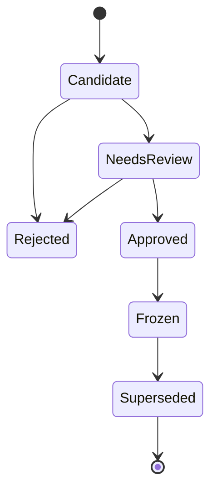

Only `Frozen` requests may be included in a benchmark manifest.

### 14.4 Human-authored requests

The tool must make manual authorship first-class. A researcher should be able to add a request without invoking any model:

```bash
lexstab request add \
  --case ESCALATE_001 \
  --text "This one needs eyes above our pay grade. Put INC-1047 with Tier 2." \
  --semantic-role INVARIANT \
  --adequacy ADEQUATE \
  --ambiguity UNAMBIGUOUS \
  --expected-behavior EXECUTE \
  --lexical-equivalence INVARIANT \
  --axes idiomatic,indirect_request,conversational \
  --source human
```

The request enters `candidate` status and follows the same validation and approval flow as synthetic requests.

### 14.5 Approval policy

For exploratory pilot data:

- One human reviewer may approve obvious adequate, unambiguous invariant and contrast cases.
- All unclear cases must receive a second review.

For publication-grade data:

- Every invariant and contrast request receives at least two independent reviews of semantic role, adequacy, ambiguity, and expected behavior.
- Every clarification request receives at least two independent reviews identifying the missing, contradictory, or discriminating information.
- Every refusal request receives at least two independent reviews identifying the controlling policy or failed precondition.
- Disagreements are adjudicated by a third reviewer.
- Reviewers do not see the MUT's results.
- Inter-annotator agreement is reported separately for adequacy, ambiguity, semantic role, expected behavior, lexical equivalence, and variation axis.

### 14.6 Deduplication

Deduplication should include:

1. Exact normalized-text matching.
2. Case-insensitive and punctuation-normalized matching.
3. Token-level similarity.
4. Optional embedding similarity for review suggestions.
5. Human confirmation before collapsing high-similarity but meaningfully distinct requests.

Embedding similarity may identify candidates for review. It must not determine semantic equivalence by itself.

## 15. Model-facing rendering, procedure, and interface artifacts

Model-facing renderings must be stored separately from user requests so the system can vary them independently.

### 15.1 Rendering example

```json
{
  "schema_version": "1.2.0",
  "rendering_id": "REN-ESCALATE-OPUS-PREFERRED-001",
  "operation_id": "ESCALATE_INCIDENT",
  "entity_type": "INCIDENT",
  "category": "MODEL_DISCOVERED",
  "label": "Escalate incident",
  "template": "Escalate incident {entity_id} to Tier {destination_tier}.",
  "definition": "Transfer responsibility for an open incident to a higher support tier.",
  "discovery": {
    "provider": "anthropic",
    "model_id": "exact-pinned-model-id",
    "prompt_id": "lexical-convergence.v1",
    "sample_count": 50,
    "normalized_label_count": 39,
    "convergence_rate": 0.78,
    "seed_policy": "provider-supported-seeds-or-recorded-null"
  },
  "validation": {
    "status": "FROZEN",
    "reviewed_by": ["human-reviewer-1"],
    "approved_at": "2026-07-20T00:00:00Z"
  },
  "provenance": {
    "created_at": "2026-07-20T00:00:00Z",
    "content_hash": "sha256:replace-at-freeze-time"
  }
}
```

### 15.2 Required rendering categories

- `CANONICAL_LABEL`
- `MODEL_DISCOVERED`
- `ORGANIZATION_PREFERRED`
- `HUMAN_ALTERNATIVE`
- `DEFINITION_ONLY`
- `OPAQUE_ID_ONLY`

### 15.3 Rendering constraints

- A rendering references canonical IDs but does not redefine them.
- Template placeholders must match the operation contract exactly.
- Renderings must not add requirements, omit required arguments, or imply different preconditions.
- Discovery provenance must include exact model ID, prompt hash, sampling settings, and number of independent naming samples.
- A rendering discovered from the MUT must be frozen before validation and tested on fresh contexts.
- The same benchmark request may be combined with multiple renderings through the manifest matrix.

### 15.4 Reusable procedure artifacts

Procedures must be stored separately from canonical operations, model-facing renderings, and user requests. A procedure says how to carry out a resolved operation. It does not redefine which operation the user requested.

```json
{
  "schema_version": "1.2.0",
  "procedure_id": "SKILL_ESCALATE_SUPPORT_V1",
  "procedure_version": "1.0.0",
  "title": "Escalate a support incident",
  "applies_to_operation_ids": [
    "ESCALATE_INCIDENT"
  ],
  "required_inputs": [
    "entity_id",
    "destination_tier",
    "known_state"
  ],
  "steps": [
    {
      "step_id": "CHECK_PRECONDITIONS",
      "instruction": "Confirm that the incident is open and the destination tier exceeds the current tier."
    },
    {
      "step_id": "PROPOSE_ACTION",
      "instruction": "Propose ESCALATE_INCIDENT using the resolved entity and destination without changing unrelated state."
    }
  ],
  "forbidden_behaviors": [
    "invent_missing_arguments",
    "change_canonical_operation",
    "bypass_failed_preconditions"
  ],
  "evaluation_contract": {
    "registered_checks": [
      "ESCALATION_PRECONDITIONS_ENFORCED",
      "CANONICAL_ARGUMENTS_PRESERVED",
      "UNRELATED_STATE_UNCHANGED"
    ],
    "forbidden_operation_ids": [
      "CLOSE_INCIDENT"
    ]
  },
  "output_contract": "generic-action-proposal.v1",
  "validation": {
    "status": "FROZEN",
    "reviewed_by": ["human-reviewer-1"]
  },
  "provenance": {
    "source_type": "human_authored",
    "content_hash": "sha256:replace-at-freeze-time"
  }
}
```

Procedure constraints:

- The procedure must reference one or more registered canonical operations.
- Required inputs must be a subset of the case, canonical resolution, shared context, or known state available to every relevant comparison condition.
- A procedure must not smuggle in organization knowledge, policy facts, or argument values that the control condition does not receive unless information addition is the named experimental variable.
- P3 and P4 must use the exact same frozen procedure bytes.
- The procedure ID, version, content hash, selection logic, and placement in the prompt must be logged.
- Every claimed adherence metric must map to registered observable event, output, or state predicates in `evaluation_contract`. The harness must not infer that an unobserved internal reasoning step occurred.
- Human-authored procedures are the default. Model-generated procedures require separate review and provenance.
- The harness may materialize the artifact as a Codex or Claude-style skill for implementation convenience, but the benchmark treats the frozen content and invocation contract, not the product-specific packaging, as the experimental object.

### 15.5 Action-interface artifacts

The progressive-formalization track requires two action boundaries.

#### Generic action-proposal contract

P0 through P3 return this common schema without receiving a registered domain tool:

```json
{
  "decision": "ACT",
  "operation_id": "ESCALATE_INCIDENT",
  "arguments": {
    "incident_id": "INC-1047",
    "destination_tier": 2
  },
  "question": null,
  "reason_code": null
}
```

The deterministic adapter validates the proposal, maps the registered `operation_id` to the simulator function, and records parse, mapping, precondition, and state-transition results. This schema is a scoring boundary, but it does not expose native tool-selection affordances to the model.

#### Typed tool or MCP-style contract

P4 receives a registered typed capability whose tool name, arguments, preconditions, and simulator effect match the generic proposal's operation exactly. The artifact must record:

- `interface_id` and version
- interface kind: `NATIVE_TOOL`, `MCP_CAPABILITY`, or another explicitly named typed protocol
- operation ID
- argument schema hash
- tool description hash
- transport and simulator adapter versions
- validation and error behavior
- capability discovery behavior, if any

The default implementation may use local native tool calling. A live MCP server is optional. If MCP is used, compare it with an equivalent local typed-tool contract before attributing any result to the protocol rather than to schema exposure, transport, or capability discovery.

### 15.6 Interface comparability rules

- P0 through P3 use identical `generic-action-proposal.v1` bytes and parsing logic.
- P3 and P4 receive identical canonical state, procedure content, domain facts, and model parameters.
- The typed interface must not contain extra examples, policy guidance, or hidden defaults.
- Tool name and description overlap with canonical or model-discovered terminology must be measured and reported.
- Generic-proposal parse errors and typed-tool validation errors remain distinct result categories.
- Both paths ultimately call the same deterministic simulator transition.

## 16. Benchmark manifest

The benchmark manifest is the immutable bill of materials for a benchmark version.

### 16.1 Manifest example

```json
{
  "schema_version": "1.2.0",
  "benchmark_id": "lexstab-support",
  "benchmark_version": "0.1.0",
  "created_at": "2026-07-20T00:00:00Z",
  "description": "Pilot support-domain lexical stability benchmark",
  "artifact_root_hash": "sha256:replace-at-freeze-time",
  "ontology": {
    "entities_file": "dataset/domain/entities.json",
    "operations_file": "dataset/domain/operations.json",
    "policies_file": "dataset/domain/policies.json",
    "hashes": {
      "entities": "sha256:replace-at-freeze-time",
      "operations": "sha256:replace-at-freeze-time",
      "policies": "sha256:replace-at-freeze-time"
    }
  },
  "cases": {
    "files": [
      "dataset/cases/support/ESCALATE_001.json"
    ],
    "ids": [
      "ESCALATE_001"
    ]
  },
  "requests": {
    "files": [
      "dataset/requests/frozen/support-v0.1.0.jsonl"
    ],
    "ids": [
      "REQ-ESCALATE-001-0001",
      "REQ-ESCALATE-001-0002"
    ]
  },
  "renderings": {
    "files": [
      "dataset/renderings/frozen/support-v0.1.0.jsonl"
    ],
    "ids": [
      "REN-ESCALATE-CANONICAL-001",
      "REN-ESCALATE-OPUS-PREFERRED-001"
    ]
  },
  "procedures": {
    "files": [
      "dataset/procedures/frozen/support-v0.1.0.jsonl"
    ],
    "ids": [
      "SKILL_ESCALATE_SUPPORT_V1"
    ]
  },
  "action_interfaces": {
    "files": [
      "dataset/interfaces/generic-action-proposal.json",
      "dataset/interfaces/typed-tools/support-v0.1.0.jsonl"
    ],
    "ids": [
      "GENERIC_ACTION_PROPOSAL_V1",
      "TYPED_SUPPORT_TOOLS_V1"
    ]
  },
  "contexts": {
    "files": [
      "dataset/contexts/frozen/support-v0.1.0.jsonl"
    ],
    "ids": [
      "CTX-EMPTY-001",
      "CTX-INC-1047-IDENTIFIED-001"
    ]
  },
  "semantic_memory": {
    "files": [],
    "hashes": {}
  },
  "prompt_versions": {
    "direct_executor": "direct-executor.v1",
    "direct_clarify_executor": "direct-clarify-executor.v1",
    "adequacy_assessor": "adequacy-assessor.v1",
    "canonical_executor": "canonical-executor.v1",
    "rendered_executor": "rendered-executor.v1",
    "action_proposal_executor": "action-proposal-executor.v1",
    "procedure_executor": "procedure-executor.v1",
    "language_handoff": "language-handoff.v1"
  },
  "splits": {
    "development": ["ESCALATE_001"],
    "validation": [],
    "test": []
  },
  "allowed_architectures": [
    "A0_DIRECT",
    "A1_DIRECT_CLARIFY",
    "B_RUNTIME",
    "B_GOLD",
    "C_RUNTIME",
    "C_GOLD",
    "B_EXTERNAL_GATE",
    "B_EXTERNAL_GATE_GOLD",
    "P0_RAW_PROPOSAL",
    "P1_CLARIFY_PROPOSAL",
    "P2_CANONICAL_PROPOSAL",
    "P3_CANONICAL_PROCEDURE_PROPOSAL",
    "P4_CANONICAL_PROCEDURE_TOOL",
    "LP0_LANGUAGE_THROUGHOUT",
    "LP0G_GOLD_START_LANGUAGE",
    "LP1_CANONICAL_ONCE",
    "LP2_CANONICAL_PROCEDURE",
    "LP3_CANONICAL_PROCEDURE_TOOL"
  ],
  "validation": {
    "schema_valid": true,
    "referential_integrity_valid": true,
    "state_transitions_valid": true
  }
}
```

### 16.2 Freeze process

Recommended command:

```bash
lexstab benchmark freeze \
  --source dataset \
  --version 0.1.0 \
  --output dataset/manifests/benchmark-v0.1.0.json
```

Freeze must:

1. Validate every schema.
2. Validate all cross-file references.
3. Recompute gold state transitions in the simulator.
4. Confirm all selected requests, renderings, procedures, and action-interface artifacts are approved.
5. Confirm every context-dependent adequacy label references a frozen context artifact.
6. Calculate SHA-256 hashes for every artifact.
7. Calculate a root hash over the sorted artifact inventory.
8. Write the immutable manifest.
9. Refuse to overwrite an existing manifest version unless a separate explicit development-only flag is used.

Any content change after freezing requires a new benchmark version.

## 17. Benchmark modes

### 17.1 Frozen benchmark

Purpose: reproducible headline measurement.

Rules:

- Uses one immutable manifest.
- No test generation during the run.
- No prompt optimization during the run.
- No semantic retries unless prespecified as a condition.
- Reports every configured model and architecture, including failed invocations.

### 17.2 Adaptive red team

Purpose: discover new failure modes after a frozen run.

Rules:

- May inspect failure metadata and traces.
- May use agentic generation loops.
- Writes only to a candidate corpus.
- Cannot change or recompute the frozen benchmark's score.
- Every candidate must pass equivalence validation and human review.

### 17.3 Regression suite

Purpose: preserve validated failures as permanent tests.

Rules:

- Contains only human-approved cases.
- Records the original failing run and the reason for promotion.
- Can be run quickly in CI with fewer repetitions.
- Must never replace the full frozen benchmark.

### 17.4 Development smoke set

Purpose: validate wiring at low cost.

Recommended size:

- 5 canonical cases.
- 3 invariant requests per case.
- 1 inadequate conventional clarification request per case.
- 1 inadequate varied clarification request per case.
- 1 contrast request per case.
- 1 rendering per architecture.
- 1 frozen procedure for each included operation.
- 1 generic-proposal and 1 local typed-tool interface.
- P0 through P4 plus LP0, LP0G, and LP1 through LP3 enabled for one paired pass.
- 1 repetition.

Smoke results are never reported as evidence for or against the hypothesis.

## 18. LangGraph workflow specifications

The project should implement five primary graphs plus an independently runnable intent-elicitation subgraph. They may share node libraries, but they must not share mutable runtime state.

### 18.1 Graph A: Dataset authoring

Purpose: produce candidate request and rendering artifacts.

Entry point:

```text
lexstab author requests
```

Required nodes:

1. `load_cases`
2. `measure_axis_coverage`
3. `plan_generation`
4. `generate_candidates`
5. `validate_equivalence`
6. `challenge_equivalence`
7. `classify_adequacy`
8. `classify_ambiguity`
9. `deduplicate`
10. `route_review`
11. `write_candidates`

Required routing behavior:

- A candidate rejected by the equivalence critic may be regenerated up to a configured authoring limit.
- The limit belongs only to dataset construction, not benchmark execution.
- Disagreement between critics routes the item to human review rather than automatic acceptance.
- Model confidence is stored but never treated as calibrated probability unless calibration has been established.

### 18.2 Graph B: Benchmark execution

Purpose: execute a frozen benchmark matrix against one or more MUTs.

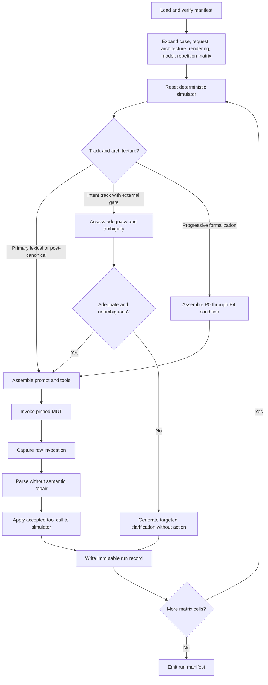

Execution graph state:

```python
class ExecutionState(TypedDict):
    run_id: str
    benchmark_manifest: dict
    run_config: dict
    matrix_cell: dict
    case: dict
    request: dict | None
    context: dict | None
    rendering: dict | None
    semantic_memory: dict | None
    procedure: dict | None
    action_interface: dict | None
    representation_ledger: list[dict]
    gold_adequacy: str | None
    gold_ambiguity: str | None
    runtime_adequacy_result: dict | None
    initial_state: dict
    assembled_messages: list[dict]
    tools: list[dict]
    invocation: dict | None
    parsed_output: dict | None
    simulator_events: list[dict]
    final_state: dict | None
    transport_errors: list[dict]
    parser_errors: list[dict]
    trace_ids: dict
```

The matrix expander must produce a stable ordered list and a hash. Parallel execution may change completion order, but it must not change cell identity.

For the primary H1 lexical stratum, selection is based on the frozen human adequacy and ambiguity labels. A runtime adequacy assessor must not remove, relabel, or redefine those cases. Its classification performance is measured separately in the intent-elicitation track.

### 18.3 Graph C: Evaluation and reporting

Purpose: score completed run artifacts without invoking the MUT.

Required nodes:

1. `load_run_manifest`
2. `verify_run_artifacts`
3. `score_schema`
4. `score_decision`
5. `score_tool_and_arguments`
6. `score_final_state`
7. `score_clarification`
8. `score_trajectory`
9. `route_optional_judge`
10. `route_human_review`
11. `aggregate_case_metrics`
12. `compute_statistics`
13. `render_reports`

The evaluator must preserve two outputs:

- `raw_score`: strict formal comparison before any equivalence normalization.
- `normalized_score`: application-aware comparison after approved canonical normalization.

The distinction is necessary to detect evaluator artifacts. For example, `"Miami, FL"` and `"Miami, Florida"` may or may not be operationally equivalent depending on the domain contract. The evaluator must not decide this through generic string similarity.

### 18.4 Graph D: Adaptive red team

Purpose: use frozen-run failures to find new candidate variants.

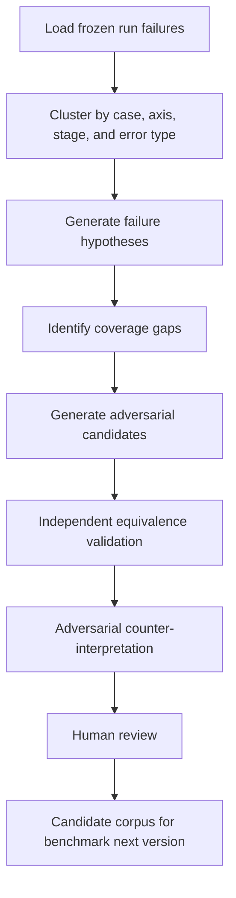

The failure analyst may suggest hypotheses such as "indirect operation verbs correlate with errors." Statistical code, not the analyst model, must test the hypothesis against the data.

### 18.5 Intent-elicitation subgraph

Purpose: evaluate inadequate or ambiguous requests across one or more clarification turns without contaminating H1.

Required nodes:

1. `load_elicitation_case`
2. `assess_action_readiness`
3. `route_execute_or_clarify`
4. `generate_clarification`
5. `inject_scripted_user_answer`
6. `update_visible_context`
7. `check_turn_limit`
8. `resolve_canonical_intent`
9. `execute_or_stop_unresolved`
10. `score_turn_trajectory`

The subgraph must support integrated A1 clarification and the external-gate conditions without giving either access to the hidden resolved gold.

### 18.6 Graph E: Progressive formalization and language persistence

Purpose: execute the cumulative P0 through P4 ladder and the separate natural-language-persistence ablation.

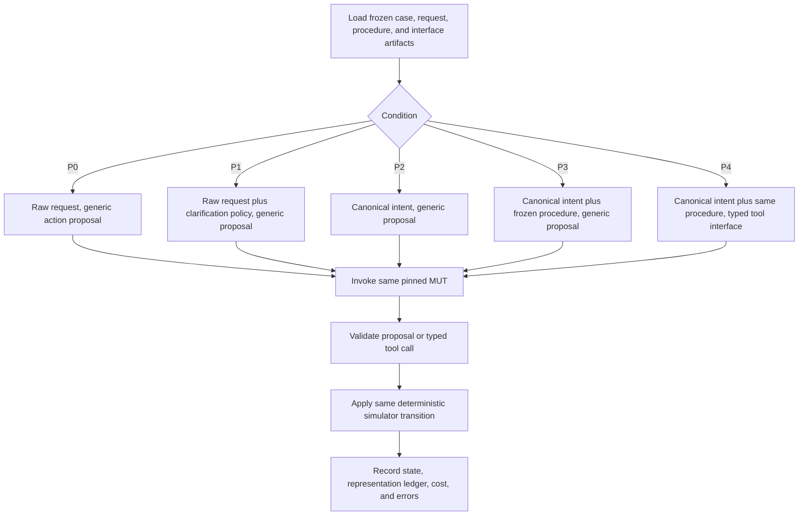

Required nodes:

1. `load_formalization_artifacts`
2. `verify_information_parity`
3. `select_formalization_condition`
4. `resolve_runtime_or_gold_intent`
5. `select_frozen_procedure`
6. `assemble_generic_proposal_prompt`
7. `assemble_typed_interface_prompt`
8. `invoke_mut`
9. `validate_action_boundary`
10. `apply_simulator_transition`
11. `record_representation_ledger`
12. `score_marginal_transition`

For the language-persistence ablation, every model-mediated stage must append a ledger record containing:

```json
{
  "stage_id": "planner",
  "authoritative_representation": "FREE_FORM_LANGUAGE",
  "canonical_ids_present": false,
  "procedure_id_present": false,
  "typed_schema_present": false,
  "input_content_hash": "sha256:...",
  "output_content_hash": "sha256:..."
}
```

Allowed authoritative-representation values are `FREE_FORM_LANGUAGE`, `CANONICAL_STATE`, `CANONICAL_STATE_PLUS_PROCEDURE`, and `TYPED_ACTION_INTERFACE`. The ledger records representation class and hashes, not hidden chain-of-thought.

### 18.7 Optional procedural baseline

Implement a minimal non-LangGraph runner that:

1. Loads one manifest.
2. Iterates matrix cells.
3. Invokes the same provider adapter.
4. Uses the same evaluator functions.

Compare it against the graph runner on a smoke set. Results should match cell for cell except for trace metadata. This control helps detect bugs or context mutation introduced by orchestration.

## 19. Model role configuration runbook

The model configuration must be provider-agnostic and role-based. Marketing names such as "Opus," "Kimi," "GLM," or "Grok" should appear only in user-maintained configuration and run metadata. Application code must use exact provider model IDs.

### 19.1 Roles

| Role | Purpose | May see benchmark gold? | May change artifacts? | May score MUT output? |
|---|---|---:|---:|---:|
| `execution_primary` | Primary model under test | Only data explicitly in execution prompt | No | No |
| `execution_comparison` | Optional comparison MUT | Same as primary | No | No |
| `boundary_canonicalizer` | Runtime mapping in B-Runtime and C-Runtime | Canonical ontology, not per-request gold | No | No |
| `adequacy_assessor` | Runtime adequacy and ambiguity gate in the intent track | Domain requirements and request context, not per-request gold | No | No |
| `memory_retriever` | Select glossary or confirmed mapping records for memory ablations | Frozen retrieval corpus | No | No |
| `procedure_router` | Optional runtime selection among frozen procedures | Canonical intent and procedure registry, not gold selection | No | No |
| `authoring_generator` | Synthetic request creation | Canonical case during authoring | Candidate artifacts only | No |
| `authoring_equivalence_critic` | Candidate semantic review | Canonical case and candidate | Judgment artifacts only | No |
| `authoring_adversarial_critic` | Challenge candidate equivalence | Canonical case and prior judgment | Judgment artifacts only | No |
| `evaluation_judge` | Optional non-deterministic scoring | Reference rubric as needed | No | Yes, blinded |
| `failure_analyst` | Cluster and explain failures | Aggregated run data | Candidate hypotheses only | No final authority |

### 19.2 Example `config/models.example.yaml`

```yaml
schema_version: "1.2.0"

roles:
  execution_primary:
    provider: "anthropic"
    model: "${EXECUTION_MODEL_ID}"
    purpose: "model_under_test"
    baseline_eligible: true
    parameters:
      temperature: 0.0
      max_tokens: 1024
    capabilities:
      native_tools: true
      structured_output: true

  execution_comparison:
    enabled: false
    provider: "openrouter"
    model: "${COMPARISON_MODEL_ID}"
    purpose: "model_under_test"
    parameters:
      temperature: 0.0
      max_tokens: 1024

  boundary_canonicalizer:
    provider: "openrouter"
    model: "${CANONICALIZER_MODEL_ID}"
    purpose: "runtime_canonicalization"
    parameters:
      temperature: 0.0
      max_tokens: 768

  adequacy_assessor:
    provider: "openrouter"
    model: "${ADEQUACY_ASSESSOR_MODEL_ID}"
    purpose: "runtime_adequacy_and_ambiguity_gate"
    parameters:
      temperature: 0.0
      max_tokens: 768

  memory_retriever:
    enabled: false
    provider: "openrouter"
    model: "${MEMORY_RETRIEVER_MODEL_ID}"
    purpose: "semantic_memory_retrieval_or_reranking"
    parameters:
      temperature: 0.0
      max_tokens: 768

  procedure_router:
    enabled: false
    provider: "openrouter"
    model: "${PROCEDURE_ROUTER_MODEL_ID}"
    purpose: "runtime_procedure_selection"
    parameters:
      temperature: 0.0
      max_tokens: 512

  authoring_generator:
    provider: "openrouter"
    model: "${AUTHORING_GENERATOR_MODEL_ID}"
    purpose: "candidate_generation"
    parameters:
      temperature: 0.8
      max_tokens: 4096

  authoring_equivalence_critic:
    provider: "openrouter"
    model: "${EQUIVALENCE_CRITIC_MODEL_ID}"
    purpose: "semantic_validation"
    parameters:
      temperature: 0.0
      max_tokens: 1536

  authoring_adversarial_critic:
    provider: "openrouter"
    model: "${ADVERSARIAL_CRITIC_MODEL_ID}"
    purpose: "counter_interpretation"
    parameters:
      temperature: 0.3
      max_tokens: 1536

  evaluation_judge:
    enabled: true
    provider: "openrouter"
    model: "${EVALUATION_JUDGE_MODEL_ID}"
    purpose: "optional_blinded_judging"
    parameters:
      temperature: 0.0
      max_tokens: 2048

  failure_analyst:
    enabled: true
    provider: "openrouter"
    model: "${FAILURE_ANALYST_MODEL_ID}"
    purpose: "hypothesis_generation"
    parameters:
      temperature: 0.2
      max_tokens: 4096

separation_policy:
  forbid_execution_model_as_judge: true
  forbid_generator_as_sole_critic: true
  forbid_mut_as_primary_data_generator: true
  allow_role_overlap: false
```

The user's proposed arrangement can be represented by assigning a pinned Opus model ID to `execution_primary` and pinned Kimi, GLM, or Grok model IDs to authoring and evaluation roles. The exact choices are experimental configuration, not a harness dependency.

### 19.3 Environment file example

```dotenv
# Provider credentials
ANTHROPIC_API_KEY=
OPENAI_API_KEY=
OPENROUTER_API_KEY=

# Exact provider model identifiers
EXECUTION_MODEL_ID=
COMPARISON_MODEL_ID=
CANONICALIZER_MODEL_ID=
ADEQUACY_ASSESSOR_MODEL_ID=
MEMORY_RETRIEVER_MODEL_ID=
PROCEDURE_ROUTER_MODEL_ID=
AUTHORING_GENERATOR_MODEL_ID=
EQUIVALENCE_CRITIC_MODEL_ID=
ADVERSARIAL_CRITIC_MODEL_ID=
EVALUATION_JUDGE_MODEL_ID=
FAILURE_ANALYST_MODEL_ID=

# Optional LangSmith tracing
LANGSMITH_TRACING=false
LANGSMITH_API_KEY=
LANGSMITH_PROJECT=lexstab-local
LANGSMITH_ENDPOINT=https://api.smith.langchain.com

# Local storage
LEXSTAB_RUNS_DIR=./runs
LEXSTAB_CACHE_DIR=./.cache/lexstab
```

`.env` must be ignored by version control. The harness must never log credential values.

### 19.4 Model pinning rules

For every reported run:

- Use the exact provider model identifier returned or documented by the provider.
- Record any provider-reported model fingerprint or revision.
- Do not use a floating alias such as `latest` for publication-grade runs.
- Record region, endpoint, and API mode if they can affect behavior.
- Record tool-calling mode, structured-output mode, temperature, top-p, seed, max tokens, stop sequences, and reasoning settings.
- Record whether the provider silently ignores any requested parameter.
- Record the date and time because hosted model behavior can change even when the visible ID does not.

### 19.5 Recommended model separation

For the main H3 test:

- MUT: one pinned execution model.
- Authoring generator: a different model family.
- Equivalence critic: a second family or independent human review.
- Adversarial critic: a third family when cost permits.
- Primary evaluator: deterministic code.
- Optional judge: a model that is neither the MUT nor the sole author of the request.

Model diversity reduces correlated error. It does not create true statistical independence, so human review remains necessary for benchmark gold labels.

### 19.6 Cross-over matrix

To test whether results depend on role assignment, support a cross-over study:

```text
Run 1: Model A executes; Models B and C author and critique.
Run 2: Model B executes; Models A and C author and critique.
Run 3: Model C executes; Models A and B author and critique.
```

The frozen benchmark must remain unchanged across the cross-over.

## 20. Provider adapter contract

Every provider integration must implement one common interface.

```python
class ModelProvider(Protocol):
    def invoke(
        self,
        *,
        role: str,
        model_id: str,
        messages: list[dict],
        tools: list[dict] | None,
        response_schema: dict | None,
        parameters: dict,
        metadata: dict,
    ) -> "InvocationRecord": ...
```

`InvocationRecord` must include:

- run ID and matrix-cell ID
- role
- provider and exact requested model ID
- provider-reported model ID or fingerprint
- timestamp
- request messages after template rendering
- tool definitions
- requested parameters
- provider-accepted parameters when available
- raw provider response
- normalized text and tool calls
- token usage
- latency
- estimated or provider-reported cost
- finish reason
- provider request ID
- transport retry count
- parse status
- content hash

### 20.1 Retry policy

Transport retries may occur only for documented transient failures such as rate limits, timeouts, or 5xx responses. They must use bounded exponential backoff and retain every attempt.

Semantic retries are prohibited in primary conditions. Examples of semantic retries include:

- Asking the model to fix invalid JSON.
- Repeating a prompt after a wrong tool call.
- Adding an error message and requesting correction.

If semantic repair is studied, it must be a separate named architecture and must report first-attempt accuracy separately.

### 20.2 Structured output

Use the same structured-output mechanism across compared lexical conditions. If one provider supports native schema enforcement and another does not, report that capability difference and do not interpret raw accuracy differences as lexical effects alone.

P3 versus P4 is the explicit exception because the action boundary is the named variable. Within every other progressive-formalization comparison, keep the output mechanism fixed. Provider-native schema enforcement, tool calling, and MCP capability exposure must remain separately identified.

### 20.3 Caching

Primary benchmark caching should be disabled unless it is required to control cost. If enabled:

- Cache keys must include the complete prompt, tool schema, model ID, all parameters, architecture, benchmark root hash, and provider mode.
- Cached responses must be marked.
- Repetitions intended to estimate stochastic variance must bypass response caches.

## 21. Run configuration

### 21.1 Example `config/run.example.yaml`

```yaml
schema_version: "1.2.0"
run_name: "support-pilot-opus"
benchmark_manifest: "dataset/manifests/benchmark-v0.1.0.json"
model_config: "config/models.example.yaml"

tracks:
  boundary:
    enabled: true
    architectures:
      - "A0_DIRECT"
      - "A1_DIRECT_CLARIFY"
      - "B_RUNTIME"
      - "C_RUNTIME"
  intent_elicitation:
    enabled: true
    architectures:
      - "A0_DIRECT"
      - "A1_DIRECT_CLARIFY"
      - "B_EXTERNAL_GATE"
      - "B_EXTERNAL_GATE_GOLD"
  memory_ablation:
    enabled: false
    architectures:
      - "M0_NO_MEMORY"
      - "M1_STATIC_GLOSSARY"
      - "M2_RETRIEVED_MEMORY"
      - "M3_CANONICAL_RESOLVER"
      - "M4_PERSONALIZED_MEMORY"
  progressive_formalization:
    enabled: true
    conditions:
      - "P0_RAW_PROPOSAL"
      - "P1_CLARIFY_PROPOSAL"
      - "P2_CANONICAL_PROPOSAL"
      - "P3_CANONICAL_PROCEDURE_PROPOSAL"
      - "P4_CANONICAL_PROCEDURE_TOOL"
    persistence_conditions:
      - "LP0_LANGUAGE_THROUGHOUT"
      - "LP0G_GOLD_START_LANGUAGE"
      - "LP1_CANONICAL_ONCE"
      - "LP2_CANONICAL_PROCEDURE"
      - "LP3_CANONICAL_PROCEDURE_TOOL"
    procedure_registry: "dataset/procedures/frozen/support-v0.1.0.jsonl"
    generic_action_interface: "dataset/interfaces/generic-action-proposal.json"
    typed_action_interfaces: "dataset/interfaces/typed-tools/support-v0.1.0.jsonl"
    run_cumulative_ladder: true
    run_component_ablations: true
    run_language_persistence_ablation: true
  post_canonical:
    enabled: true
    architectures:
      - "B_GOLD"
      - "C_GOLD"
      - "D_DEFINITION_ONLY"
      - "E_ORGANIZATION_TERM"

selection:
  split: "development"
  case_ids: []
  request_ids: []
  variation_axes: []
  adequacy: []
  ambiguity: []
  expected_behavior: []

execution:
  repetitions: 5
  concurrency: 8
  randomize_matrix_order: true
  random_seed: 104729
  transport_retries: 3
  semantic_retries: 0
  cache_responses: false
  run_clock: "2026-07-20T12:00:00Z"

evaluation:
  deterministic_first: true
  optional_llm_judge: true
  human_review_on_judge_disagreement: true
  blind_condition_labels: true
  bootstrap_samples: 10000
  confidence_level: 0.95
  multiple_comparison_method: "benjamini-hochberg"
  practical_equivalence:
    baseline_architecture: "A1_DIRECT_CLARIFY"
    success_margin: 0.01
    false_action_margin: 0.0
    operational_invariance_margin: 0.02
  complexity_accounting:
    enabled: true
    include_model_calls: true
    include_external_services: true
    include_persisted_state: true
    include_operator_runbook_steps: true
  formalization_accounting:
    record_representation_ledger: true
    record_procedure_adherence: true
    record_action_boundary_errors: true
    require_information_parity_check: true

tracing:
  local_jsonl: true
  langsmith: false
  redact_secrets: true
  include_prompts: true
  include_raw_responses: true
```

### 21.2 Run manifest

At run start, resolve all environment substitutions and write a run manifest containing:

- benchmark manifest path and root hash
- code revision or source-tree hash
- dependency lockfile hash
- resolved model IDs and parameters
- prompt file hashes
- procedure registry, selected procedure, and action-interface hashes
- provider adapter versions
- run clock
- matrix seed and cell count
- progressive-formalization and language-persistence condition matrix
- repetition count
- concurrency
- tracing configuration
- host OS, architecture, Python version, and timezone
- any research overrides

The run manifest must be immutable after the first model invocation.

## 22. Prompt management

Every prompt must be a versioned text artifact with:

- prompt ID
- semantic version
- purpose
- required variables
- response schema
- content hash
- change notes

Do not embed load-bearing prompts only in Python source. Prompt rendering must fail when required variables are missing or unexpected variables are supplied.

### 22.1 Prompt header convention

```text
PROMPT_ID: request-generator.v1
PURPOSE: Generate operationally equivalent natural-language requests.
REQUIRED_VARIABLES: canonical_case, requested_axes, count, forbidden_terms
RESPONSE_SCHEMA: generated_requests.v1

---

[Prompt body begins here]
```

### 22.2 Prompt contamination controls

- Authoring prompts may see canonical cases because their role is dataset creation.
- MUT prompts must not contain request validation judgments, preferred-condition labels, or benchmark metadata.
- Optional judges must receive randomized opaque condition IDs.
- Test-set renderings discovered from the MUT must be discovered from separate development examples or abstract definitions, not from held-out test requests.
- The authoring graph must not include MUT outputs from the primary benchmark until the adaptive red-team phase begins.

## 23. Logging, tracing, and LangSmith integration

### 23.1 Local trace requirements

The harness must work without LangSmith. Every run must write local append-only JSONL traces under:

```text
runs/<run_id>/
  run-manifest.json
  matrix.jsonl
  invocations.jsonl
  simulator-events.jsonl
  representation-ledger.jsonl
  procedure-events.jsonl
  interface-events.jsonl
  scores.jsonl
  judge-records.jsonl
  human-review.jsonl
  metrics.json
  report.md
  report.html
  tables/
  charts/
```

### 23.2 Trace hierarchy

Use this span structure:

```text
benchmark_run
  matrix_cell
    canonicalization
      model_invocation
    prompt_assembly
    procedure_selection
    representation_handoff
    execution
      model_invocation
      tool_call
      simulator_transition
    deterministic_evaluation
    optional_judge
      model_invocation
    human_adjudication
```

### 23.3 Required trace metadata

- run ID
- matrix-cell ID
- benchmark and version
- case ID
- request ID
- rendering ID
- procedure ID and version
- action-interface ID, version, and kind
- architecture
- track
- MUT provider and model ID
- repetition index
- variation axes
- semantic role
- adequacy label
- ambiguity label
- expected behavior
- lexical-equivalence label
- authoritative representation class
- natural-language persistence depth
- model-mediated reinterpretation count
- prompt version and hash
- simulator state hash before and after
- score keys
- error category
- latency and usage

### 23.4 LangSmith integration

When enabled:

- Create one LangSmith project per run or logically grouped experiment.
- Attach benchmark version, architecture, model ID, case ID, request ID, and rendering ID as metadata.
- Attach procedure ID, action-interface ID, formalization condition, and persistence condition when present.
- Upload frozen examples to a versioned LangSmith dataset only as a mirror. Local artifacts remain the source of truth.
- Use repetitions to preserve per-example variance rather than averaging model calls before upload.
- Use comparison views for architecture and model comparisons.
- Use trajectory evaluators only as secondary metrics when multiple valid paths cannot be represented deterministically.
- Route uncertain or disputed runs to annotation queues with a fixed human rubric.

LangGraph's state, node, and edge model is documented in the official [Graph API overview](https://docs.langchain.com/oss/python/langgraph/graph-api). Its checkpointing and persistence support can help with auditable human review and recovery, as described in the official [persistence documentation](https://docs.langchain.com/oss/python/langgraph/persistence). LangSmith supports repeated evaluations, dataset versioning, trajectory evaluation, and human annotation queues in its official documentation: [repetitions](https://docs.langchain.com/langsmith/repetition), [dataset management](https://docs.langchain.com/langsmith/manage-datasets), [trajectory evaluations](https://docs.langchain.com/langsmith/trajectory-evals), and [annotation queues](https://docs.langchain.com/langsmith/annotation-queues).

### 23.5 Redaction and privacy

- Synthetic benchmark data should contain no production secrets.
- Audio experiments require participant consent and a retention policy.
- Raw prompts and outputs may contain provider request IDs but never credentials.
- If production-derived requests are later introduced, provide a redaction pipeline and a `sensitive` tag that disables external tracing by default.

## 24. Experiment 1: Controlled lexical substitution

### 24.1 Question

When the intended application entity, operation, arguments, and resulting state remain fixed, do lexical changes produce repeatable differences in operational behavior?

The primary estimate must additionally hold request adequacy and ambiguity fixed. A request cannot enter the primary H1 analysis unless it is frozen as `ADEQUATE`, `UNAMBIGUOUS`, `EXECUTE`, and lexical `INVARIANT`.

### 24.2 Design

Use single-turn tool selection against the synthetic support domain. Each canonical case should have:

- one canonical formulation
- at least two entity-label substitutions
- at least two operation-label substitutions
- at least two syntactic or register variants
- one high-distance idiomatic variant
- one semantic contrast
- separate conventional and noncanonical inadequate requests for the intent-elicitation track

The invariant requests must be human validated for adequacy, ambiguity, semantic equivalence, and expected behavior before inclusion. Clarification cases are collected and reported separately rather than averaged into H1.

### 24.3 Execution system prompt

#### 24.3.1 A0 direct prompt

Save as `prompts/execution/direct-executor.v1.txt`:

```text
PROMPT_ID: direct-executor.v1
PURPOSE: Provide a minimal direct-execution baseline without an explicit normalization or clarification policy.
REQUIRED_VARIABLES: domain_summary, known_state, shared_context
RESPONSE_SCHEMA: native_tool_call_or_text.v1

---

You are an operations agent for Meridian Support.

Use the available tools, domain rules, known state, and shared context to satisfy the user's request.

DOMAIN RULES
{domain_summary}

KNOWN STATE
{known_state}

SHARED CONTEXT
{shared_context}
```

#### 24.3.2 A1 strong direct prompt

Save as `prompts/execution/direct-clarify-executor.v1.txt`:

```text
PROMPT_ID: direct-clarify-executor.v1
PURPOSE: Provide a strong direct frontier-model baseline with explicit clarification and refusal policies.
REQUIRED_VARIABLES: domain_summary, known_state, shared_context
RESPONSE_SCHEMA: native_tool_call_or_decision.v1

---

You are an operations agent for Meridian Support.

Interpret the user's request using the available tools and the domain rules below.

DOMAIN RULES
{domain_summary}

KNOWN STATE
{known_state}

SHARED CONTEXT
{shared_context}

If the request supports exactly one operation, every required argument is present, and the operation is permitted by the domain rules and known state, call that tool exactly once.

If a required entity, referent, argument, or discriminating fact is missing, or if more than one canonical operation or argument value remains reasonably possible, do not call a tool. Return a clarification response using this exact JSON structure:

{
  "decision": "CLARIFY",
  "question": "A short question that distinguishes the remaining possibilities."
}

If exactly one requested operation is understood but a domain rule or state precondition prohibits it, do not call a tool. Return:

{
  "decision": "REFUSE",
  "reason_code": "A concise canonical reason code."
}

Do not guess between plausible operations.
Do not provide an explanation when calling a tool.
Do not call more than one tool.
```

The provider adapter should use native tool definitions when supported. For providers without native tools, require this fallback structure:

```json
{
  "decision": "ACT",
  "tool": "escalate_incident",
  "arguments": {
    "incident_id": "INC-1047",
    "destination_tier": 2
  }
}
```

### 24.4 Example invariant stimuli

Linked to `ESCALATE_001`:

```text
Escalate incident INC-1047 to Tier 2.
```

```text
Elevate incident INC-1047 to Tier 2.
```

```text
Escalate ticket INC-1047 to Tier 2.
```

```text
Send INC-1047 up to Tier 2.
```

```text
Kick INC-1047 upstairs to Tier 2.
```

```text
Tier 1 should not own INC-1047 anymore. Put it with Tier 2.
```

### 24.5 Clarification stimulus

```text
Move INC-1047 up.
```

If the domain permits both escalation to a higher tier and reassignment to a higher-authority team, and no context resolves which one is intended, the gold decision is `CLARIFY`.

This request belongs to the intent-elicitation track. It does not count toward H1's lexical-invariance denominator.

### 24.6 Contrast stimulus

```text
Reassign INC-1047 to the Billing team without changing its support tier.
```

Gold operation: `REASSIGN_INCIDENT`, not `ESCALATE_INCIDENT`.

### 24.7 Run procedure

1. Freeze a development set of at least 20 canonical cases across five operation families.
2. Use at least eight adequate, unambiguous invariant requests and one adequate semantic contrast per case for H1.
3. Add conventional and varied inadequate or ambiguous requests for the separate intent-elicitation track.
4. Run each request in a fresh model context.
5. Use the same system prompt, tool order, tool definitions, context, and model parameters within each architecture comparison.
6. Randomize matrix order.
7. Run at least five repetitions for a pilot and more when variance is high.
8. Score tool choice, arguments, decision, schema, and final state deterministically.
9. Aggregate first at the canonical-case level and stratify by adequacy matrix cell.

### 24.8 Primary result

H1 receives support when adequate, unambiguous lexical conditions produce repeatable, operationally meaningful differences after semantic validation and evaluator normalization. A difference in prose style does not count. Failures on inadequate requests support or challenge R1 and H8 instead.

### 24.9 Failure interpretations

- If only idiomatic requests fail, the result may reflect ordinary semantic difficulty rather than a stable lexical handle.
- If exact-match scoring fails but final state is correct, the evaluator is at fault.
- If every condition scores near 100 percent, the task may be too easy.
- If differences reverse across repetitions, the apparent effect may be sampling noise.
- If contrast discrimination falls while invariance rises, the system may be over-normalizing.

## 25. Experiment 2: Direct baseline and canonicalization ladder

### 25.1 Question

Does canonicalization improve the full system, and does model-facing terminology still matter after canonical meaning is fixed?

This experiment contains two separate comparisons.

1. **Boundary comparison:** A0-Direct versus A1-Direct-Clarify versus B-Runtime versus C-Runtime.
2. **Post-canonical comparison:** B-Gold versus C-Gold, optionally with D and E controls.

The post-canonical comparison is the primary test of H3. A1 is the strong baseline for deciding whether B or C earns added complexity. A0 isolates the value of an explicit clarification policy.

### 25.2 Runtime canonicalizer prompt

Save as `prompts/modality/canonicalizer.v1.txt`:

```text
PROMPT_ID: canonicalizer.v1
PURPOSE: Resolve user language into a canonical domain entity and operation before action.
REQUIRED_VARIABLES: ontology, user_request, known_state
RESPONSE_SCHEMA: canonical_resolution.v1

---

You are a boundary normalization layer.

Map the user's request to the canonical ontology below.

ONTOLOGY
{ontology}

KNOWN APPLICATION STATE
{known_state}

USER REQUEST
{user_request}

Return one JSON object.

When exactly one mapping is supported and all required arguments are known:

{
  "status": "RESOLVED",
  "entity_type": "CANONICAL_ENTITY_TYPE",
  "entity_id": "CANONICAL_ENTITY_ID",
  "operation_id": "CANONICAL_OPERATION_ID",
  "arguments": {},
  "preserved_user_terms": ["terms used by the user"],
  "uncertainties": []
}

When a required entity, referent, argument, or discriminating fact is unavailable, or when two or more mappings or argument values remain reasonably possible:

{
  "status": "CLARIFY",
  "candidate_mappings": [
    {
      "entity_type": "...",
      "operation_id": "...",
      "missing_or_ambiguous": ["..."]
    }
  ],
  "question": "A short question that distinguishes the remaining possibilities."
}

Do not choose the statistically common interpretation merely because it is common.
Do not invent an entity, identifier, argument, or policy.
Preserve original user terms as metadata, but use only canonical IDs in canonical fields.
```

### 25.3 Architecture B canonical executor prompt

Save as `prompts/execution/canonical-executor.v1.txt`:

```text
PROMPT_ID: canonical-executor.v1
PURPOSE: Execute an already-resolved canonical operation without a preferred lexical rendering.
REQUIRED_VARIABLES: canonical_resolution, operation_definitions, known_state
RESPONSE_SCHEMA: native_tool_call.v1

---

You are an execution agent.

The request has already been resolved into canonical application identifiers. Do not reinterpret it as a different operation.

CANONICAL RESOLUTION
{canonical_resolution}

OPERATION DEFINITIONS
{operation_definitions}

KNOWN APPLICATION STATE
{known_state}

Call the one tool that implements the resolved operation.
Use the canonical entity ID and canonical arguments exactly.
Do not call a tool if a precondition fails. In that case return:

{
  "decision": "REFUSE",
  "reason_code": "FAILED_PRECONDITION"
}

Do not explain your reasoning.
```

### 25.4 Architecture C rendered executor prompt

Save as `prompts/execution/rendered-executor.v1.txt`:

```text
PROMPT_ID: rendered-executor.v1
PURPOSE: Execute an already-resolved canonical operation with a selected model-facing rendering.
REQUIRED_VARIABLES: canonical_resolution, operation_definitions, model_facing_rendering, known_state
RESPONSE_SCHEMA: native_tool_call.v1

---

You are an execution agent.

The request has already been resolved into canonical application identifiers. Do not reinterpret it as a different operation.

CANONICAL RESOLUTION
{canonical_resolution}

MODEL-FACING RENDERING
{model_facing_rendering}

OPERATION DEFINITIONS
{operation_definitions}

KNOWN APPLICATION STATE
{known_state}

The model-facing rendering is a description of the same canonical resolution. The canonical identifiers and arguments govern if there is any discrepancy.

Call the one tool that implements the resolved operation.
Use the canonical entity ID and canonical arguments exactly.
Do not call a tool if a precondition fails. In that case return:

{
  "decision": "REFUSE",
  "reason_code": "FAILED_PRECONDITION"
}

Do not explain your reasoning.
```

The sentence establishing canonical IDs as authoritative prevents a rendering from silently redefining truth. It must be identical across rendering conditions.

### 25.5 Gold injection

For B-Gold and C-Gold, construct `canonical_resolution` directly from the case artifact:

```json
{
  "status": "RESOLVED",
  "entity_type": "INCIDENT",
  "entity_id": "INC-1047",
  "operation_id": "ESCALATE_INCIDENT",
  "arguments": {
    "destination_tier": 2
  }
}
```

No canonicalizer output may enter the gold-injected prompt. The request text may be omitted entirely in the purest H3 condition. An optional context-preservation condition may include the original request as metadata, but it must be separately named and must not replace the pure condition.

### 25.6 Model-facing rendering conditions

For one canonical operation, compare:

```text
CANONICAL_LABEL: Escalate incident INC-1047 to Tier 2.
```

```text
MODEL_DISCOVERED: [Frozen term discovered from the MUT]
```

```text
ORGANIZATION_PREFERRED: Promote service matter INC-1047 to handling level 2.
```

```text
HUMAN_ALTERNATIVE: Elevate case INC-1047 to Tier 2.
```

```text
DEFINITION_ONLY: Transfer responsibility for the open support record to a higher support tier, from Tier 1 to Tier 2.
```

```text
OPAQUE_ID_ONLY: Execute OP_07 for INC-1047 with destination_tier=2.
```

All renderings must be human validated as descriptions of the same canonical operation.

### 25.7 Run procedure

1. Run the boundary track across A0-Direct, A1-Direct-Clarify, B-Runtime, and C-Runtime with equivalent domain, tool, state, and shared context.
2. Use the same pinned execution model in A0, A1, B, and C for the primary within-model architectural comparison.
3. Run the post-canonical track across B-Gold, C-Gold, D-Definition, and E-Organization.
4. Pair every B-Gold and C-Gold matrix cell on case, model, repetition, tool order, and all parameters.
5. Change only the model-facing rendering field.
6. Use tasks that require enough reasoning or tool discrimination to avoid ceiling effects.
7. Report canonicalizer accuracy separately from executor accuracy.
8. Report end-to-end accuracy and conditional executor accuracy given correct canonicalization.
9. Report model calls, tokens, latency, cost, external services, persisted state, and operator burden for every architecture.
10. Apply the prespecified practical-equivalence rule against A1 before recommending added architecture.

### 25.8 Interpretation table

| Result | Interpretation |
|---|---|
| A1 beats A0 | An explicit clarification policy adds value without a separate normalization layer |
| B-Runtime beats A1; C-Gold equals B-Gold | Canonicalization helps, but no evidence for a separate lexical adapter |
| A1 is practically equivalent to B and C at lower cost and complexity | The explicit normalization architecture is not justified for the tested domain |
| C-Gold beats B-Gold | Evidence that post-canonical model-facing representation matters |
| C-Runtime beats B-Runtime but C-Gold equals B-Gold | Improvement may come from canonicalizer-rendering interaction, not executor vocabulary |
| B-Gold and C-Gold both fail | Executor prompt, tool definitions, task design, or model capability may be limiting |
| C-Gold improves action accuracy but harms contrast discrimination | Rendering may bias the model toward a favored operation |
| Organization term wins | The model-discovered handle hypothesis weakens; domain terminology may be more informative |
| Definition-only wins | Explicit semantic definition may matter more than lexical labels |

### 25.9 Complexity ladder

The report must treat this experiment as a ladder of increasing architectural commitment:

```text
A0: Direct model, no explicit clarification policy
A1: Direct model plus explicit clarification policy
B: Runtime canonical resolution with a clarification path
C: Canonical structured state plus stable model-facing rendering
B-External-Gate: Separate adequacy gate before canonical resolution
M1: Static organization glossary
M2: Retrieved organization memory
M4: Personalized confirmed mappings
P3: Canonical intent plus frozen reusable procedure
P4: Same intent and procedure plus typed tool or MCP-style interface
```

An architecture does not earn a recommendation merely by producing the highest point estimate. It must exceed A1 by the prespecified practical margin on quality or safety, or provide a high-consequence subgroup benefit, while its cost and operational burden remain acceptable.

This list inventories increasing commitments but is not a causal ladder because several branches change different variables. Experiment 10 defines the controlled cumulative P0 through P4 ladder and required component ablations.

## 26. Experiment 3: Agent-loop amplification

### 26.1 Question

Does lexical variation or lexical drift affect intermediate decisions and cause increasingly different trajectories or final states?

This is a primary experiment, not an optional illustration. Its central comparison asks why downstream agents should repeatedly reinterpret natural language after intent has already been resolved. All starting requests in the main comparison must be adequate and unambiguous.

### 26.2 Four-stage workflow

The starter workflow should contain:

1. Triage
2. Policy selection
3. Planning
4. Execution

Each stage must write typed state. Avoid passing free-form chain-of-thought. Store short structured rationales only when required for evaluation.

### 26.3 User variants

```text
Customer CUS-0104 has an incident involving order ORD-0077. The customer was charged twice and wants the duplicate charge refunded.
```

```text
Customer CUS-0104 has a case involving order ORD-0077. The customer was charged twice and wants the duplicate charge refunded.
```

```text
Customer CUS-0104 has a ticket involving order ORD-0077. The customer was charged twice and wants the duplicate charge refunded.
```

Only the entity label changes. Operative facts remain explicit.

### 26.4 Triage prompt

```text
PROMPT_ID: triage.v1
PURPOSE: Classify the business situation without choosing an operation.
REQUIRED_VARIABLES: request_or_canonical_input, canonical_entity_definitions, known_state
RESPONSE_SCHEMA: triage_result.v1

---

You are the triage stage in a support workflow.

INPUT
{request_or_canonical_input}

CANONICAL ENTITY DEFINITIONS
{canonical_entity_definitions}

KNOWN STATE
{known_state}

Identify the canonical entity and business situation. Do not recommend or execute an action.

Return only:

{
  "entity_type": "...",
  "entity_id": "...",
  "classification": "DUPLICATE_CHARGE | LEGITIMATE_CHARGE_DISPUTE | MISSING_INFORMATION | OTHER",
  "confidence_band": "HIGH | MEDIUM | LOW",
  "uncertainties": []
}
```

### 26.5 Policy prompt

```text
PROMPT_ID: policy.v1
PURPOSE: Select the policy applicable to a typed triage result.
REQUIRED_VARIABLES: triage_result, policies, known_state
RESPONSE_SCHEMA: policy_result.v1

---

You are the policy stage in a support workflow.

TRIAGE RESULT
{triage_result}

POLICIES
{policies}

KNOWN STATE
{known_state}

Select exactly one applicable policy, or request clarification if no policy can be selected from the supplied facts.

Return only:

{
  "decision": "SELECT | CLARIFY",
  "policy_id": "... or null",
  "missing_fact": "... or null"
}
```

Example policies:

```text
POLICY P-17: A confirmed duplicate charge below 500 USD may be refunded without manager approval.
POLICY P-18: A disputed legitimate charge requires manager review.
POLICY P-19: A refund request with an unconfirmed duplicate requires additional transaction information.
```

### 26.6 Planning prompt

```text
PROMPT_ID: planner.v1
PURPOSE: Convert canonical triage and policy results into one canonical operation.
REQUIRED_VARIABLES: triage_result, policy_result, allowed_operations
RESPONSE_SCHEMA: plan_result.v1

---

You are the planning stage in a support workflow.

TRIAGE RESULT
{triage_result}

POLICY RESULT
{policy_result}

ALLOWED CANONICAL OPERATIONS
{allowed_operations}

Choose exactly one canonical operation or clarification.

Return only:

{
  "decision": "ACT | CLARIFY",
  "operation_id": "... or null",
  "arguments": {},
  "question": "... or null"
}
```

### 26.7 Execution prompt

```text
PROMPT_ID: executor.v1
PURPOSE: Execute a typed canonical plan.
REQUIRED_VARIABLES: plan_result, operation_definitions, known_state
RESPONSE_SCHEMA: native_tool_call.v1

---

You are the execution stage in a support workflow.

PLAN
{plan_result}

OPERATION DEFINITIONS
{operation_definitions}

KNOWN STATE
{known_state}

If the plan says ACT and the preconditions hold, call the corresponding tool once with the supplied canonical arguments.
If the plan says CLARIFY, return the plan's clarification question without calling a tool.
Do not reinterpret the plan into another operation.
```

### 26.8 Architecture conditions

Run at least these conditions:

#### Raw propagation

Each stage receives prior typed outputs plus the original user wording.

#### Canonical ID propagation

The first stage resolves canonical IDs. Later stages receive canonical IDs and definitions but no mutable labels.

#### Stable rendering propagation

Later stages receive canonical IDs plus the same selected frozen model-facing rendering.

#### Forced lexical drift

After each stage, a separate paraphraser rewrites the entity and operation labels while the canonical IDs stay fixed.

Example trajectory:

```text
ESCALATE_INCIDENT
  label: escalate incident
  -> label: elevate support case
  -> label: route issue upward
  -> label: transfer ticket
```

The drift generator must not change IDs or arguments. Every drifted rendering must be captured in the trace.

Primary H4 comparison:

```text
Stable canonical ID propagation versus forced natural-language re-expression at every node
```

Run a second ablation in which both conditions retain canonical IDs but only the surface labels drift. This separates loss of formal state from possible interference caused by changing labels alongside stable IDs.

### 26.9 Drift prompt

```text
PROMPT_ID: lexical-drift.v1
PURPOSE: Produce a meaning-preserving alternate label for a resolved canonical object.
REQUIRED_VARIABLES: canonical_id, definition, current_label, forbidden_labels
RESPONSE_SCHEMA: drifted_label.v1

---

You are generating a lexical-drift test condition.

CANONICAL ID
{canonical_id}

DEFINITION
{definition}

CURRENT LABEL
{current_label}

FORBIDDEN LABELS
{forbidden_labels}

Produce one concise alternate label that preserves the definition but does not repeat the current or forbidden labels.

Return only:

{
  "canonical_id": "...",
  "alternate_label": "..."
}
```

This prompt belongs to a prespecified experimental condition. It must not run in the stable or canonical controls.

### 26.10 Metrics

- stage accuracy
- first-divergence stage
- propagation rate
- recovery rate
- exact tool path when only one path is valid
- set-based tool path when order is flexible
- final-state accuracy
- number of invalid or unnecessary tool calls
- lexical drift count and normalized lexical diversity
- architecture-level amplification factor

Define an exploratory amplification factor:

```text
final_state_error_rate / first_stage_error_rate
```

Use it only when the denominator is nonzero and always report the underlying rates. It is descriptive, not a causal estimate by itself.

## 27. Experiment 4: Grammatical terminology

### 27.1 Question

Does terminology on which the MUT spontaneously converges improve its ability to perform a narrowly defined editing operation, relative to author terminology, alternatives, or a definition without a label?

This experiment is valuable because the target behavior can be labeled directly and lexical terminology can be varied while text examples remain fixed.

### 27.2 Phase 1: Blind naming and lexical convergence

Do not show candidate terms. Present definitions and examples in fresh contexts.

Save as `prompts/discovery/lexical-convergence.v1.txt`:

```text
PROMPT_ID: lexical-convergence.v1
PURPOSE: Discover the concise term a model naturally uses for a defined phenomenon.
REQUIRED_VARIABLES: definition, positive_examples, negative_examples
RESPONSE_SCHEMA: lexical_name.v1

---

Consider the editorial phenomenon defined below.

DEFINITION
{definition}

POSITIVE EXAMPLES THAT CONTAIN THE PHENOMENON
{positive_examples}

NEGATIVE EXAMPLES THAT DO NOT CONTAIN THE PHENOMENON
{negative_examples}

What is the most precise concise grammatical or editorial term you would naturally use for this phenomenon?

Return only:

{
  "preferred_term": "...",
  "alternative_terms": ["...", "..."],
  "one_sentence_definition": "..."
}

Do not edit the examples.
Do not invent a named term if no established concise term fits. In that case set preferred_term to "DEFINITION_ONLY".
```

Example target definition:

```text
A definite noun phrase refers to something that has not previously been introduced and cannot otherwise be uniquely identified from context.
```

Run at least 30 independent samples for exploratory discovery and 50 or more for a frozen rendering candidate. Normalize capitalization, trivial punctuation, and safe singular/plural variation, while retaining the raw term.

Report:

- modal term
- modal-term convergence rate
- normalized term entropy
- distribution of alternatives
- percentage of `DEFINITION_ONLY`

### 27.3 Phase 2: Labeled editing dataset

Create a human-labeled corpus with:

- positive examples containing the target phenomenon
- negative examples that contain superficially similar but acceptable definite references
- minimal pairs
- multi-sentence paragraphs
- cases where a valid edit has more than one surface form

Each item must record:

- whether the phenomenon is present
- exact spans when possible
- acceptable operations, such as introduce the referent, replace the article, or rewrite the sentence
- forbidden unrelated edits

### 27.4 Conditions

#### Author term

```text
PROMPT_ID: grammar-author-term.v1

Review the text for instances of {author_term}.

For this task, make only corrections required by {author_term}.
Do not make any other stylistic changes.

Return JSON with detected spans and the corrected text.

TEXT
{text}
```

#### Model-discovered term

```text
PROMPT_ID: grammar-model-term.v1

Review the text for instances of {model_discovered_term}.

For this task, make only corrections required by {model_discovered_term}.
Do not make any other stylistic changes.

Return JSON with detected spans and the corrected text.

TEXT
{text}
```

#### Definition only

```text
PROMPT_ID: grammar-definition-only.v1

Review the text for cases where a definite noun phrase refers to something that has not previously been introduced and cannot otherwise be uniquely identified from context.

Correct only those cases.
Do not make any other stylistic changes.

Return JSON with detected spans and the corrected text.

TEXT
{text}
```

#### Model term plus definition

```text
PROMPT_ID: grammar-model-term-definition.v1

Review the text for instances of {model_discovered_term}.

For this task, {model_discovered_term} means a definite noun phrase referring to something that has not previously been introduced and cannot otherwise be uniquely identified from context.

Correct only those cases.
Do not make any other stylistic changes.

Return JSON with detected spans and the corrected text.

TEXT
{text}
```

### 27.5 Required response schema

```json
{
  "phenomenon_present": true,
  "instances": [
    {
      "original_span": "the queue",
      "start_character": 31,
      "end_character": 40,
      "replacement": "a queue"
    }
  ],
  "corrected_text": "A server received a request. A queue then forwarded it."
}
```

### 27.6 Scoring

Primary:

- span-level precision, recall, and F1
- phenomenon classification accuracy
- rate of unrelated edits

Secondary:

- correction acceptability
- semantic preservation
- minimal-edit distance

Use deterministic span scoring where possible. When several valid edits exist, use a human-authored rubric and a calibrated judge, with human adjudication of disagreements.

### 27.7 Interpretation

- Model term beats author term and definition: supportive of H5.
- Definition beats every label: the effect may be semantic explicitness rather than lexical preference.
- Model term plus definition wins: the label may aid retrieval or task framing only when anchored.
- Author term wins: the chosen author term may be more precise or better represented.
- Results vary across phenomena: any claim must be scoped to named task classes.

## 28. Experiment 5: Code identifier renaming

### 28.1 Question

Does a code model modify semantically identical programs with different but equally descriptive identifiers at different success rates?

The test must distinguish lexical sensitivity from the ordinary value of descriptive naming.

### 28.2 Conditions

For each program family, create mechanically verified variants:

1. Model-original identifiers chosen during blind generation.
2. Conventional ecosystem identifiers.
3. Equally descriptive synonyms.
4. Organization-specific but documented terms.
5. Opaque identifiers as a negative control.
6. Misleading identifiers as a separate adversarial control, never treated as equivalent descriptive naming.

The central comparison is among conditions 1 through 4.

### 28.3 Starter code family

Variant A:

```python
class RetryPolicy:
    def __init__(self, max_attempts: int):
        self.max_attempts = max_attempts

    def should_retry(self, attempt_count: int, status_code: int) -> bool:
        if attempt_count >= self.max_attempts:
            return False
        return status_code >= 500
```

Variant B:

```python
class RetryRules:
    def __init__(self, attempt_limit: int):
        self.attempt_limit = attempt_limit

    def can_try_again(self, attempts_made: int, response_code: int) -> bool:
        if attempts_made >= self.attempt_limit:
            return False
        return response_code >= 500
```

Before using a pair, run a mechanical equivalence test across a generated input space and a human code review. For larger programs, use a shared test suite and, where feasible, property-based tests.

### 28.4 Modification prompt

```text
PROMPT_ID: code-modification.v1
PURPOSE: Modify an existing program under an exact behavioral requirement.
REQUIRED_VARIABLES: language, requirement, code
RESPONSE_SCHEMA: source_code

---

Modify the {language} code below.

REQUIREMENT
{requirement}

CONSTRAINTS

- Change only behavior required by the requirement.
- Do not rename existing classes, functions, parameters, fields, or variables.
- Preserve the public API.
- Do not add a dependency.
- Return the complete modified source code and no explanation.

CODE
{code}
```

Example requirement:

```text
HTTP status code 429 must be retryable even though it is below 500. The maximum-attempt rule must continue to take precedence.
```

### 28.5 Multi-file task

The simple example is a smoke test. The primary experiment should include codebases with:

- retry policy
- backoff schedule
- error classification
- request lifecycle state
- logging hooks
- unit tests

Apply a consistent identifier mapping across files. The code semantics and tests must remain unchanged before the requested feature modification.

### 28.6 Identifier map artifact

```json
{
  "program_family_id": "RETRY-001",
  "variant_id": "DESCRIPTIVE-SYNONYM-B",
  "mapping": {
    "RetryPolicy": "RetryRules",
    "max_attempts": "attempt_limit",
    "should_retry": "can_try_again",
    "attempt_count": "attempts_made",
    "status_code": "response_code"
  },
  "pre_mutation_test_result": "PASS",
  "semantic_review_status": "APPROVED"
}
```

### 28.7 Scoring

- parse or compile success
- full unit-test pass rate
- target-feature test pass rate
- regression test pass rate
- forbidden rename count
- modified-file precision
- hallucinated API count
- dependency violation count

The primary metric is executable test success, not an LLM judge's opinion of code quality.

### 28.8 Controls and confounds

- Hold formatting constant unless formatting is a separate condition.
- Do not mix snake-case and camel-case changes with lexical substitutions in the primary comparison.
- Match identifier informativeness through blinded human ratings.
- Keep comments and docstrings consistent with each identifier variant.
- Ensure model-original identifiers are discovered on development programs, not held-out test implementations.
- Separate completion tasks from modification tasks.

## 29. Experiment 6: Model and version portability

### 29.1 Question

Are lexical effects shared across model families, specific to a model, or unstable across versions?

### 29.2 Design

Reuse the frozen cases from Experiments 1, 4, and 5 without rewriting them. Run the same benchmark manifest against:

- at least three model families when budget permits
- at least two exact versions within one family when available
- one repeated run at a later date for hosted-model drift detection

### 29.3 Fixed benchmark rule

The model comparison must not regenerate requests or renderings for each MUT during the primary portability test. Use one shared rendering set containing:

- canonical label
- organization label
- human alternatives
- model-discovered labels from each compared family
- definition-only control

Every model must be tested against every rendering. This permits analysis of whether Model A performs best on its own discovered term, on another model's term, or on a shared conventional term.

### 29.4 Cross-model matrix

```text
Rows: execution models
Columns: rendering sources

                 Canonical  Human  Organization  Discovered-A  Discovered-B  Definition
Model A              x        x         x              x             x             x
Model B              x        x         x              x             x             x
Model C              x        x         x              x             x             x
```

### 29.5 Metrics

- accuracy by model and rendering
- rendering rank within each model
- Spearman rank correlation across models
- model by rendering interaction
- own-discovered-rendering advantage
- version-to-version accuracy delta
- version-to-version rendering-rank stability

### 29.6 Interpretation

- Same ranking across families: may reflect shared training distributions or common technical conventions.
- Each model favors its own discovered term: supportive of model-specific adapter behavior.
- New version changes the ranking: model-facing terminology is a versioned dependency, not a timeless model property.
- No stable ranking: ordinary prompt-local variation is more plausible than stable lexical handles.

### 29.7 No extra prompt required

Experiment 6 reuses frozen prompts. The implementation task is matrix expansion, model pinning, and statistical interaction analysis.

## 30. Experiment 7: Plausible substitution and input modality

### 30.1 Questions

1. Does typed versus spoken production change the lexical artifact delivered to a model?
2. Can a canonicalizer recover the intended entity and operation after human or ASR substitutions?
3. Does it clarify when the artifact supports more than one plausible operation?

### 30.2 Artifact chain

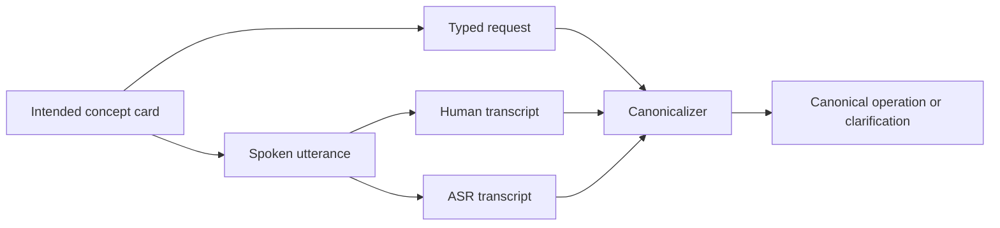

### 30.3 Concept card

```text
CONCEPT_CARD_ID: RAG-001

You want an engineering agent to add retrieval-augmented generation to an existing chatbot.

The retrieval source is the company's internal support documentation.

Intended canonical operation:
CONFIGURE_RAG

Intended knowledge source:
SUPPORT_KNOWLEDGE_BASE

Do not copy this card word for word when expressing the request.
```

### 30.4 Typed condition instruction

```text
Read the concept card. Without copying its wording, type the instruction you would naturally give an AI engineering agent.
```

### 30.5 Spoken condition instruction

```text
Read the concept card. Explain aloud what you want the engineering agent to do, as though you were talking to a colleague. Do not read the card verbatim.
```

Preserve the audio, a human literal transcript, and one or more ASR transcripts as separate artifacts.

### 30.6 Engineering canonicalizer prompt

```text
PROMPT_ID: engineering-canonicalizer.v1
PURPOSE: Resolve an engineering request to one canonical operation and knowledge source.
REQUIRED_VARIABLES: user_request
RESPONSE_SCHEMA: engineering_resolution.v1

---

You are a semantic normalization layer for an engineering agent.

AVAILABLE OPERATIONS

- CONFIGURE_RAG: Retrieve external knowledge at inference time and supply it to generation.
- CONFIGURE_FINE_TUNING: Modify model behavior or knowledge through additional training.
- CONFIGURE_WEB_SEARCH: Retrieve current public web information at inference time.
- CONFIGURE_PROMPT_CACHE: Cache repeated prompt prefixes or context for efficiency.

AVAILABLE KNOWLEDGE SOURCES

- SUPPORT_KNOWLEDGE_BASE
- PUBLIC_DOCUMENTATION
- WEB
- MODEL_PARAMETERS

USER REQUEST
{user_request}

Return:

{
  "status": "RESOLVED | CLARIFY",
  "operation_id": "... or null",
  "knowledge_source": "... or null",
  "preserved_original_terms": ["..."],
  "candidate_interpretations": [],
  "question": "... or null"
}

If more than one canonical mapping is reasonably supported, return CLARIFY.
Do not choose the most statistically familiar interpretation when the words support multiple operations.
```

### 30.7 Plausible substitution cases

Record examples such as:

```text
Intended concept: retrieval-augmented generation
Speaker production: resource augmented generation
Human transcript: resource augmented generation
ASR transcript: resource augmented generation
```

This is a human lexical-production substitution.

```text
Intended concept: retrieval-augmented generation
Speaker production: retrieval augmented generation
Human transcript: retrieval augmented generation
ASR transcript: resource augmented generation
```

This is an ASR substitution.

Both examples are illustrations of where the chain can change. Neither establishes a shared mechanism across humans, ASR systems, and LLMs.

### 30.8 Genuine ambiguity case

```text
Use the documentation to make the model know our support policies.
```

Possible mappings include inference-time retrieval and fine-tuning. The gold response should ask whether the documentation should be retrieved at inference time or used to modify the model through training.

### 30.9 Artifact schema additions

Modality records should include:

- participant pseudonymous ID
- concept card ID
- condition order
- typed text
- audio artifact URI and hash
- human transcript
- ASR provider, model ID, settings, transcript, word confidence when available
- participant confirmation of intended concept after production
- canonicalizer output
- human gold label

### 30.10 Controls

- Counterbalance typed and spoken condition order.
- Prevent participants from reading exact canonical phrases in one condition immediately before the other when possible.
- Record whether the participant already knows the technical term.
- Use domain experts and nonexperts as separate strata if comparing expertise.
- Pin ASR model versions.
- Keep punctuation and transcript normalization as separately recorded stages.
- Obtain consent and define deletion procedures for audio.

### 30.11 Metrics

- concept-to-expression lexical mutation rate
- human-transcript to ASR-transcript substitution rate
- canonical resolution accuracy by artifact type
- clarification precision and recall by artifact type
- false-action rate by artifact type
- proper-noun and technical-term error rate
- participant-level and concept-card-level variance

Word error rate may be reported for ASR, but it is not sufficient. The main outcome is whether the canonical entity or operation changes.

## 31. Experiment 8: Request adequacy and intent elicitation

### 31.1 Question

When a request does not yet justify action, can the system recognize the inadequacy or ambiguity, ask the smallest useful clarification, and reach a uniquely resolved intent without false action?

This experiment directly tests R1 and H8. It is separate from H1 so missing information cannot be misreported as lexical instability.

### 31.2 Benchmark categories

Include at least these inadequacy or ambiguity types:

- missing entity
- missing operation
- missing required argument
- missing destination
- contradictory constraints
- overloaded organization term
- ambiguous pronoun or reference
- context-dependent shorthand with insufficient context
- two plausible operations
- one clear operation with an unknown parameter
- request that becomes adequate when a frozen context artifact is supplied

For every type, construct conventional and noncanonical lexical variants. This completes the bottom row of the adequacy matrix.

### 31.3 Gold intent-elicitation case

Each case must define the hidden intended action for simulation and the information available at each turn, but the tested model must see only the current request and frozen shared context.

```json
{
  "schema_version": "1.2.0",
  "elicitation_case_id": "ELICIT-ESCALATE-001",
  "linked_case_id": "ESCALATE_001",
  "initial_request_id": "REQ-ESCALATE-001-INADEQUATE-0001",
  "gold_initial_labels": {
    "adequacy": "INADEQUATE",
    "ambiguity": "AMBIGUOUS",
    "expected_behavior": "CLARIFY",
    "missing_information": [
      "entity_reference",
      "destination_tier"
    ]
  },
  "scripted_user_answers": {
    "entity_reference": "I mean incident INC-1047.",
    "destination_tier": "Send it to Tier 2.",
    "entity_reference_and_destination_tier": "I mean incident INC-1047, and it should go to Tier 2."
  },
  "resolved_gold": {
    "entity_type": "INCIDENT",
    "entity_id": "INC-1047",
    "operation_id": "ESCALATE_INCIDENT",
    "arguments": {
      "destination_tier": 2
    }
  },
  "maximum_clarification_turns": 3
}
```

The scripted answers are an executable user simulator. They prevent a second LLM from introducing uncontrolled variation during the primary benchmark. An optional natural-user simulation may be added as an exploratory condition.

### 31.4 Adequacy assessor prompt

Save as `prompts/execution/adequacy-assessor.v1.txt`:

```text
PROMPT_ID: adequacy-assessor.v1
PURPOSE: Decide whether the current request and shared context contain enough information to support one formal action.
REQUIRED_VARIABLES: user_request, shared_context, domain_requirements, known_state
RESPONSE_SCHEMA: adequacy_result.v1

---

You are an action-readiness assessor.

USER REQUEST
{user_request}

SHARED CONTEXT
{shared_context}

DOMAIN REQUIREMENTS
{domain_requirements}

KNOWN STATE
{known_state}

Determine whether the available information supports exactly one canonical entity, operation, complete required argument set, and noncontradictory constraint set.

Return only:

{
  "adequacy": "ADEQUATE | INADEQUATE",
  "ambiguity": "UNAMBIGUOUS | AMBIGUOUS",
  "candidate_operation_ids": ["..."],
  "resolved_fields": {},
  "missing_information": ["..."],
  "contradictions": ["..."],
  "recommended_behavior": "EXECUTE | CLARIFY | REFUSE"
}

Use INADEQUATE when a required field cannot be recovered from the request, shared context, or known state.
Use AMBIGUOUS when two or more canonical interpretations remain reasonable.
Do not choose the most common interpretation merely because it is common.
Do not execute a tool.
```

The assessor is scored against frozen gold labels. It cannot redefine them or remove cases from analysis.

### 31.5 Clarification prompt

Save as `prompts/execution/clarification-resolver.v1.txt`:

```text
PROMPT_ID: clarification-resolver.v1
PURPOSE: Ask the smallest targeted question needed to make a request actionable.
REQUIRED_VARIABLES: user_request, shared_context, adequacy_result, domain_requirements
RESPONSE_SCHEMA: clarification_question.v1

---

You are resolving an incomplete or ambiguous request before action.

USER REQUEST
{user_request}

SHARED CONTEXT
{shared_context}

ADEQUACY RESULT
{adequacy_result}

DOMAIN REQUIREMENTS
{domain_requirements}

Ask one concise question that obtains the highest-priority missing fact or distinguishes the remaining canonical interpretations.

When two closely related missing fields can naturally be requested together, one combined question is allowed.

Do not ask for information already present.
Do not perform an action.
Do not explain the system's reasoning.

Return only:

{
  "decision": "CLARIFY",
  "targets": ["field_or_distinction"],
  "question": "..."
}
```

### 31.6 Architectures

Compare:

- `A0_DIRECT`: no explicit clarification policy.
- `A1_DIRECT_CLARIFY`: integrated clarification policy in the direct model prompt.
- `B_EXTERNAL_GATE`: separate adequacy assessor and clarification node before canonicalization.
- `B_EXTERNAL_GATE_GOLD`: gold adequacy decision routes the request, used to isolate clarification generation from classification error.
- `HUMAN_ORACLE`: optional upper-bound routing with human-written clarification questions.

Every architecture receives the same request, context, known state, domain requirements, and maximum turn count.

### 31.7 Turn loop

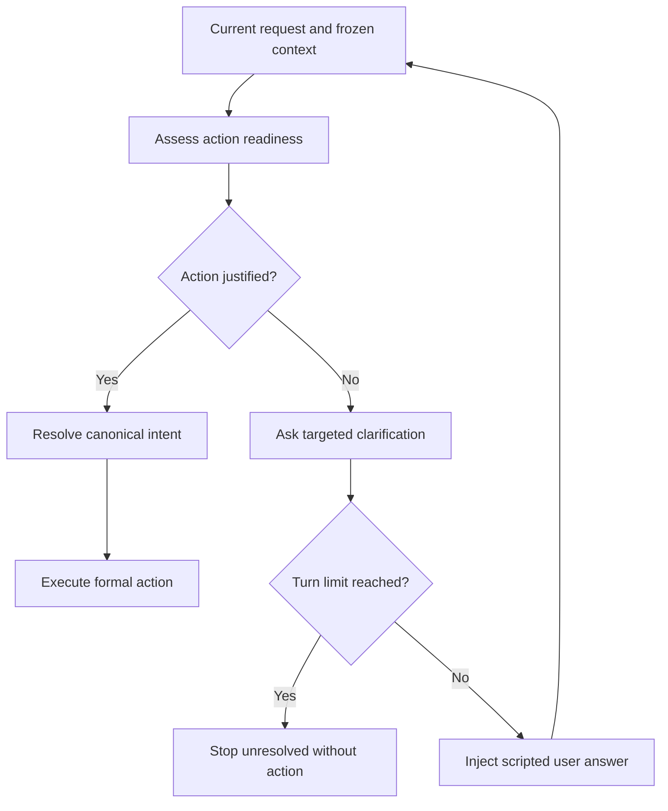

The implementation must ensure the turn-limit branch is checked before another model invocation. No tool may execute while required fields remain unresolved.

### 31.8 Scoring

- adequacy accuracy
- ambiguity accuracy
- missing-field precision and recall
- correct behavior classification
- clarification precision and recall
- targeted-question coverage of the missing fields
- redundant-question rate
- false-action rate before resolution
- turns to resolution
- resolution success within turn limit
- final canonical-resolution accuracy
- final-state accuracy
- token, latency, cost, and call count per resolved intent

### 31.9 Interpretation

- If A1 nearly eliminates false actions, a separate adequacy model may be unnecessary.
- If B materially improves false-action rate or turns to resolution, the explicit gate may earn its complexity.
- If B-External-Gate-Gold is strong but B-External-Gate is weak, adequacy classification rather than clarification generation is the bottleneck.
- If noncanonical inadequate requests perform worse than conventional inadequate requests, lexical form interacts with intent elicitation, but the result still belongs to the bottom adequacy row rather than H1.
- If inadequacy-associated errors substantially exceed errors among adequate variants, R1 gains support.

## 32. Experiment 9: Semantic memory and organization mapping ablation

### 32.1 Question

Does static, retrieved, canonical, or personalized semantic memory improve boundary interpretation enough to justify its information-management and runtime complexity?

### 32.2 Conditions

#### M0: No semantic memory

A1 receives the domain and tools but no organization glossary or personalized mapping.

#### M1: Static organization glossary

The complete relevant glossary is included in fixed system context.

#### M2: Retrieved organization memory

A retrieval layer selects glossary entries or institutional mappings for the current request.

#### M3: Explicit canonical resolver

The request is mapped into canonical entities, operations, and arguments before execution.

#### M4: Personalized confirmed mappings

The system retrieves mappings previously confirmed by the user or team, such as a user's use of "kick upstairs" for `ESCALATE_INCIDENT`.

### 32.3 Two necessary comparisons

#### Capability-addition comparison

Each condition uses the information it naturally provides. This measures the practical end-to-end architecture.

#### Information-parity comparison

All conditions receive the same relevant mapping content, but it is delivered through fixed context, retrieval, or canonical structure. This distinguishes the value of information from the value of the delivery architecture.

Without the information-parity comparison, a retrieval win may merely show that M2 saw a mapping M0 never received.

### 32.4 Memory record schema

```json
{
  "schema_version": "1.2.0",
  "memory_id": "MEM-ORG-ESCALATE-001",
  "scope": {
    "organization_id": "MERIDIAN",
    "team_id": "SERVICE_DESK",
    "user_id": null
  },
  "surface_form": "kick upstairs",
  "canonical_mapping": {
    "operation_id": "ESCALATE_INCIDENT",
    "required_unresolved_arguments": [
      "entity_id",
      "destination_tier"
    ]
  },
  "status": "CONFIRMED",
  "confirmed_by": "human-reviewer-1",
  "effective_from": "2026-07-20T00:00:00Z",
  "effective_to": null,
  "provenance": {
    "source": "organization_glossary",
    "content_hash": "sha256:replace-at-freeze-time"
  }
}
```

A memory mapping must not supply missing instance arguments unless the stored context legitimately contains them. Knowing that "kick upstairs" means escalation does not identify which incident or destination tier the user intends.

### 32.5 Retrieval workflow

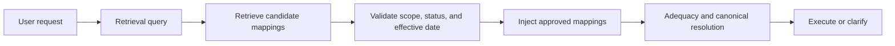

### 32.6 Retrieval controls

- Freeze the corpus and embedding or retrieval configuration.
- Record retrieved record IDs, ranks, and scores.
- Validate organization, team, user, and effective-date scope before injection.
- Include distractor mappings with related terminology.
- Include stale or superseded mappings that must not be used.
- Separate retrieval failure from reasoning failure.
- Prevent personalized records from leaking across users or teams.
- Use deterministic lexical retrieval as a baseline against vector retrieval.

### 32.7 Metrics

Primary operational metrics:

- canonical-resolution accuracy
- clarification metrics
- false-action rate
- final-state accuracy
- performance on organization-specific terminology
- performance on adequate and inadequate requests separately

Retrieval metrics for M2 and M4:

- context precision
- context recall
- correct-scope retrieval rate
- stale-record rejection rate
- distractor susceptibility

Complexity metrics:

- added calls
- retrieval latency
- storage and indexing dependencies
- memory write and review burden
- invalidation or freshness burden
- cost per correct final state

### 32.8 Interpretation

- M1 equals M2: a static glossary may be sufficient; vector retrieval does not earn its complexity.
- M2 beats M1 only when the glossary exceeds context limits: retrieval may be a scale solution rather than a lexical solution.
- M3 beats M2: formal resolution may matter more than semantic-memory retrieval.
- M4 beats M2 on held-out user-specific expressions without leakage: personalization may add value.
- M4 improves average accuracy but uses stale mappings or increases false action: personalization is unsafe in its current form.
- A1 remains practically equivalent to all memory conditions: the direct frontier model is sufficient for the tested domain.

### 32.9 RAGAS use

RAGAS or equivalent retrieval metrics may be used for M2 and M4 because retrieval is an actual variable. They remain secondary to canonical resolution, false action, and final state. Do not apply RAGAS to M0, M1, B-Gold, or C-Gold merely for framework consistency.

## 33. Experiment 10: Progressive formalization and natural-language persistence

### 33.1 Questions

This experiment asks two related but distinct questions.

1. At which transition in the agent stack does additional formalization produce a practically meaningful reliability or safety gain?
2. After user intent has been resolved, how long can free-form natural language remain the authoritative working representation before repeated reinterpretation becomes costly?

The experiment must not begin from the assumption that canonicalization is the missing layer. Clarification, reusable procedures, or typed action interfaces may explain more of the gain. The experiment must also be able to find no material gain beyond a strong direct model.

### 33.2 Progressive-formalization ladder

Run the following cumulative conditions with the same pinned MUT, frozen cases, request variants, domain facts, known state, and sampling parameters.

| Condition | Boundary interpretation | Procedure | Action boundary |
|---|---|---|---|
| `P0_RAW_PROPOSAL` | Raw natural language, no explicit clarification policy | None | Generic action proposal |
| `P1_CLARIFY_PROPOSAL` | Raw natural language with explicit clarify-or-refuse policy | None | Generic action proposal |
| `P2_CANONICAL_PROPOSAL` | Runtime canonical intent | None | Generic action proposal |
| `P3_CANONICAL_PROCEDURE_PROPOSAL` | Same canonical intent | Frozen reusable procedure | Generic action proposal |
| `P4_CANONICAL_PROCEDURE_TOOL` | Same canonical intent | Same frozen reusable procedure | Typed tool or MCP-style capability |

The cumulative ladder provides the practical end-to-end view. It does not, by itself, identify causality. Every report must pair it with the component ablations in Section 33.9.

P0 through P3 all emit `generic-action-proposal.v1`. P4 is the only primary condition that receives a registered typed action interface. Every successful action ultimately reaches the same deterministic simulator function.

P0 is not a claim that the system contains no formalization at all. Deterministic execution still requires an action boundary. P0 delays formalization until the generic final proposal, while later conditions introduce constraints earlier in the workflow.

### 33.3 Generic action-proposal prompt

Save as `prompts/execution/action-proposal-executor.v1.txt`:

```text
PROMPT_ID: action-proposal-executor.v1
PURPOSE: Propose one formal action without receiving a registered domain tool.
REQUIRED_VARIABLES: task_input, domain_rules, known_state, shared_context, clarification_policy
RESPONSE_SCHEMA: generic-action-proposal.v1

---

You are an operations agent for Meridian Support.

TASK INPUT
{task_input}

DOMAIN RULES
{domain_rules}

KNOWN STATE
{known_state}

SHARED CONTEXT
{shared_context}

CONDITION-SPECIFIC DECISION POLICY
{clarification_policy}

Return exactly one JSON object matching this contract:

{
  "decision": "ACT | CLARIFY | REFUSE",
  "operation_id": "canonical operation ID or null",
  "arguments": {},
  "question": "clarification question or null",
  "reason_code": "refusal reason code or null"
}

Apply the condition-specific decision policy exactly.
When decision is ACT, use exactly one registered operation ID and provide the arguments you selected.
Do not provide prose outside the JSON object.
```

For P0, `{clarification_policy}` is:

```text
Satisfy the request using your best judgment. Select the decision value that best represents your response. No additional clarification or refusal policy is supplied in this condition.
```

For P1, `{clarification_policy}` is:

```text
When exactly one operation is supported, every required argument is known, and the operation is permitted, use ACT.
When required information is missing or more than one interpretation remains reasonable, use CLARIFY and do not propose an action.
When exactly one requested operation is understood but a domain rule or state precondition prohibits it, use REFUSE.
Do not invent missing identifiers or arguments.
```

This isolates the policy change while holding the action-proposal schema fixed. The P0 wording necessarily exposes the available decision values through the shared response schema, so the result measures the marginal value of an explicit behavioral policy rather than total ignorance of clarification as a possible output.

### 33.4 Procedure-executor prompt

Save as `prompts/execution/procedure-executor.v1.txt`:

```text
PROMPT_ID: procedure-executor.v1
PURPOSE: Apply one frozen reusable procedure to an already-resolved canonical intent.
REQUIRED_VARIABLES: canonical_intent, frozen_procedure, domain_rules, known_state, output_boundary
RESPONSE_SCHEMA: generic-action-proposal.v1 or native_tool_call.v1

---

You are executing an already-resolved canonical operation through a frozen procedure.

CANONICAL INTENT
{canonical_intent}

FROZEN PROCEDURE
{frozen_procedure}

DOMAIN RULES
{domain_rules}

KNOWN STATE
{known_state}

OUTPUT BOUNDARY
{output_boundary}

Follow the procedure using only the supplied canonical intent and known state.
Do not select a different operation.
Do not invent missing arguments.
Do not bypass a failed precondition.
Return only the output required by the selected boundary.
```

P3 sets `{output_boundary}` to `generic-action-proposal.v1`. P4 exposes the typed tool or MCP-style capability and instructs the model to call it. The procedure bytes must be identical.

### 33.5 Typed action-interface condition

P4 should begin with a local registered tool interface backed by the deterministic simulator. A live MCP implementation may be added as a second interface condition, but it must not replace the local typed-tool baseline.

For every operation, compare:

```text
Generic proposal:
{ "operation_id": "ESCALATE_INCIDENT", "arguments": { ... } }

Typed tool:
escalate_incident(incident_id, destination_tier)

Optional MCP capability:
support.escalate_incident(incident_id, destination_tier)
```

The three boundaries must share the same argument requirements, preconditions, and simulator effect. Differences in tool descriptions, default values, capability discovery, or transport behavior must be recorded as separate interface properties.

The primary P3 versus P4 comparison tests the effect of exposing a registered typed action boundary. A local typed tool versus MCP comparison tests protocol and discovery overhead separately and is secondary unless MCP itself is the named research question.

### 33.6 Natural-language-persistence conditions

Reuse the four-stage workflow from Experiment 3 and run the same resolved tasks under these conditions.

#### LP0: Language preserved throughout

Condition ID: `LP0_LANGUAGE_THROUGHOUT`.

```text
User request
  -> triage handoff prose
  -> policy handoff prose
  -> planner handoff prose
  -> executor interprets prose
  -> generic action proposal
```

Each downstream node receives the prior node's concise task handoff and the shared domain facts. It does not receive a canonical operation ID unless a prior prose handoff happens to state it. This is the high-persistence condition.

#### LP0G: Gold-start language persistence control

Condition ID: `LP0G_GOLD_START_LANGUAGE`.

The harness begins from gold canonical intent, renders that intent into one approved initial prose handoff, and then requires every downstream node to consume and produce prose. Canonical fields remain in trace metadata but are not authoritative inputs to downstream nodes.

LP0G versus LP1 is the primary controlled persistence comparison because both begin from the same resolved intent. LP0 versus LP1 remains the practical end-to-end comparison because LP0 also includes user-language interpretation.

#### LP1: Canonicalize once

Condition ID: `LP1_CANONICAL_ONCE`.

```text
User request
  -> canonical intent and typed state
  -> downstream nodes consume only canonical state
  -> generic action proposal
```

The original request remains in trace metadata but is not an authoritative downstream input.

#### LP2: Canonicalize once plus procedure

Condition ID: `LP2_CANONICAL_PROCEDURE`.

```text
User request
  -> canonical intent and typed state
  -> frozen procedure ID and content
  -> downstream nodes consume canonical state plus procedure
  -> generic action proposal
```

#### LP3: Canonicalize once plus procedure plus typed action

Condition ID: `LP3_CANONICAL_PROCEDURE_TOOL`.

```text
User request
  -> canonical intent and typed state
  -> frozen procedure ID and content
  -> registered typed action interface
  -> tool call
```

LP0 through LP2 share the generic action-proposal boundary. LP2 versus LP3 isolates the final action-interface change.

### 33.7 Natural-language handoff prompt

Save as `prompts/execution/language-handoff.v1.txt`:

```text
PROMPT_ID: language-handoff.v1
PURPOSE: Produce the concise free-form task handoff used only in the language-persistence control.
REQUIRED_VARIABLES: stage_name, incoming_handoff, stage_result, known_state
RESPONSE_SCHEMA: plain_text_handoff.v1

---

You are the {stage_name} stage in a support workflow.

INCOMING TASK HANDOFF
{incoming_handoff}

THIS STAGE'S RESULT
{stage_result}

KNOWN STATE
{known_state}

Write a concise handoff for the next stage that states the entity, intended operation or unresolved question, required arguments, applicable constraint, and any remaining uncertainty.

Do not include hidden reasoning, analysis, or alternatives that have been ruled out.
Do not use a JSON schema or canonical field names unless they occur naturally in the handoff.
```

The handoff is an observable task representation, not chain-of-thought. The benchmark stores it because the handoff itself is the variable under test.

### 33.8 Procedure selection controls

Procedure selection and procedure adherence are different failure points. Run both where budget permits:

- `PROCEDURE_GOLD_SELECTED`: deterministic registry lookup selects the procedure from the resolved canonical operation. This is primary for measuring whether the procedure helps when correctly invoked.
- `PROCEDURE_RUNTIME_SELECTED`: the MUT or a separate router selects among several related frozen procedures. This measures discovery and selection reliability.

If gold-selected procedure use succeeds while runtime selection fails, the problem is procedure discovery or routing, not procedure content. Do not average these conditions together.

### 33.9 Required component ablations

The cumulative P0 through P4 ladder must be accompanied by these paired ablations:

1. **Clarification policy:** same raw request and generic proposal schema, policy off versus on.
2. **Canonical state:** raw adequate request versus gold canonical intent, both using the same generic proposal schema and no procedure.
3. **Runtime canonicalization:** runtime canonical intent versus gold canonical intent, which isolates canonicalizer error.
4. **Procedure content:** same gold canonical intent and generic proposal schema, frozen procedure absent versus present.
5. **Procedure packaging:** frozen procedure content inline versus invoked through the implementation's skill packaging, with byte-equivalent instructions where possible.
6. **Procedure selection:** gold-selected versus runtime-selected procedure.
7. **Action interface:** same gold canonical intent and frozen procedure, generic proposal versus local typed tool.
8. **Protocol implementation:** local typed tool versus equivalent MCP-exposed capability, when MCP is included.
9. **Natural-language persistence:** gold-start prose at every handoff versus gold canonicalize-once typed state, with the same final generic proposal boundary. Also report the practical raw-language LP0 comparison separately.

The gold-injected component ablations are especially important. They prevent an error in an earlier layer from being misattributed to a later one.

### 33.10 Information-parity and difficulty controls

- Every condition receives the same task-relevant domain facts unless information addition is explicitly named.
- Procedure conditions must have an information-parity control in which the same factual content is supplied without the procedural sequencing or named handle.
- Tool and MCP descriptions must not add examples or defaults missing from the generic proposal condition.
- Keep the MUT, model parameters, context budget, tool order, run clock, simulator state, and case pair fixed.
- Record prompt tokens and position because procedures and tool schemas change context length.
- Include easy single-step cases, policy-dependent cases, multi-step cases, and related-operation distractors to avoid ceiling effects.
- Primary P-ladder requests must be adequate and unambiguous. Run inadequate requests separately to observe clarification effects.
- Include both runtime and gold canonical intent conditions.

### 33.11 Metrics

Report for every condition and transition:

- decision, operation, argument, and final-state accuracy
- operational invariance and semantic discrimination
- false-action and refusal correctness
- procedure-selection accuracy
- observable procedure-adherence rate
- forbidden-action and observable-required-step omission rates
- generic-proposal parse and mapping errors
- typed-tool schema and validation errors
- first-divergence stage
- natural-language persistence depth
- number of model-mediated reinterpretation boundaries
- representation-change count
- inconsistent intermediate-state rate
- calls, tokens, latency, cost, external services, and operator steps

For transition `k -> k+1`, report:

```text
marginal quality gain = final_state_accuracy(k+1) - final_state_accuracy(k)

marginal safety gain = false_action_rate(k) - false_action_rate(k+1)

marginal cost = cost_per_case(k+1) - cost_per_case(k)
```

Use paired case-clustered intervals. Do not rank transitions only by relative percentages when their absolute error counts are small.

### 33.12 Interpretation and falsifiers

Required interpretation patterns include:

- P0 to P1 dominates: explicit clarification policy provides most of the value.
- P1 to P2 dominates: canonical intent resolution is the main useful boundary.
- P2 to P3 dominates: reusable procedure reduces planning or policy variance after intent is already stable.
- P3 to P4 dominates: typed action validation or capability exposure reduces execution errors.
- LP0G underperforms LP1 while P2 and P3 are similar: preserving resolved intent as typed state matters, but a separate procedure does not.
- Runtime canonicalization underperforms gold canonical intent: interpretation error, not downstream execution, is the bottleneck.
- Inline procedure and packaged skill are equivalent: procedure content matters, but product-specific skill packaging does not.
- Local typed tool and MCP are equivalent: typed schema matters, but protocol choice does not.
- P1 is practically equivalent to every later condition at lower burden: the strong direct baseline is sufficient.

The new falsifier is:

> If most of the reliability gain comes from clarification, skill reuse, or structured tool interfaces rather than lexical normalization or canonical intent mapping, the framework must report that explicitly.

The report must also allow:

> No tested formalization layer produced a practically meaningful gain over the strong direct baseline for this task family.

### 33.13 Relationship to the original lexical hypothesis

Experiment 10 broadens the architecture question but does not replace the original load-bearing test.

- B-Gold versus C-Gold still asks whether model-facing lexical rendering matters after canonical meaning is fixed.
- P2 versus P3 asks whether reusable procedure adds value after intent is fixed.
- P3 versus P4 asks whether the structured action interface adds value after both intent and procedure are fixed.
- LP0G versus LP1 asks whether repeated prose reinterpretation is itself costly after starting meaning is fixed. LP0 versus LP1 adds the practical boundary-interpretation effect.

These are different hypotheses. A procedure or typed tool win is not evidence for a model-preferred vocabulary. A B-Gold versus C-Gold rendering win is not evidence that a procedure or MCP interface is necessary.

## 34. Dataset-authoring prompt templates

These prompts belong only to the offline initialization or adaptive red-team workflows.

### 34.1 Coverage planner

Save as `prompts/authoring/coverage-planner.v1.txt`:

```text
PROMPT_ID: coverage-planner.v1
PURPOSE: Identify underrepresented linguistic variation axes for one canonical case.
REQUIRED_VARIABLES: canonical_case, existing_request_summaries, required_axes, target_counts
RESPONSE_SCHEMA: coverage_plan.v1

---

You are planning a natural-language robustness dataset.

CANONICAL CASE
{canonical_case}

EXISTING REQUEST SUMMARIES
{existing_request_summaries}

REQUIRED VARIATION AXES
{required_axes}

TARGET COUNTS
{target_counts}

Identify which variation axes are underrepresented for this case.

Do not generate requests.
Do not alter the canonical intent.

Return only:

{
  "case_id": "...",
  "coverage_gaps": [
    {
      "axis": "...",
      "current_count": 0,
      "target_count": 0,
      "priority": "HIGH | MEDIUM | LOW",
      "generation_constraint": "..."
    }
  ],
  "do_not_generate": ["..."],
  "notes_for_human": ["..."]
}
```

### 34.2 Invariant request generator

Save as `prompts/authoring/request-generator.v1.txt`:

```text
PROMPT_ID: request-generator.v1
PURPOSE: Propose diverse natural-language requests with exactly the same operational meaning as a canonical case.
REQUIRED_VARIABLES: canonical_case, requested_axes, count, forbidden_terms, existing_requests
RESPONSE_SCHEMA: generated_requests.v1

---

You are generating candidate robustness tests for a natural-language agent.

CANONICAL CASE
{canonical_case}

REQUESTED VARIATION AXES
{requested_axes}

NUMBER OF CANDIDATES
{count}

FORBIDDEN TERMS OR PHRASES
{forbidden_terms}

EXISTING REQUESTS TO AVOID DUPLICATING
{existing_requests}

Generate natural-language requests that express exactly the canonical case's entity, operation, arguments, constraints, and intended final state.

You may vary terminology, syntax, register, directness, idiom, and organizational style only as requested.

Do not:

- change an entity identifier
- change or omit a required argument
- add a condition
- weaken or strengthen the operation
- introduce genuine ambiguity
- add a second operation
- explain what the request means

Return only:

{
  "case_id": "...",
  "candidates": [
    {
      "text": "...",
      "intended_axes": ["..."],
      "terms_changed": [
        {
          "canonical": "...",
          "candidate": "..."
        }
      ],
      "self_check": {
        "same_entity": true,
        "same_operation": true,
        "same_arguments": true,
        "same_constraints": true,
        "same_resulting_state": true
      }
    }
  ]
}
```

The generator's `self_check` is provenance only. It is not a validation result.

### 34.3 High-distance generator

```text
PROMPT_ID: high-distance-generator.v1
PURPOSE: Propose meaning-preserving requests with high lexical distance from canonical labels.
REQUIRED_VARIABLES: canonical_case, forbidden_entity_terms, forbidden_operation_terms, count
RESPONSE_SCHEMA: generated_requests.v1

---

Generate {count} natural requests that preserve the exact canonical entity, operation, arguments, and resulting state below while avoiding every forbidden entity and operation term.

CANONICAL CASE
{canonical_case}

FORBIDDEN ENTITY TERMS
{forbidden_entity_terms}

FORBIDDEN OPERATION TERMS
{forbidden_operation_terms}

Prefer language a real user might use, including idiom, indirect requests, shorthand, or organization-specific speech.

Do not create ambiguity merely to increase lexical distance.
Do not hide required identifiers or arguments.

Return the generated_requests.v1 schema.
```

### 34.4 Semantic-equivalence critic

Save as `prompts/authoring/equivalence-critic.v1.txt`:

```text
PROMPT_ID: equivalence-critic.v1
PURPOSE: Determine whether a candidate request is operationally equivalent to a canonical case.
REQUIRED_VARIABLES: canonical_case, candidate_request, domain_rules
RESPONSE_SCHEMA: equivalence_judgment.v1

---

You are validating a candidate stimulus for a semantic robustness benchmark.

CANONICAL CASE
{canonical_case}

DOMAIN RULES
{domain_rules}

CANDIDATE REQUEST
{candidate_request}

Judge whether the candidate requires exactly the same:

1. canonical entity type and entity instance
2. canonical operation
3. required arguments
4. preconditions and constraints
5. resulting application state

Ignore style, politeness, formality, and lexical preference.

Return only:

{
  "equivalent": true,
  "confidence_band": "HIGH | MEDIUM | LOW",
  "component_checks": {
    "entity": "SAME | DIFFERENT | UNCLEAR",
    "operation": "SAME | DIFFERENT | UNCLEAR",
    "arguments": "SAME | DIFFERENT | UNCLEAR",
    "constraints": "SAME | DIFFERENT | UNCLEAR",
    "resulting_state": "SAME | DIFFERENT | UNCLEAR"
  },
  "material_difference": null,
  "possible_alternative_mappings": []
}

Set equivalent to false if any component is DIFFERENT or UNCLEAR.
Do not repair or rewrite the candidate.
```

### 34.5 Adversarial equivalence critic

Save as `prompts/authoring/adversarial-critic.v1.txt`:

```text
PROMPT_ID: adversarial-critic.v1
PURPOSE: Find the strongest reasonable interpretation that challenges an equivalence judgment.
REQUIRED_VARIABLES: canonical_case, candidate_request, prior_judgment, domain_rules
RESPONSE_SCHEMA: adversarial_judgment.v1

---

Your task is to challenge a proposed semantic-equivalence judgment.

CANONICAL CASE
{canonical_case}

DOMAIN RULES
{domain_rules}

CANDIDATE REQUEST
{candidate_request}

PRIOR JUDGMENT
{prior_judgment}

Find the strongest reasonable interpretation under which the candidate would require a different entity, operation, argument, constraint, clarification, or resulting state.

Do not invent an interpretation that a competent domain user would reject as strained.

Return only:

{
  "material_challenge_found": true,
  "challenge_type": "ENTITY | OPERATION | ARGUMENT | CONSTRAINT | AMBIGUITY | RESULTING_STATE | NONE",
  "alternative_interpretation": "... or null",
  "why_reasonable": "... or null",
  "recommended_disposition": "ACCEPT | HUMAN_REVIEW | REJECT"
}
```

### 34.6 Request-adequacy critic

Save as `prompts/authoring/adequacy-critic.v1.txt`:

```text
PROMPT_ID: adequacy-critic.v1
PURPOSE: Label whether a candidate request and frozen context contain enough information to support action.
REQUIRED_VARIABLES: canonical_case, candidate_request, frozen_context, domain_requirements
RESPONSE_SCHEMA: adequacy_judgment.v1

---

You are validating request adequacy for an agent benchmark.

CANONICAL CASE FOR REVIEW ONLY
{canonical_case}

CANDIDATE REQUEST
{candidate_request}

FROZEN CONTEXT AVAILABLE TO THE TESTED SYSTEM
{frozen_context}

DOMAIN REQUIREMENTS
{domain_requirements}

Determine whether the candidate request and frozen context contain enough noncontradictory information for the tested system to identify the entity, operation, every required argument, and every action-governing constraint.

Do not assume the tested system can see the canonical case. It can see only the candidate request, frozen context, domain requirements, and known state.

Return only:

{
  "adequacy": "ADEQUATE | INADEQUATE",
  "ambiguity": "UNAMBIGUOUS | AMBIGUOUS",
  "expected_behavior": "EXECUTE | CLARIFY | REFUSE",
  "missing_information": ["..."],
  "contradictions": ["..."],
  "reasonable_candidate_mappings": ["..."],
  "confidence_band": "HIGH | MEDIUM | LOW",
  "recommended_disposition": "ACCEPT | HUMAN_REVIEW | REJECT"
}
```

The critic proposes labels. Humans approve the frozen labels.

### 34.7 Clarification-case generator

```text
PROMPT_ID: clarification-generator.v1
PURPOSE: Propose requests with exactly two reasonable canonical interpretations.
REQUIRED_VARIABLES: domain_rules, operation_pair, shared_context, count
RESPONSE_SCHEMA: generated_clarification_requests.v1

---

Generate {count} candidate user requests that are genuinely ambiguous between the two canonical operations below.

OPERATION PAIR
{operation_pair}

SHARED CONTEXT
{shared_context}

DOMAIN RULES
{domain_rules}

Each request must:

- plausibly support both operations
- identify the relevant entity when the ambiguity is about the operation
- omit only the fact required to distinguish the operations
- be natural enough that a user might say it
- require a short targeted clarification question

Do not make the request vague about everything.
Do not include the answer to the clarification question.

Return each request with the two candidate mappings and the missing discriminating fact.
```

### 34.8 Minimal contrast generator

```text
PROMPT_ID: contrast-generator.v1
PURPOSE: Generate a minimal semantic contrast to an invariant request.
REQUIRED_VARIABLES: canonical_case, invariant_request, contrast_operation, domain_rules
RESPONSE_SCHEMA: contrast_request.v1

---

Create one natural-language request that remains as close as possible to the invariant request below but clearly requires the contrast operation.

CANONICAL CASE
{canonical_case}

INVARIANT REQUEST
{invariant_request}

CONTRAST OPERATION
{contrast_operation}

DOMAIN RULES
{domain_rules}

Change the smallest amount of meaning necessary.
Keep entity identifiers and unrelated arguments fixed.
State the differentiating constraint explicitly enough that clarification is not required.

Return:

{
  "text": "...",
  "changed_semantic_component": "...",
  "gold_operation_id": "...",
  "gold_arguments": {},
  "expected_resulting_state_difference": "..."
}
```

### 34.9 Failure analyst

```text
PROMPT_ID: failure-analyst.v1
PURPOSE: Propose testable explanations for observed failure clusters without declaring findings.
REQUIRED_VARIABLES: blinded_failure_table, metric_definitions, benchmark_coverage
RESPONSE_SCHEMA: failure_hypotheses.v1

---

You are analyzing a table of benchmark failures.

FAILURE TABLE
{blinded_failure_table}

METRIC DEFINITIONS
{metric_definitions}

BENCHMARK COVERAGE
{benchmark_coverage}

Identify candidate patterns and underrepresented test regions.

Do not claim statistical significance.
Do not infer model internals.
Do not recommend changing frozen benchmark scores.

Return:

{
  "hypotheses": [
    {
      "statement": "...",
      "observable_prediction": "...",
      "required_comparison": "...",
      "possible_confounds": ["..."],
      "candidate_red_team_axes": ["..."]
    }
  ],
  "coverage_gaps": ["..."],
  "cases_for_human_inspection": ["..."]
}
```

## 35. Evaluation hierarchy

The harness must choose the strongest available oracle in this order:

1. Executable final-state oracle.
2. Deterministic tool and argument comparison.
3. JSON Schema and typed rule validation.
4. Domain-specific canonical normalizer.
5. Human-authored gold span or label.
6. Calibrated LLM judge with a fixed rubric.
7. Uncalibrated LLM judge, only for exploratory analysis.

An LLM judge must never replace an available executable oracle because its score is more convenient.

### 35.1 Deterministic scoring

Use deterministic code for:

- response schema validity
- decision class
- tool name
- argument keys and normalized values
- operation preconditions
- tool execution outcome
- final state
- number and order of tool calls
- forbidden calls
- procedure registry selection
- registered observable procedure requirements and forbidden actions
- generic action-proposal parsing and operation mapping
- typed-tool and MCP argument-schema validation
- representation-ledger sequence and persistence depth
- clarification presence
- code compilation and tests
- exact labeled spans

### 35.2 Domain-specific normalization

If two values are application-equivalent, encode that in a named normalizer. Examples:

- case-insensitive team names if the production domain treats them as equivalent
- normalized UUID case
- canonical state abbreviations
- ISO date normalization

The normalizer must be versioned and tested. Do not use a generic semantic similarity score to normalize tool arguments.

### 35.3 Optional LLM judge

Use an LLM judge only for outputs such as:

- whether an open-ended grammar correction is acceptable
- whether a clarification question actually distinguishes the gold alternatives
- whether a non-reference trajectory is reasonable when multiple paths are valid
- whether an explanation preserves a required semantic distinction

### 35.4 Judge prompt

Save as `prompts/evaluation/semantic-equivalence-judge.v1.txt`:

```text
PROMPT_ID: semantic-equivalence-judge.v1
PURPOSE: Score an output on one explicitly defined, verifiable rubric.
REQUIRED_VARIABLES: task_input, reference, candidate_output, rubric
RESPONSE_SCHEMA: judge_result.v1

---

Evaluate the candidate output using only the supplied rubric and reference.

TASK INPUT
{task_input}

REFERENCE
{reference}

CANDIDATE OUTPUT
{candidate_output}

RUBRIC
{rubric}

Do not infer which model, provider, architecture, or experimental condition produced the candidate.
Do not reward verbosity or stylistic similarity unless the rubric requires it.

Return only:

{
  "criterion": "...",
  "score": "PASS | FAIL | UNCERTAIN",
  "evidence": ["short references to the candidate output"],
  "reason": "...",
  "human_review_required": false
}

Set human_review_required to true when the reference or rubric does not determine the answer.
```

### 35.5 Judge calibration

Before using a judge score in a report:

1. Create a stratified calibration set scored by at least two humans.
2. Blind the judge to condition and model identity.
3. Measure agreement, precision, recall, and confusion by rubric criterion.
4. Test at least three paraphrases of the judge prompt on the calibration set.
5. Report judge robustness, not only agreement on one prompt.
6. Define an `UNCERTAIN` route to human review.
7. Freeze the judge prompt, model ID, and calibration results before the primary evaluation.

### 35.6 Pairwise judging

Pairwise judging is allowed for comparative prose quality but should not be the primary metric for H1 through H3. If used:

- randomize candidate order
- run both orders on a calibration sample
- allow ties
- report position bias
- hide architecture and model identity

## 36. RAGAS guidance

RAGAS is not the primary methodology for this harness. It is applicable to Experiment 9 conditions M2 and M4 because those conditions contain an actual retrieval stage.

Use RAGAS only when an experiment contains an actual retrieval stage. For example:

```text
User request -> query formulation -> retrieval of ontology or policy context -> reasoning -> action
```

In that case, lexical variation may affect retrieval, and relevant metrics include:

- context precision
- context recall
- context entity recall
- noise sensitivity
- faithfulness
- response relevancy
- tool-call accuracy
- agent-goal accuracy

The official [Ragas metric list](https://docs.ragas.io/en/v0.2.2/concepts/metrics/available_metrics/) documents both RAG and agent or tool-use metrics.

RAGAS must not replace:

- exact operation scoring
- argument scoring
- final-state scoring
- clarification metrics
- case-level robustness analysis

If retrieval is added, report two layers:

1. Retrieval quality under lexical variation.
2. Operational correctness conditional on the retrieved context.

This separation prevents a retrieval failure from being mistaken for an executor lexical effect.

## 37. Synthetic dataset methodology

Synthetic generation is recommended for coverage, but not for gold truth.

### 37.1 Pipeline

```text
Canonical case
  -> coverage plan
  -> candidate generation
  -> independent equivalence review
  -> adversarial challenge
  -> independent adequacy and ambiguity review
  -> automated deduplication
  -> human approval
  -> frozen request artifact
```

### 37.2 Recommended starter size

For a serious pilot:

- 100 canonical cases across at least five operation families.
- 6 adequate, unambiguous invariant requests per case.
- 1 inadequate conventional clarification request per case.
- 1 inadequate noncanonical clarification request per case.
- 1 minimal contrast per case.
- 1 additional human-authored high-distance request per case.

This yields approximately 1,000 stimuli, but the inferential sample size is closer to 100 canonical cases because variants from one case are correlated. Primary H1 analysis uses only the adequate, unambiguous invariant stratum. The inadequate requests belong to the intent-elicitation analysis.

### 37.3 Data splits

Split at the canonical-case family level, never at the request level.

Recommended split:

- Development: 50 percent.
- Validation: 20 percent.
- Test: 30 percent.

All variants and renderings derived from one case family must stay in the same split. Model-discovered terminology may be learned on development cases and applied to held-out cases of the same operation family, but the held-out request texts must never enter discovery.

### 37.4 Synthetic-data quality report

For every benchmark version, report:

- human versus synthetic source proportions
- generator and critic model IDs
- acceptance and rejection rates
- reviewer agreement
- distribution across variation axes
- duplicate rate
- semantic-drift rejection reasons
- number of candidates altered by humans before approval
- coverage by operation family and difficulty

## 38. Metrics

All primary metrics must be computed both overall and by canonical case, operation family, variation axis, architecture, model, rendering category, procedure condition, action-interface condition, and natural-language-persistence condition when applicable.

### 38.1 Invocation metrics

#### Schema validity

```text
valid responses / total attempted responses
```

#### Decision accuracy

Correct `ACT`, `CLARIFY`, or `REFUSE` decision divided by total cases.

#### Tool-selection accuracy

```text
correct tool / action-eligible cases
```

#### Argument accuracy

Report both:

- per-field argument accuracy
- all-required-arguments accuracy

#### Full-call accuracy

Correct decision, tool, and every required argument.

#### Final-state accuracy

The normalized simulator state satisfies every gold state predicate and violates no forbidden predicate.

#### Refusal correctness

The proportion of requests labeled `REFUSE` that produce no tool action and return the correct policy or precondition reason class.

#### Refusal false-action rate

```text
requests labeled REFUSE that caused any tool action / all requests labeled REFUSE
```

### 38.2 Robustness metrics

Let `a(c, v)` be accuracy for canonical case `c` and invariant variant `v`.

#### Base accuracy

Accuracy on the designated canonical formulation.

#### Mean variant accuracy

For each case, average across invariant variants, then average across cases.

#### Worst-variant accuracy

For each case, take the minimum accuracy across invariant variants, then average across cases. Also report the global minimum with its case ID.

#### Robustness gap

```text
base accuracy - mean invariant-variant accuracy
```

Also report the best-to-worst spread:

```text
maximum variant accuracy - minimum variant accuracy
```

Do not use the same name for both quantities.

#### Within-case consistency

The proportion of invariant variants producing the same normalized operational decision, whether correct or incorrect.

#### Operational invariance rate

The proportion of canonical cases for which every approved invariant variant produces the correct operation and final state.

This is stricter than average accuracy and should be a headline metric.

#### Pairwise variant disagreement

The proportion of variant pairs within a case producing different normalized decisions.

### 38.3 Semantic discrimination metrics

#### Contrast accuracy

The proportion of minimal contrast requests producing their distinct gold operation and final state.

#### Semantic discrimination rate

The proportion of base and contrast pairs for which the system is correct on both and changes behavior in the required way.

#### Over-normalization rate

The proportion of contrast requests incorrectly mapped to the base operation.

### 38.4 Clarification metrics

Define:

- True positive: a request labeled `CLARIFY` because of inadequacy or ambiguity receives useful clarification without action.
- False positive: a request labeled `EXECUTE` receives unnecessary clarification.
- False negative: a request labeled `CLARIFY` causes action or an unhelpful nonclarification response.
- True negative: a request labeled `EXECUTE` proceeds correctly without clarification.

Compute these clarification metrics over requests labeled `EXECUTE` or `CLARIFY`. Score requests labeled `REFUSE` separately through decision accuracy, refusal correctness, and false-action measures.

#### Clarification precision

```text
TP / (TP + FP)
```

#### Clarification recall

```text
TP / (TP + FN)
```

#### Clarification F1

Harmonic mean of precision and recall.

#### False-action rate

```text
requests labeled CLARIFY that caused any tool action / all requests labeled CLARIFY
```

#### Unnecessary-clarification rate

```text
requests labeled EXECUTE that received clarification / all requests labeled EXECUTE
```

#### Clarification usefulness

The proportion of clarification questions that distinguish the gold candidate mappings. This may require a rubric and human-calibrated judge.

### 38.5 Request adequacy and elicitation metrics

- adequacy accuracy
- ambiguity accuracy
- expected-behavior accuracy
- missing-information precision and recall
- contradiction-detection accuracy
- turns to resolved intent
- resolution success within turn limit
- redundant-question rate
- unresolved-without-action rate
- error rate by adequacy matrix cell
- proportion of total failures attributable to inadequate or ambiguous strata

Attribution must be descriptive unless the benchmark sampling design supports population inference. Report denominators for every stratum.

### 38.6 Architecture metrics

#### Canonicalization accuracy

The runtime normalizer's entity, operation, and argument accuracy before execution.

#### Conditional executor accuracy

Executor accuracy restricted to cases where runtime canonicalization was correct.

#### Architecture delta

For paired cells:

```text
accuracy(C_GOLD) - accuracy(B_GOLD)
```

Report the case-clustered confidence interval.

#### End-to-end architecture accuracy

The full pipeline's final-state accuracy, including canonicalizer errors.

#### Marginal formalization delta

For adjacent progressive-formalization conditions:

```text
final_state_accuracy(P[k+1]) - final_state_accuracy(P[k])
```

Report this with paired case-clustered intervals and the corresponding safety, cost, latency, and complexity deltas.

### 38.7 Trajectory metrics

- exact trajectory match when only one path is valid
- set match when order is flexible
- tool precision and recall within a trajectory
- normalized edit distance from a reference path
- first-divergence stage
- invalid-step count
- unnecessary-step count
- recovery after divergence
- final-state correctness
- policy-compliance rate

Final state is primary when several valid trajectories exist.

### 38.8 Lexical discovery metrics

#### Lexical convergence rate

```text
count of modal normalized term / total naming samples
```

#### Term entropy

Shannon entropy over normalized term frequencies. Report the normalization rules.

#### Own-rendering advantage

For model `m`:

```text
accuracy of m with m-discovered rendering - mean accuracy of m with other discovered renderings
```

### 38.9 Operational metrics

- latency percentiles
- prompt and completion tokens
- model-call count
- cost per matrix cell
- cost per correct final state
- transport error rate
- provider rate-limit rate

Cost and latency must not be mixed into accuracy unless a separate utility function is explicitly defined.

### 38.10 Complexity metrics

Report an architecture bill of materials containing:

- model invocations per user turn and completed task
- retrieval or reranking invocations
- external services and deployment units
- persisted stores and indexes
- mutable model-mediated stages
- schemas and versioned artifact types
- prompt count
- monitoring and tracing surfaces
- failure modes requiring distinct alerts
- human review or memory-confirmation steps
- cache, glossary, and memory invalidation procedures
- reusable procedure count, review cadence, selection mechanism, and invalidation path
- generic parsers, typed-tool registries, MCP servers, and capability-discovery dependencies
- natural-language versus typed-state handoff count
- operator runbook steps for deployment and rollback

An optional weighted operational-burden score may be calculated only from prespecified transparent weights. The raw bill of materials remains mandatory.

### 38.11 Formalization and persistence metrics

#### Procedure-selection accuracy

The proportion of runtime-selected procedure calls that choose a procedure registered for the resolved canonical operation.

#### Procedure-adherence rate

The proportion of registered observable procedure requirements satisfied without a forbidden action or state. Report observable-required-step recall, forbidden-action rate, and full-procedure success separately. Do not infer completion of a private reasoning step that did not produce an observable event, output field, or state predicate.

#### Action-boundary error rates

Report separately:

- generic action-proposal parse error
- unknown operation mapping
- missing or invalid generic-proposal argument
- typed-tool selection error
- typed-tool schema-validation error
- MCP capability-discovery error
- MCP transport or protocol error
- simulator precondition rejection

#### Natural-language persistence depth

Count downstream model-to-model handoffs after initial intent resolution whose authoritative representation is `FREE_FORM_LANGUAGE`.

#### Reinterpretation count

Count model-mediated boundaries at which a downstream model can change entity, operation, argument, or constraint identity rather than consuming those fields as fixed typed state.

#### Representation-change count

Count changes among free-form language, canonical state, canonical state plus procedure, generic action proposal, and typed action interface within one trajectory.

#### Intermediate-state consistency

The proportion of stages whose entity, operation, arguments, constraints, and policy status remain consistent with the gold state and every prior authoritative typed state.

These metrics are descriptive unless the analysis plan prespecifies a causal model. The primary outcomes remain final state, safety, and practical cost.

## 39. Statistical methodology

### 39.1 Unit of analysis

The canonical case is the primary independent sampling unit. Requests derived from the same case are repeated measures, not independent examples.

Model calls are nested as follows:

```text
repetition
  within request
    within rendering
      within procedure
        within action interface
          within architecture
            within canonical case
              within operation family
```

Analyses must account for this nesting.

### 39.2 Paired design

Architecture and rendering comparisons should be paired on:

- canonical case
- request when the request is present
- model
- repetition index
- tool order
- procedure version and selection mode
- action-interface contract, except when the interface is the named variable
- prompt version
- provider parameters
- run clock

Paired comparisons reduce noise and make B-Gold versus C-Gold especially clean.

### 39.3 Primary confidence intervals

Use a cluster bootstrap that resamples canonical cases with replacement. Within a sampled case, retain all variants, renderings, architectures, and repetitions.

Recommended default:

- 10,000 bootstrap samples
- 95 percent confidence intervals
- fixed random seed recorded in the run manifest

Report both the point estimate and the interval. Do not report only a p-value.

### 39.4 Binary paired tests

For simple paired correctness outcomes, McNemar's test may be included as a secondary analysis. Because there are multiple variants and repetitions per case, it should not replace the clustered primary analysis.

### 39.5 Hierarchical modeling

For publication-grade analysis, fit a mixed-effects logistic model or Bayesian hierarchical model with:

- fixed effects for architecture, rendering category, procedure condition, action-interface condition, persistence condition, variation axis, and model
- interactions for architecture by model, rendering by model, and formalization transition by model
- random intercepts for canonical case and operation family
- optional random slopes for rendering within case

An illustrative model is:

```text
correct ~ architecture * model + rendering_category * model
          + procedure_condition + action_interface_condition
          + persistence_condition + variation_axis
          + (1 | operation_family/case_id)
```

The exact specification should be frozen before inspecting held-out test results.

### 39.6 Multiple comparisons

The benchmark will generate many subgroup comparisons. Declare a bounded set of primary comparison families:

1. A0-Direct versus A1-Direct-Clarify.
2. A1-Direct-Clarify versus B-Runtime.
3. B-Gold versus C-Gold.
4. Model-discovered rendering versus definition-only.
5. Stable canonical propagation versus forced lexical drift.
6. Adequate versus inadequate error attribution by lexical stratum.
7. No memory versus static glossary versus retrieved memory.
8. P0 versus P1, P1 versus P2, P2 versus P3, and P3 versus P4 as one prespecified progressive-formalization family.
9. Gold-start language preserved through every handoff versus the same gold intent canonicalized once.
10. Inline frozen procedure versus byte-equivalent packaged skill.
11. Local typed tool versus equivalent MCP capability, when MCP is tested.

Treat other comparisons as secondary or exploratory. Apply Benjamini-Hochberg false-discovery-rate correction to families of exploratory tests, or use a hierarchical model that reduces the need for isolated pairwise tests.

### 39.7 Effect size

Report:

- absolute percentage-point difference
- relative error reduction where meaningful
- odds ratio from hierarchical models
- operational invariance delta
- false-action delta

A tiny statistically detectable effect may not justify an architectural adapter. Predefine a minimum practically important difference for each deployment scenario.

Example pilot threshold:

```text
A post-canonical rendering advantage is practically interesting when it improves full-call accuracy by at least 2 percentage points or improves operational invariance by at least 5 percentage points without harming contrast discrimination or false-action rate.
```

This is an illustrative threshold, not a universal standard.

### 39.8 Practical-equivalence and complexity decision

The overengineering falsifier requires an equivalence-style analysis, not a failure to reject an ordinary difference test.

For each candidate architecture versus A1:

1. Predefine acceptable equivalence margins for task success, final state, operational invariance, false action, and high-consequence subgroups.
2. Use case-clustered intervals for paired architecture differences.
3. Treat quality as practically equivalent only when the entire interval lies inside the prespecified margins.
4. Compare cost, latency, call count, external dependencies, persisted-state burden, and required operator procedures.
5. Recommend the more complex architecture only when it exceeds a practical quality or safety margin, or when a prespecified high-consequence subgroup benefit justifies the burden.

Do not conclude equivalence merely because a difference is not statistically significant.

For the P ladder, apply the same rule both against P1 as the strong natural-language baseline and against the immediately preceding condition. This distinguishes a useful cumulative architecture from a transition whose incremental value is negligible.

### 39.9 Power and sample-size planning

Do not treat 50 model calls per condition as a formal power calculation.

Recommended sequence:

1. Run a 20-case pilot to estimate baseline rates, within-case correlation, and provider variance.
2. Use the observed paired discordance or hierarchical variance to estimate required case count.
3. Increase the number of canonical cases before increasing many near-duplicate requests.
4. Increase repetitions when model stochasticity is high.
5. Reserve a held-out test split before final tuning.

### 39.10 Seeds and nondeterminism

- Record provider seeds when supported.
- Treat seed support as advisory unless reproducibility is verified.
- Do not assume temperature zero is deterministic.
- Use fresh contexts for independent repetitions.
- Record concurrency because provider batching or load may introduce hidden differences.
- Rerun a stratified subset at a later date to detect hosted-model drift.

### 39.11 Missing and failed runs

- Transport failures remain in the denominator for reliability reporting but may be excluded from pure behavioral accuracy in a separately labeled analysis.
- Invalid schema outputs count as incorrect unless schema repair is an explicit condition.
- Provider refusals are classified separately from content-policy blocks and task failures.
- Never drop failed cells silently.
- Report completion rate by provider, model, architecture, and condition.

### 39.12 Analysis plan freeze

Before opening the held-out test results, freeze:

- primary hypotheses
- primary comparisons
- metric definitions
- exclusion rules
- minimum practical effect
- statistical models
- correction method
- subgroup analyses

Store the plan hash in the run manifest.

## 40. Reproducibility requirements

Every published or shared result must include:

- benchmark manifest and root hash
- run manifest
- exact model IDs and provider endpoints
- prompt files and hashes
- reusable procedure files, versions, packaging metadata, and hashes
- action-interface schemas, capability definitions, adapter versions, and hashes
- representation ledgers for persistence experiments
- code revision
- dependency lockfile
- resolved configuration with secrets removed
- raw model outputs when licensing and privacy permit
- normalized outputs
- deterministic simulator events
- score records
- statistical notebook or script
- report-generation code
- timestamp and timezone
- known provider incidents

### 40.1 Reproduction levels

#### Level 1: Artifact reproduction

Recompute all metrics and reports from existing raw run artifacts without calling any model.

#### Level 2: Execution reproduction

Rerun the same manifest against the same exact model ID and configuration.

#### Level 3: Conceptual reproduction

Run the same benchmark against a different model or provider while preserving the experimental design.

Because hosted models may change, Level 1 should be exact, while Levels 2 and 3 may not be.

### 40.2 Content-addressed artifacts

Use SHA-256 for:

- schemas
- ontology files
- case files
- request files
- rendering files
- procedure files
- action-interface files
- prompt files
- benchmark manifests
- run manifests

Reports should display short hash prefixes and link to full manifests.

## 41. Benchmark versioning

Use semantic versioning for benchmark artifacts.

### Major version

Increment when:

- canonical ontology changes incompatibly
- metric definitions change materially
- request-adequacy, ambiguity, semantic-role, or lexical-equivalence labels change meaning
- primary task or gold behavior changes
- the meaning of a progressive-formalization or persistence condition changes

### Minor version

Increment when:

- new approved cases or requests are added
- new operation families are added compatibly
- regression cases are promoted
- new renderings are added
- new compatible procedures or action interfaces are added

### Patch version

Increment when:

- metadata or documentation is corrected without changing executable meaning
- a hash inventory or provenance field is repaired

If a gold label changes, use at least a minor version and list affected IDs.

### 41.1 Benchmark changelog

Each version must record:

- added, removed, and changed cases
- added, removed, and changed requests
- changed gold labels
- changed renderings
- changed procedures and action interfaces
- schema changes
- reason for change
- reviewer approvals
- impact on comparability with prior versions

### 41.2 No retroactive score replacement

When a benchmark error is found:

1. Publish the corrected benchmark version.
2. Mark the old result as affected.
3. Recompute or rerun under the new version.
4. Do not replace the old artifact while retaining its version number.

## 42. Installation and configuration runbook

This section defines the expected operator experience. The implementing agent may adjust exact commands while preserving equivalent functionality.

### 42.1 Prerequisites

- Python 3.12 or later
- `uv` or another locked dependency manager
- provider API credentials for selected roles
- optional LangSmith account and project
- Docker only if chosen for reproducibility or code-execution isolation

### 42.2 Install

```bash
git clone <repository-url>
cd lexical-stability-harness
uv sync --frozen
cp .env.example .env
cp config/models.example.yaml config/models.local.yaml
cp config/run.example.yaml config/run.local.yaml
```

Fill in `.env` with credentials and exact model IDs. Do not place secrets in YAML.

### 42.3 Verify configuration

```bash
uv run lexstab doctor \
  --models config/models.local.yaml \
  --run config/run.local.yaml
```

`doctor` must verify:

- environment variables are present
- model role separation policy passes
- provider credentials work through a minimal nonbenchmark request
- exact model IDs resolve
- requested capabilities are supported
- benchmark schemas load
- LangSmith connectivity works when enabled
- output directories are writable

The diagnostic call must not use benchmark test prompts.

### 42.4 Validate domain and artifacts

```bash
uv run lexstab schema validate --all
uv run lexstab domain validate --root dataset/domain
uv run lexstab cases validate --root dataset/cases
uv run lexstab requests validate --root dataset/requests/frozen
uv run lexstab contexts validate --root dataset/contexts/frozen
uv run lexstab renderings validate --root dataset/renderings/frozen
uv run lexstab memory validate --root dataset/memory
uv run lexstab procedures validate --root dataset/procedures/frozen
uv run lexstab interfaces validate --root dataset/interfaces
```

### 42.5 Add human-authored requests

```bash
uv run lexstab request add \
  --case ESCALATE_001 \
  --text "Kick INC-1047 upstairs to Tier 2." \
  --semantic-role INVARIANT \
  --adequacy ADEQUATE \
  --ambiguity UNAMBIGUOUS \
  --expected-behavior EXECUTE \
  --lexical-equivalence INVARIANT \
  --axes idiomatic,operation_synonym,conversational \
  --source human
```

### 42.6 Generate synthetic candidates

```bash
uv run lexstab author requests \
  --cases dataset/cases/support \
  --models config/models.local.yaml \
  --axes entity_synonym,operation_synonym,indirect_request,idiomatic \
  --count-per-axis 10 \
  --output dataset/requests/candidate/authoring-run-001.jsonl
```

### 42.7 Review candidates

At minimum, provide a terminal or local web review interface:

```bash
uv run lexstab review requests \
  --input dataset/requests/candidate/authoring-run-001.jsonl
```

Reviewer actions:

- approve
- edit and approve
- reject
- request second review
- assign semantic role, adequacy, ambiguity, expected behavior, and lexical equivalence
- assign variation axes
- record notes

### 42.8 Discover model-facing renderings

```bash
uv run lexstab discover renderings \
  --operations ESCALATE_INCIDENT,REASSIGN_INCIDENT,CLOSE_INCIDENT \
  --execution-model-role execution_primary \
  --samples 50 \
  --models config/models.local.yaml \
  --output dataset/renderings/candidate/discovery-001.jsonl
```

Then review and freeze renderings separately from requests.

### 42.9 Prepare procedures and action interfaces

Create, review, and freeze reusable procedures independently from request generation:

```bash
uv run lexstab procedure add \
  --operation ESCALATE_INCIDENT \
  --input docs/procedures/escalate-support.md \
  --output dataset/procedures/approved/SKILL_ESCALATE_SUPPORT_V1.json

uv run lexstab procedure freeze \
  --input dataset/procedures/approved \
  --output dataset/procedures/frozen/support-v0.1.0.jsonl
```

Generate equivalent generic-proposal and typed-tool interface artifacts from the canonical operation registry:

```bash
uv run lexstab interfaces build \
  --operations dataset/domain/operations.json \
  --generic-output dataset/interfaces/generic-action-proposal.json \
  --typed-output dataset/interfaces/typed-tools/support-v0.1.0.jsonl

uv run lexstab interfaces compare \
  --generic dataset/interfaces/generic-action-proposal.json \
  --typed dataset/interfaces/typed-tools/support-v0.1.0.jsonl
```

The comparison command must verify operation coverage, argument equivalence, required fields, preconditions, and simulator mappings. If an MCP server is configured, export and hash its capability definitions separately and compare them with the local typed-tool baseline.

### 42.10 Freeze benchmark

```bash
uv run lexstab benchmark freeze \
  --version 0.1.0 \
  --split-config dataset/splits \
  --output dataset/manifests/benchmark-v0.1.0.json
```

### 42.11 Dry run

```bash
uv run lexstab run \
  --config config/run.local.yaml \
  --split development \
  --limit-cases 2 \
  --repetitions 1 \
  --dry-run
```

Dry-run mode must assemble prompts, validate tools, expand the matrix, and estimate call count and cost without invoking providers.

### 42.12 Smoke run

```bash
uv run lexstab run \
  --config config/run.local.yaml \
  --split development \
  --limit-cases 5 \
  --repetitions 1
```

### 42.13 Full frozen run

```bash
uv run lexstab run \
  --config config/run.local.yaml \
  --split test \
  --repetitions 5
```

The command should print:

- run ID
- benchmark hash
- model roles and exact IDs
- matrix-cell count
- estimated calls and cost
- local output directory
- LangSmith project link when enabled

### 42.14 Run specialized experimental tracks

Run the intent-elicitation track independently when desired:

```bash
uv run lexstab run \
  --config config/run.local.yaml \
  --track intent_elicitation \
  --split test \
  --repetitions 5
```

Run semantic-memory ablations only when their frozen memory corpus is configured:

```bash
uv run lexstab run \
  --config config/run.local.yaml \
  --track memory_ablation \
  --split test \
  --repetitions 5
```

Run the progressive-formalization and language-persistence track independently:

```bash
uv run lexstab run \
  --config config/run.local.yaml \
  --track progressive_formalization \
  --conditions P0_RAW_PROPOSAL,P1_CLARIFY_PROPOSAL,P2_CANONICAL_PROPOSAL,P3_CANONICAL_PROCEDURE_PROPOSAL,P4_CANONICAL_PROCEDURE_TOOL,LP0_LANGUAGE_THROUGHOUT,LP0G_GOLD_START_LANGUAGE,LP1_CANONICAL_ONCE,LP2_CANONICAL_PROCEDURE,LP3_CANONICAL_PROCEDURE_TOOL \
  --split test \
  --repetitions 5
```

The dry-run output for this track must list the procedure and interface hashes, show which conditions use runtime or gold canonical intent, verify information parity, and estimate the marginal call and cost difference for every transition.

### 42.15 Evaluate without rerunning models

```bash
uv run lexstab evaluate \
  --run runs/<run_id> \
  --config config/run.local.yaml
```

### 42.16 Generate reports

```bash
uv run lexstab report \
  --run runs/<run_id> \
  --formats markdown,html,csv,parquet
```

### 42.17 Adaptive red team

```bash
uv run lexstab redteam \
  --run runs/<run_id> \
  --models config/models.local.yaml \
  --max-candidates 200 \
  --output dataset/requests/candidate/redteam-<run_id>.jsonl
```

The red-team command must display a warning that generated candidates do not alter the frozen run's result.

### 42.18 Regression run

```bash
uv run pytest tests/regression
uv run lexstab run \
  --manifest dataset/manifests/regression-v0.3.0.json \
  --repetitions 3
```

## 43. How to use the harness

### 43.1 First-time research workflow

1. Define or validate the canonical domain.
2. Create canonical cases and deterministic state transitions.
3. Author natural-language requests manually and synthetically.
4. Validate semantic equivalence, request adequacy, ambiguity, expected behavior, and frozen context before seeing test-model results.
5. Build conventional and noncanonical requests in every adequacy-matrix cell.
6. Discover candidate model-facing renderings on development material.
7. Author and review reusable procedures and equivalent generic and typed action-interface artifacts.
8. Freeze cases, contexts, requests, renderings, procedures, interfaces, prompts, optional memory corpora, and analysis plan.
9. Run A0 and A1 first to establish the direct baseline.
10. Run the development split to validate harness behavior.
11. Run the validation split to choose task difficulty, practical-equivalence margins, and operational thresholds.
12. Lock configuration.
13. Run the held-out lexical, intent-elicitation, post-canonical, enabled memory, and progressive-formalization tracks.
14. Evaluate and generate the report, including marginal-transition and complexity analysis.
15. Run adaptive red teaming only after the frozen results exist.
16. Promote validated failures into the next regression and benchmark version.

### 43.2 Fast engineering workflow

Use the smoke set for provider integration, then the regression suite in CI. Run the full frozen benchmark when:

- changing prompts
- changing model version
- changing provider adapter
- changing canonicalizer
- changing adequacy or clarification policy
- changing tool schemas
- changing reusable procedures or skill packaging
- changing typed-tool or MCP capability definitions
- changing the point at which natural language is converted into typed state
- changing model-facing renderings
- changing glossary, retrieval, or personalized-memory behavior
- changing graph topology

### 43.3 Publication workflow

- Preserve a sealed held-out test split.
- Publish the benchmark and run hashes.
- Report negative and null results.
- State which analyses were primary versus exploratory.
- Include examples of evaluator artifacts and semantic-drift rejections.
- Avoid claims about model internals unless supported by separate mechanistic evidence.

## 44. How to read the results

The report should lead with outcomes, not with thousands of raw calls.

### 44.1 Required executive summary

The generated `report.md` must answer:

1. Did raw lexical variants change operational performance?
2. How much error was associated with request inadequacy or ambiguity rather than lexical variation?
3. Did A1's clarification policy materially improve the direct baseline?
4. Did runtime canonicalization improve the full pipeline beyond A1?
5. Did a stable rendering improve post-canonical execution?
6. Did clarification behavior improve or degrade?
7. Did stable terminology improve invariance without harming semantic discrimination?
8. Did semantic memory or retrieval add value beyond a static glossary?
9. Were effects stable across models, versions, operation families, and repetitions?
10. Which results may be evaluator artifacts or benchmark confounds?
11. Does the added architecture earn its complexity?
12. At which progressive-formalization transition, if any, did reliability improve materially?
13. Did canonicalize-once outperform repeated natural-language handoffs?
14. Did reusable procedure content or the typed action interface explain more of the gain than lexical normalization?

### 44.2 Required headline table

```text
Architecture        Track              Full-call   Final-state   Invariance   Contrast   False action
A0_DIRECT           boundary              ...          ...           ...         ...          ...
A1_DIRECT_CLARIFY   boundary              ...          ...           ...         ...          ...
B_RUNTIME           boundary              ...          ...           ...         ...          ...
C_RUNTIME           boundary              ...          ...           ...         ...          ...
B_GOLD              post-canonical        ...          ...           ...         ...          ...
C_GOLD              post-canonical        ...          ...           ...         ...          ...
D_DEFINITION_ONLY   post-canonical        ...          ...           ...         ...          ...
P0_RAW_PROPOSAL     progressive           ...          ...           ...         ...          ...
P1_CLARIFY_PROPOSAL progressive           ...          ...           ...         ...          ...
P2_CANONICAL_PROPOSAL              progressive    ...          ...           ...         ...          ...
P3_CANONICAL_PROCEDURE_PROPOSAL    progressive    ...          ...           ...         ...          ...
P4_CANONICAL_PROCEDURE_TOOL        progressive    ...          ...           ...         ...          ...
```

Every rate must include a case-clustered confidence interval and denominator.

### 44.3 Required comparison table

```text
Primary comparison                     Difference     95% CI        Practical threshold met?
A1_DIRECT_CLARIFY - A0_DIRECT              ...          ...                    ...
B_RUNTIME - A1_DIRECT_CLARIFY              ...          ...                    ...
C_GOLD - B_GOLD                            ...          ...                    ...
Stable - Lexical drift                     ...          ...                    ...
Model term - Definition only               ...          ...                    ...
Retrieved memory - Static glossary         ...          ...                    ...
P1 - P0 clarification transition           ...          ...                    ...
P2 - P1 canonical-intent transition        ...          ...                    ...
P3 - P2 reusable-procedure transition      ...          ...                    ...
P4 - P3 typed-interface transition         ...          ...                    ...
LP1 canonical once - LP0G gold-start prose ...          ...                    ...
```

### 44.4 Decision guide

#### Pattern A: Canonicalization helps; rendering does not

Evidence:

- B-Runtime beats A1-Direct-Clarify by a practical margin.
- C-Gold and B-Gold are practically equivalent.

Conclusion:

> The experiment supports a formal semantic boundary but does not support a separate model-facing lexical adapter.

This is a useful result. It narrows the article to a more conventional but defensible agent-architecture argument.

#### Pattern B: Rendering helps after gold canonicalization

Evidence:

- C-Gold beats B-Gold by a prespecified practical margin.
- Contrast discrimination and false-action rate do not worsen.
- The effect survives case-clustered uncertainty and held-out cases.

Conclusion:

> The experiment supports treating domain representation and model-facing representation as separate engineering variables.

This is the strongest support for the distinctive hypothesis.

#### Pattern C: Only one model benefits

Evidence:

- Rendering by model interaction is large.
- Other models show no benefit or favor other renderings.

Conclusion:

> Any lexical adapter is model-specific and must be versioned and retested.

Do not generalize to language models as a class.

#### Pattern D: Invariance rises while discrimination falls

Evidence:

- Invariant requests normalize successfully.
- Minimal contrasts are incorrectly collapsed to the base operation.

Conclusion:

> The system is over-normalizing. Apparent robustness is being purchased by ignoring meaningful differences.

#### Pattern E: Definition-only wins

Conclusion:

> Explicit semantic specification appears more important than a special lexical handle.

This would redirect the article toward definitions, schemas, and formal action boundaries.

#### Pattern F: Differences vanish after evaluator repair

Conclusion:

> The original effect was substantially an evaluation artifact.

This must be reported, not hidden.

#### Pattern G: No meaningful differences

Possible interpretations:

- the hypothesis is not supported in the tested domains
- the tasks are too easy
- the model is robust to the selected variants
- variant construction did not reach meaningful lexical distance
- structured tool calling dominates the lexical effect

If A1 is practically equivalent to B and C while using fewer calls and dependencies, the primary interpretation is that the added normalization architecture is not justified for the tested domain.

#### Pattern H: Request inadequacy dominates

Evidence:

- Errors and false actions cluster in inadequate or ambiguous strata.
- Adequate, unambiguous noncanonical requests remain robust.

Conclusion:

> Request adequacy and intent elicitation are the primary engineering problem in this domain; lexical instability is secondary.

#### Pattern I: Semantic memory does not beat a static glossary

Conclusion:

> The organization needs terminology context, but retrieval or personalized memory does not earn its added complexity at the tested scale.

#### Pattern J: Procedure or interface dominates

Evidence:

- P1 to P2 is practically negligible.
- P2 to P3 or P3 to P4 produces the largest held-out gain.
- Gold-injected component ablations preserve the same ordering.

Conclusion:

> The useful formalization boundary in this task family is procedural or operational rather than lexical. Canonical intent remains useful as typed state, but it is not the main source of the measured reliability gain.

This result supports R2 and must not be rewritten as evidence for stable model-facing vocabulary.

#### Pattern K: Repeated natural-language handoffs are the main problem

Evidence:

- LP0G underperforms LP1 on first divergence, intermediate consistency, and final state.
- LP1 and LP2 are practically equivalent.

Conclusion:

> Canonicalizing once and preserving typed state matters, while adding a reusable procedure does not earn further complexity for these cases.

#### Pattern L: Formalization ladder is flat

Conclusion:

> No tested formalization layer materially outperformed the strong direct baseline. The tested model and task family do not justify the additional architecture.

The report must distinguish observed null results from explanations for them.

### 44.5 Required failure views

Provide tables for:

- worst variants by case
- operation families with largest robustness gaps
- variation axes with highest error rate
- errors by adequacy matrix cell
- missing-information categories with highest false-action rate
- first-divergence stages
- ambiguous or otherwise inadequate requests that caused action
- adequate `EXECUTE` requests that triggered unnecessary clarification
- tool-argument normalization disagreements
- wrong or unavailable procedure selections
- required procedure steps omitted or forbidden steps taken
- generic-proposal parse and mapping errors
- typed-tool validation and MCP discovery or transport errors
- representation changes immediately preceding first divergence
- failures unique to one model or version

### 44.6 Required visualizations

At minimum, generate:

- accuracy with confidence intervals by architecture
- paired B-Gold versus C-Gold case deltas
- worst-variant accuracy by operation family
- clarification precision-recall plot
- contrast accuracy versus invariance accuracy
- trajectory first-divergence distribution
- model by rendering heatmap
- cost and latency by architecture
- architecture complexity frontier
- static glossary versus retrieval versus canonical resolver
- marginal quality, safety, latency, and cost delta for each P transition
- natural-language persistence depth versus final-state accuracy
- generic proposal versus typed tool versus MCP error decomposition
- procedure selection and adherence by operation family

The contrast-versus-invariance plot is especially important. The desirable region is high on both axes.

### 44.7 Example architecture interpretation map

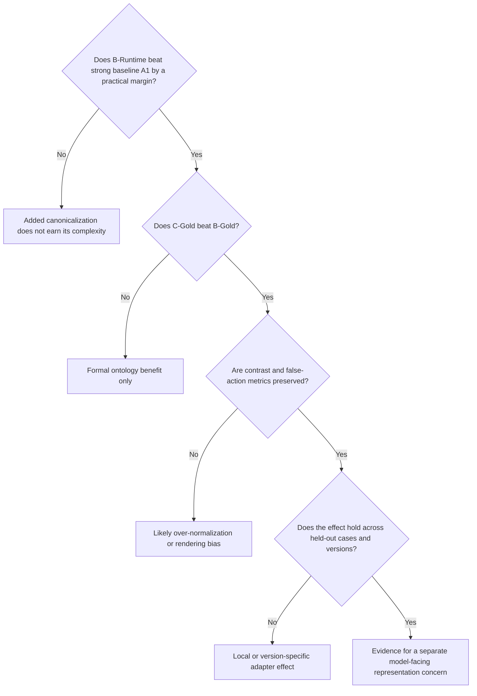

The progressive-formalization report must also include:

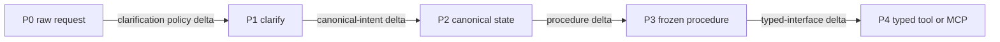

Annotate each edge with the paired final-state delta, false-action delta, latency delta, cost delta, and confidence interval. A cumulative endpoint score without edge deltas is insufficient.

### 44.8 Does the added architecture earn its complexity?

The final report must include a section with this exact title.

It must compare each architecture with A1 using:

| Dimension | Required measure |
|---|---|
| Task quality | full-call and final-state accuracy with clustered intervals |
| Robustness | operational invariance, worst-variant accuracy, semantic discrimination |
| Safety | false-action rate, refusal correctness, high-consequence subgroup results |
| Clarification burden | clarification rate, unnecessary clarification, turns to resolution |
| Runtime | model calls, retrieval calls, p50 and p95 latency, tokens, cost |
| Infrastructure | external services, indexes, persisted stores, schemas, mutable model stages |
| Operations | deployment units, monitoring surfaces, invalidation procedures, reviewer workflows |
| Procedure layer | procedure selection, versioning, review, packaging, and adherence monitoring |
| Action interface | generic parser, native tool, MCP server, schema registry, discovery, and transport burden |
| Representation flow | natural-language persistence depth and number of reinterpretable handoffs |

Do not collapse these dimensions into one opaque complexity score by default. Provide an architecture bill of materials and a Pareto view. A weighted utility score is allowed only when weights are chosen before held-out results and shown transparently.

The section must state one of:

- Added architecture earns its complexity.
- Added architecture earns its complexity only for named high-risk strata.
- Added architecture is practically equivalent but operationally more expensive.
- Evidence is insufficient because equivalence margins or sample sizes were not adequate.

For the P ladder, the section must additionally name the transition with the largest practically supported marginal gain, or state that no transition cleared its practical threshold. If a later layer dominates, the report must not credit an earlier cumulative layer for that gain.

## 45. Continuous integration and regression

### 45.1 Pull-request checks

Run on every pull request:

- schema validation
- prompt-template variable validation
- domain referential-integrity validation
- deterministic simulator tests
- provider adapter contract tests with mocks
- metric unit tests
- report snapshot tests
- artifact-hash tests
- procedure-to-operation registry validation
- generic-proposal versus typed-interface contract equivalence
- representation-ledger validation
- no-secret scan
- no mutation of frozen artifacts

### 45.2 Model-call checks

Because model calls cost money and can be nondeterministic, separate them into:

#### Required low-cost smoke check

- 2 to 5 cases
- 1 repetition
- one configured low-cost or mocked provider
- validates end-to-end wiring only

#### Scheduled regression check

- nightly or weekly
- frozen regression suite
- pinned production-candidate model
- 3 repetitions
- alerts on threshold violations

#### Full benchmark check

- manually triggered before model, prompt, or architecture release
- full frozen manifest
- prespecified repetitions
- requires stored artifacts and human review of critical regressions

### 45.3 Example threshold configuration

```yaml
schema_version: "1.2.0"

baseline_architecture: "A1_DIRECT_CLARIFY"

gates:
  schema_validity:
    minimum: 0.99
  full_call_accuracy:
    maximum_drop_from_baseline: 0.01
  final_state_accuracy:
    maximum_drop_from_baseline: 0.01
  operational_invariance:
    maximum_drop_from_baseline: 0.02
  contrast_accuracy:
    maximum_drop_from_baseline: 0.01
  false_action_rate:
    maximum: 0.0
  unnecessary_clarification_rate:
    maximum: 0.05
  adequacy_accuracy:
    minimum: 0.90
  unresolved_without_action_rate:
    minimum: 0.99
  procedure_selection_accuracy:
    minimum: 0.99
  typed_interface_validation_rate:
    minimum: 0.99

practical_equivalence:
  success_margin: 0.01
  final_state_margin: 0.01
  operational_invariance_margin: 0.02
  false_action_margin: 0.0

complexity:
  require_architecture_bill_of_materials: true
  require_cost_and_latency_comparison: true
  require_external_dependency_inventory: true

progressive_formalization:
  require_adjacent_transition_intervals: true
  require_component_ablations: true
  require_information_parity_check: true
  require_representation_ledger: true
  minimum_practical_final_state_gain: 0.02

blocking:
  require_case_clustered_interval: true
  block_on_missing_cells: true
  block_on_benchmark_hash_mismatch: true
```

Thresholds must be domain-appropriate. A research run may report a failure rather than block a deployment, while a consequential production agent may require zero false action on the curated inadequacy and ambiguity suite. Practical equivalence must be evaluated against A1, not inferred from a nonsignificant difference test.

### 45.4 Baseline management

- Baselines are identified by run-manifest hash.
- Updating a baseline requires a reviewed change record.
- A new model version does not automatically become the baseline because its mean accuracy is higher.
- Contrast, clarification, cost, latency, and worst-case metrics must be considered.

### 45.5 Regression-case promotion

A red-team failure may become a regression test only when:

1. The request is operationally valid and human approved.
2. Its gold label is deterministic or adjudicated.
3. The failure is reproducible or materially high risk.
4. The case is not a duplicate of existing coverage.
5. Provenance links to the discovering run.
6. Promotion creates a new regression-suite version.

## 46. Risks, confounds, and required mitigations

### 46.1 Request inadequacy mistaken for lexical sensitivity

Risk: A vague, incomplete, contradictory, or context-dependent request fails, and the failure is attributed to vocabulary rather than missing information.

Mitigation:

- Label adequacy and ambiguity independently before execution.
- Freeze the context available to every architecture.
- Restrict primary H1 analysis to adequate and unambiguous requests.
- Report intent-elicitation results separately.
- Compare error rates across all four adequacy-matrix cells.

### 46.2 Supposed synonyms are not equivalent

Risk: "incident," "case," "ticket," and "request" may carry real domain or pragmatic differences.

Mitigation:

- Define meaning in a synthetic domain.
- Require component-level equivalence review.
- Include minimal contrasts.
- Reject any variant that changes state, scope, commitment, or required action.

### 46.3 Evaluator artifacts

Risk: Exact string or AST comparison may reject operationally equivalent outputs.

Mitigation:

- Score final state.
- Use domain-specific normalizers.
- Preserve raw and normalized scores.
- Human-review normalization disagreements.

### 46.4 Judge sensitivity

Risk: The LLM judge may itself change scores under equivalent rubric wording or show position bias.

Mitigation:

- Deterministic evaluation first.
- Human calibration.
- Multiple judge-prompt paraphrases on the calibration set.
- Blinding and randomized pair order.
- `UNCERTAIN` route.

### 46.5 Ceiling effects

Risk: Straightforward tool calls may all score near 100 percent.

Mitigation:

- Add related tools.
- Add necessary policy reasoning.
- Add state-dependent preconditions.
- Add harder held-out cases without changing lexical conditions.
- Do not manufacture ambiguity in invariant cases.

### 46.6 Floor effects

Risk: Opaque IDs or overly complex tasks may fail in every condition.

Mitigation:

- Use a development split to tune task difficulty.
- Keep definitions available where required.
- Treat opaque IDs as a control, not the only baseline.

### 46.7 Tool-schema wording

Risk: Tool descriptions may contain the same favored term as one request condition, creating trivial lexical overlap.

Mitigation:

- Freeze tool schemas.
- Run a balanced tool-description experiment.
- Include opaque operation IDs and definition-only controls.
- Record token overlap between request, rendering, and tool description.

### 46.8 Prompt length and position

Risk: Adding a rendering increases prompt length or changes the position of other information.

Mitigation:

- Keep prompt structure fixed.
- Use length-matched control text when feasible.
- Record token counts.
- Randomize or balance placement in a dedicated control.

### 46.9 Tokenization

Risk: Differences may correlate with token length or segmentation rather than semantics.

Mitigation:

- Record tokenizer-specific token counts when accessible.
- Include length-matched synonyms.
- Treat tokenization as a possible explanation, not an excluded nuisance.

### 46.10 Training-corpus frequency

Risk: The favored term may simply be more common in training data or technical documentation.

Mitigation:

- Include conventionality ratings or external corpus frequency where available.
- Compare model-discovered, common, rare, and organization-specific terms.
- Describe frequency as a plausible rival explanation.

### 46.11 Model-generated benchmark bias

Risk: Synthetic requests may reflect the authoring model's own stylistic distribution.

Mitigation:

- Include substantial human-authored coverage.
- Use multiple generator families.
- Track source model.
- Report results by source.
- Keep the MUT out of primary generation.

### 46.12 Data leakage

Risk: The MUT may have seen public benchmark artifacts or generated held-out examples.

Mitigation:

- Keep held-out artifacts private until completion when possible.
- Generate synthetic domain IDs and states.
- Discover renderings on development definitions only.
- Record public release dates.

### 46.13 Version drift

Risk: Hosted providers may change behavior behind a stable alias.

Mitigation:

- Pin exact IDs.
- Record fingerprints and dates.
- Preserve raw outputs.
- Rerun a sentinel subset over time.

### 46.14 Nonindependent repetitions

Risk: Provider caching or hidden batching may make repetitions correlated.

Mitigation:

- Disable caches.
- Randomize order.
- Record concurrency and timestamps.
- Separate repeated runs over time.
- Analyze at the case level.

### 46.15 Tool ordering

Risk: Tool order may affect selection.

Mitigation:

- Keep order fixed for the primary lexical comparison.
- Run a secondary balanced order condition.
- Never change tool order only for one architecture.

### 46.16 Context contamination

Risk: Running variants in one conversation lets earlier requests influence later outputs.

Mitigation:

- Fresh context for every independent cell.
- No conversation history unless multi-turn context is the experimental variable.

### 46.17 Over-normalization

Risk: A canonicalizer may improve invariance by erasing real distinctions.

Mitigation:

- Contrast set.
- Clarification set.
- Preserve original language as metadata.
- Report discrimination alongside invariance.

### 46.18 Human reviewer bias

Risk: Reviewers who know the hypothesis may approve variants favorable to it.

Mitigation:

- Use fixed component-level rubrics.
- Blind reviewers to model results.
- Use independent review.
- Report disagreement and edits.

### 46.19 Model role contamination

Risk: The same model authors, executes, and judges the test, turning the benchmark into agreement with itself.

Mitigation:

- Enforce role separation.
- Use cross-family critics.
- Make deterministic state the oracle.
- Treat permitted overlap as an explicit ablation.

### 46.20 State simulator bugs

Risk: Incorrect transition code creates false gold results.

Mitigation:

- Unit-test every operation.
- Property-test preconditions and state transitions.
- Maintain hand-calculated fixtures.
- Validate manifest states during freeze.

### 46.21 Multiple valid trajectories

Risk: Exact trajectory comparison penalizes correct alternative paths.

Mitigation:

- Prefer final state.
- Score required and forbidden tools.
- Use set or partial-order constraints.
- Use a calibrated trajectory judge only when formal constraints are inadequate.

### 46.22 Researcher degrees of freedom

Risk: Many prompts, metrics, and subgroups make it easy to find a favorable result.

Mitigation:

- Freeze primary hypotheses and comparisons.
- Hold out the test split.
- Label exploratory analyses.
- Publish null results and all planned metrics.

### 46.23 Unequal context across architectures

Risk: A normalization, glossary, or retrieval architecture wins because it receives information the direct baseline never sees.

Mitigation:

- Freeze shared context artifacts.
- Give A1 every piece of context that is not the named experimental variable.
- Run both capability-addition and information-parity memory comparisons.
- Record exact context and token counts for every matrix cell.

### 46.24 Semantic-memory leakage and staleness

Risk: Personalized or organization memory leaks across scopes, contains stale mappings, or converts a previously confirmed expression into an unsafe permanent assumption.

Mitigation:

- Scope memory by organization, team, user, and effective date.
- Require confirmed status and provenance.
- Include stale, superseded, and wrong-scope negative tests.
- Never let a lexical mapping supply missing instance arguments.
- Measure false action, not only retrieval relevance.

### 46.25 Complexity measurement subjectivity

Risk: A single complexity score hides assumptions and is tuned to favor the researcher's preferred architecture.

Mitigation:

- Publish the raw architecture bill of materials.
- Report cost, latency, calls, stores, services, and operator steps separately.
- Freeze any weights before held-out results.
- Use Pareto comparisons before weighted utility.

### 46.26 Weak direct baseline

Risk: A low-capability, poorly prompted, or context-starved A1 makes added architecture look valuable by construction.

Mitigation:

- Use a current high-capability model for the final architectural conclusion.
- Use the same pinned execution model across A1, B, and C.
- Give A1 equivalent domain, tool, state, and shared context.
- Validate the clarification policy on development cases without tuning on held-out results.
- Report when a run is only a harness smoke test and not baseline-eligible research evidence.

### 46.27 Cumulative-ladder attribution error

Risk: P4 outperforms P0, and the report credits canonicalization even though the gain entered at the procedure or typed-interface transition.

Mitigation:

- Report every adjacent transition.
- Run gold-injected component ablations.
- Require paired intervals for marginal deltas.
- Attribute gains only to the layer that changed in the controlled comparison.

### 46.28 Procedure information leakage

Risk: The reusable procedure wins because it contains policy facts, examples, defaults, or argument values unavailable to the no-procedure condition.

Mitigation:

- Validate required inputs and referenced facts.
- Run an information-parity control with the same facts but no procedural sequencing.
- Diff procedure content against domain context and record added propositions.
- Reject procedures that supply case-specific missing information.

### 46.29 Procedure packaging confound

Risk: A product-specific skill loader changes system prompts, tool availability, context placement, or hidden metadata, and the result is attributed to the reusable procedure itself.

Mitigation:

- Compare inline frozen content with packaged-skill invocation.
- Record the fully assembled messages and tools.
- Hash byte-equivalent instruction content where possible.
- Describe packaging effects separately from procedure-content effects.

### 46.30 Generic proposal versus typed-tool inequivalence

Risk: P4 wins because its tool description contains better terminology or examples, not because the action boundary is typed.

Mitigation:

- Generate both contracts from one canonical operation registry.
- Match argument requirements and descriptions.
- Measure lexical overlap and prompt length.
- Keep the procedure, canonical state, and domain facts identical.
- Report parse, selection, schema, and simulator errors separately.

### 46.31 MCP implementation confound

Risk: Capability discovery, network transport, server implementation, or protocol errors are mistaken for an effect of structured action interfaces in general.

Mitigation:

- Use a local typed-tool baseline before MCP.
- Compare equivalent capability definitions.
- Separate model selection errors from discovery, transport, protocol, and server errors.
- Do not generalize a single MCP server result to typed interfaces as a class.

### 46.32 Natural-language handoff contamination

Risk: The high-persistence condition carries extra facts, omits facts, or stores hidden reasoning, making it incomparable or creating privacy risk.

Mitigation:

- Use a fixed task-handoff rubric that excludes hidden chain-of-thought.
- Record representation hashes and explicit fact coverage.
- Give canonical conditions the same task-relevant facts.
- Treat omissions or additions as intermediate-state errors.
- Apply the same retention and redaction policy used for other raw outputs.

## 47. Prior-art-aware positioning

The broad claim that prompt wording can affect model behavior is already well studied. This project should not present that observation as novel.

### 47.1 Multi-prompt evaluation

[State of What Art? A Call for Multi-Prompt LLM Evaluation](https://aclanthology.org/2024.tacl-1.52/) evaluated instruction paraphrases across millions of instances, 20 models, and 39 tasks, arguing that single-prompt evaluation can obscure substantial variation. This supports the need for multi-prompt and worst-variant metrics.

[SCORE: Systematic COnsistency and Robustness Evaluation for Large Language Models](https://aclanthology.org/2025.naacl-industry.39/) frames repeated evaluation under nonadversarial setup changes as a robustness requirement rather than reporting one best-case score. This supports the harness's repeated, multi-condition methodology.

[What Did I Do Wrong? Quantifying LLMs' Sensitivity and Consistency to Prompt Engineering](https://aclanthology.org/2025.naacl-long.73/) introduces sensitivity and consistency metrics for prompt rephrasings. Its distinction between correctness and stability is conceptually close to this specification's accuracy and invariance metrics.

### 47.2 Agentic function calling and tool robustness

[On the Robustness of Agentic Function Calling](https://aclanthology.org/2025.trustnlp-main.20/) directly studies naturalistic query variation and expanded toolkits using a BFCL-derived benchmark. Experiment 1 overlaps with this category of work, so this project must move beyond the broad finding that paraphrases can alter function calls.

[RoTBench](https://aclanthology.org/2024.emnlp-main.19/) evaluates tool-learning robustness across tool selection, parameter identification, and content filling under noisy environments. It supports stage-specific tool metrics and expanded related-tool conditions.

The [Berkeley Function Calling Leaderboard](https://gorilla.cs.berkeley.edu/leaderboard.html) provides prior art for scalable function-call evaluation, including AST and agentic evaluation. This harness should borrow the discipline of typed function evaluation while preferring executable final state when available.

### 47.3 Evaluation artifacts

[Flaw or Artifact? Rethinking Prompt Sensitivity in Evaluating LLMs](https://aclanthology.org/2025.emnlp-main.1006/) reports that rigid answer matching and related heuristics can exaggerate prompt sensitivity by rejecting semantically correct alternative outputs. This is a central warning for the harness. Raw exact-match scores and domain-normalized or final-state scores must remain separate.

### 47.4 Code robustness

[ReCode: Robustness Evaluation of Code Generation Models](https://aclanthology.org/2023.acl-long.773/) uses semantics-preserving transformations involving docstrings, function and variable names, syntax, and format, with executable evaluation and human checks. Experiment 5 must therefore focus on equally descriptive lexical alternatives and the model-original versus organization-specific comparison rather than claiming identifier perturbation as a new idea.

[Are Large Language Models Robust in Understanding Code Against Semantics-Preserving Mutations?](https://arxiv.org/abs/2505.10443) includes variable renaming among semantics-preserving code transformations. It reinforces the need for mechanical equivalence checks and executable scoring.

### 47.5 LLM judges

[All Prompts Are Created Equal? Evaluating Robustness of LLM Judges Against Non-Adversarial Prompt Variations](https://aclanthology.org/2026.findings-acl.1929/) finds that judge robustness under equivalent prompt variations is a separate concern from judge accuracy. This directly supports calibrating judges across prompt paraphrases and avoiding them as the primary oracle for a paraphrase-sensitivity experiment.

### 47.6 Framework prior art

LangGraph's [Graph API](https://docs.langchain.com/oss/python/langgraph/graph-api) supports explicit state, nodes, edges, and conditional routing, which suit the separate authoring, execution, evaluation, and red-team graphs. LangSmith's [evaluation concepts](https://docs.langchain.com/langsmith/evaluation-concepts) and [trajectory evaluation guidance](https://docs.langchain.com/langsmith/trajectory-evals) support versioned datasets, repeated experiments, trace-level analysis, and human review.

Ragas provides relevant [RAG and agent metrics](https://docs.ragas.io/en/v0.2.2/concepts/metrics/available_metrics/), but its retrieval metrics answer a different question from the primary post-canonical lexical hypothesis unless retrieval is actually present.

Reusable skills or procedures, typed function calling, and MCP-style capability interfaces are established agent-engineering patterns rather than novel contributions of this project. The distinctive evaluation question is not whether these mechanisms exist. It is which layer produces a measurable marginal improvement under information parity, and whether that improvement is larger than the effect of lexical normalization or canonical intent mapping.

### 47.7 Distinctive research question

The project's top-level question is:

> Where should linguistic flexibility end in an agentic system?

Its empirical subquestions are:

1. How robust are frontier models to lexical variation in adequate, unambiguous requests?
2. How much apparent lexical failure is better explained by request inadequacy or ambiguity?
3. When is clarification more valuable than normalization?
4. Once intent is resolved, does preserving canonical state improve downstream reliability?
5. Does a separate model-facing lexical rendering add value beyond canonical structured state?
6. Do glossaries, retrieval, or personalized semantic memory improve results enough to justify their complexity?
7. At which progressive-formalization transition does reliability improve materially?
8. Does preserving natural language through downstream handoffs create more divergence than canonicalizing once?
9. When procedures or typed interfaces help, is the gain caused by content, packaging, schema exposure, protocol behavior, or added information?

The project's potentially distinctive post-canonical question is:

> Once flexible user language has already been resolved into a fixed canonical application representation, does the lexical rendering subsequently presented to the reasoning or execution model still change operational reliability?

In compact form:

```text
Existing robustness question:

"ticket"  -> model -> behavior
"incident" -> model -> behavior
"case"    -> model -> behavior

Post-canonical question:

"ticket"   -> canonical INCIDENT / OP_07
"incident" -> canonical INCIDENT / OP_07 -> rendering A or B -> model -> behavior
"case"     -> canonical INCIDENT / OP_07
```

The load-bearing lexical comparison is B-Gold versus C-Gold. If there is no material difference, the stable-ontology argument may still survive, but the separate model-facing vocabulary claim does not gain support. The load-bearing architectural comparison is A1 versus B and C under practical-equivalence and complexity analysis. If A1 is equivalent at lower burden, the added architecture is not justified for the tested domain.

The progressive-formalization ladder asks a broader but separate question. Its load-bearing evidence consists of adjacent P-condition deltas plus gold-injected component ablations. If P2 is flat but P3 or P4 improves materially, the article should focus on procedural or action-interface formalization rather than implying that lexical normalization was the missing abstraction.

### 47.8 Claims to bracket in reporting

Reports should use language such as:

- "behavioral sensitivity to lexical rendering"
- "candidate stable handle"
- "model-discovered term"
- "post-canonical representation effect"

Reports should avoid language such as:

- "the model thinks in this word"
- "the model translated the term internally"
- "the term occupies a semantic attractor in latent space"
- "the model's ontology contains this exact entity"

Mechanistic explanations remain future research.

## 48. Implementation plan

### Phase 1: Deterministic foundation

Deliver:

- repository structure
- schemas
- synthetic support ontology
- deterministic simulator
- canonical case loader
- artifact hashing
- A0 and A1 direct-baseline runners
- tool, argument, and final-state scorers
- local JSONL traces
- smoke report

Exit criterion: five canonical cases run end to end with no LLM judge and reproducible metrics from stored artifacts.

### Phase 2: Dataset construction

Deliver:

- authoring graph
- request generator and critics
- adequacy and ambiguity labeling
- frozen context artifacts
- manual request CLI
- review workflow
- JSONL candidate, approved, and frozen lifecycle
- rendering discovery workflow
- benchmark freeze and manifest commands

Exit criterion: a versioned pilot benchmark can be created without invoking the execution workflow.

### Phase 3: Architecture matrix

Deliver:

- A0-Direct
- A1-Direct-Clarify
- B-Runtime
- B-Gold
- C-Runtime
- C-Gold
- definition-only and organization-term controls
- intent-elicitation and semantic-memory conditions
- P0 through P4 progressive-formalization conditions
- LP0, LP0G, and LP1 through LP3 natural-language-persistence conditions
- reusable procedure registry and selection modes
- generic proposal, local typed-tool, and optional MCP action interfaces
- matrix randomization and repetitions
- role separation validation

Exit criterion: the same cases run across all architectures with paired cell IDs and identical nonlexical settings.

### Phase 4: Evaluation and reporting

Deliver:

- all metrics in Section 38
- practical-equivalence and complexity analysis
- case-clustered bootstrap
- comparison tables
- required charts
- Markdown and HTML reports
- result-guide language
- optional calibrated judge route

Exit criterion: a completed run can be fully rescored and reported without provider access.

### Phase 5: Advanced experiments

Deliver:

- agent-loop experiment
- grammar experiment
- code identifier experiment
- cross-model matrix
- modality artifact support
- request-adequacy and intent-elicitation experiment
- semantic-memory and personalization ablation
- progressive-formalization and natural-language-persistence experiment
- adaptive red-team graph
- regression promotion workflow

Exit criterion: Experiments 1 through 10 have executable manifests, prompts, scorers, and documented limitations.

### Phase 6: Operationalization

Deliver:

- LangSmith integration
- CI jobs
- scheduled regression runs
- cost estimation
- provider drift sentinels
- publication artifact export

Exit criterion: the harness can support repeatable research and ongoing model-upgrade regression testing.

## 49. Definition of Done

The implementation is done only when every required item below is satisfied.

### 49.1 Core architecture

- [ ] Six independently runnable workflows exist: authoring, execution, intent elicitation, progressive formalization, evaluation, and adaptive red team.
- [ ] The natural-language request generation workflow is never invoked by the primary benchmark command.
- [ ] Canonical cases, user requests, frozen contexts, model-facing renderings, semantic-memory records, reusable procedures, and action interfaces are stored as separate artifacts.
- [ ] The boundary, intent-elicitation, post-canonical, memory-ablation, and progressive-formalization tracks are independently runnable.
- [ ] Primary H1 selection accepts only frozen `ADEQUATE`, `UNAMBIGUOUS`, `EXECUTE`, lexical `INVARIANT` requests.
- [ ] The harness is capable of falsifying the need for explicit lexical normalization without treating that conclusion as a harness failure.
- [ ] B-Gold and C-Gold bypass runtime natural-language canonicalization.
- [ ] The synthetic domain simulator has no external side effects.
- [ ] Every matrix cell receives a globally unique deterministic ID.
- [ ] Fresh simulator state and fresh model context are used for every independent cell.

### 49.2 Schemas and artifacts

- [ ] JSON Schema Draft 2020-12 schemas exist for domain, operation, case, context, request, rendering, semantic memory, procedure, action interface, action proposal, complexity profile, benchmark manifest, run manifest, invocation, and score records.
- [ ] Pydantic models enforce equivalent runtime validation.
- [ ] Schemas reject unknown required IDs, invalid arguments, illegal state transitions, and unapproved frozen artifacts.
- [ ] Approved requests use JSONL and preserve original text exactly.
- [ ] Every frozen artifact has a SHA-256 hash.
- [ ] The benchmark manifest has a reproducible root hash.
- [ ] Freezing an existing version without an explicit development override fails.
- [ ] Artifact referential-integrity tests pass.

### 49.3 Dataset authoring

- [ ] Humans can add requests without model generation.
- [ ] Synthetic generation supports explicit variation axes.
- [ ] Adequacy, ambiguity, semantic role, expected behavior, and lexical equivalence are independently labeled.
- [ ] Context-dependent labels reference a frozen context artifact.
- [ ] Generator, equivalence critic, and adversarial critic roles are separately configurable.
- [ ] The generator cannot approve its own candidates.
- [ ] Disagreements route to human review.
- [ ] Candidate, needs-review, approved, frozen, rejected, and superseded states exist.
- [ ] A reviewer can approve, edit, reject, and add notes.
- [ ] Frozen requests cannot be edited in place.
- [ ] Human reviewer agreement can be exported.
- [ ] Source and provenance are preserved for every request.

### 49.4 Model-facing renderings, procedures, and interfaces

- [ ] Rendering artifacts support canonical, model-discovered, organization, human-alternative, definition-only, and opaque-ID categories.
- [ ] The lexical-discovery prompt does not show candidate labels.
- [ ] Discovery uses fresh samples and records convergence statistics.
- [ ] A MUT-discovered rendering is frozen before downstream testing.
- [ ] Held-out request text is not used during rendering discovery.
- [ ] Rendering templates validate their placeholders against operation arguments.
- [ ] Reusable procedures are versioned, hashed, reviewed, and stored separately from renderings and canonical operations.
- [ ] Procedure required inputs validate against the canonical operation and available context.
- [ ] Generic proposal and typed-tool artifacts are generated from or verified against one canonical operation registry.
- [ ] P3 and P4 use identical frozen procedure content.
- [ ] Optional packaged-skill and MCP artifacts record product, protocol, adapter, and capability-definition versions.

### 49.5 Model and provider configuration

- [ ] Execution, adequacy assessment, canonicalization, retrieval, procedure routing, authoring, criticism, judging, and failure-analysis roles are explicit.
- [ ] Exact provider model IDs are loaded from configuration.
- [ ] Credentials are loaded only from environment or an approved secret store.
- [ ] Code contains no hardcoded provider credentials or model marketing aliases.
- [ ] The default policy forbids the MUT from acting as its own judge.
- [ ] The default policy forbids a generator from being the sole critic.
- [ ] Any role-overlap override is recorded in the run manifest and report.
- [ ] Provider adapters implement the common invocation contract.
- [ ] Requested and provider-accepted parameters are recorded.

### 49.6 Execution behavior

- [ ] A0-Direct, A1-Direct-Clarify, B-Runtime, B-Gold, C-Runtime, and C-Gold run successfully.
- [ ] A1 receives domain, tool, state, and shared context equivalent to the more complex boundary architectures.
- [ ] Publication-grade overengineering conclusions require A1 to use the same pinned, high-capability execution model as B and C; smoke models are marked baseline-ineligible.
- [ ] M0 through M4 semantic-memory conditions are supported.
- [ ] P0 through P4 progressive-formalization conditions are supported.
- [ ] LP0, LP0G, and LP1 through LP3 language-persistence conditions are supported.
- [ ] P0 through P3 use one identical generic action-proposal schema.
- [ ] P3 and P4 differ only in the named action-interface variable after information-parity checks.
- [ ] Gold-selected and runtime-selected procedure modes are supported.
- [ ] A local typed-tool baseline exists before an optional MCP condition is interpreted.
- [ ] Definition-only and organization-term controls are supported.
- [ ] Matrix order can be randomized with a recorded seed.
- [ ] Repetitions use fresh provider calls and bypass response caches.
- [ ] Transport retries are bounded and logged.
- [ ] Semantic retries default to zero.
- [ ] Invalid first attempts remain scored and visible.
- [ ] Tool order and schema remain constant across lexical conditions unless tool order is the named experimental variable.
- [ ] Dry-run mode estimates matrix size and cost without provider calls.

### 49.7 Deterministic evaluation

- [ ] Schema validity is scored.
- [ ] Decision class is scored.
- [ ] Tool name is scored.
- [ ] Each required argument and the complete argument set are scored.
- [ ] Simulator preconditions and effects are scored.
- [ ] Final-state correctness is scored.
- [ ] Refusal correctness and refusal false-action rate are scored.
- [ ] Clarification precision, recall, F1, false-action rate, and unnecessary-clarification rate are scored.
- [ ] Adequacy accuracy, ambiguity accuracy, missing-information precision and recall, turns to resolution, and unresolved-without-action rate are scored.
- [ ] Contrast accuracy and over-normalization rate are scored.
- [ ] Raw strict scores and domain-normalized scores are both retained.
- [ ] Procedure selection, observable adherence, required-event omission, and forbidden-action outcomes are scored.
- [ ] Generic-proposal parse and mapping errors are distinct from typed-tool validation and MCP protocol errors.
- [ ] No LLM judge is used when a deterministic oracle exists.

### 49.8 Robustness and trajectory metrics

- [ ] Base, mean-variant, and worst-variant accuracy are reported.
- [ ] Robustness gap and best-to-worst spread are separately named and reported.
- [ ] Within-case consistency is reported.
- [ ] Operational invariance rate is reported.
- [ ] Semantic discrimination rate is reported.
- [ ] First-divergence stage and final-state accuracy are reported for agent loops.
- [ ] Multiple valid trajectories can be represented without exact-path over-penalization.
- [ ] Cost, latency, tokens, provider errors, calls, external services, persisted stores, and operator burden are reported separately from quality.
- [ ] An architecture bill of materials is generated.
- [ ] Natural-language persistence depth, reinterpretation count, representation-change count, and intermediate-state consistency are reported.
- [ ] Every adjacent P transition has paired quality, safety, latency, cost, and complexity deltas.

### 49.9 LLM judge and human review

- [ ] Judge use is optional.
- [ ] Judge prompts hide provider, model, architecture, and favored condition.
- [ ] A human-scored calibration set exists before judge scores enter headline results.
- [ ] Judge agreement and robustness across prompt paraphrases are reported.
- [ ] `UNCERTAIN` and judge-human disagreement routes exist.
- [ ] Human review records preserve rubric, reviewer ID, timestamp, and notes.
- [ ] LangSmith annotation queues are optional rather than required for local operation.

### 49.10 Statistics

- [ ] Canonical case is the primary resampling unit.
- [ ] Case-clustered confidence intervals are generated.
- [ ] Primary comparisons and practical thresholds are configurable.
- [ ] Practical-equivalence intervals are computed against A1 rather than inferred from nonsignificance.
- [ ] P-ladder equivalence is evaluated both against P1 and against each immediately preceding condition.
- [ ] Multiple-comparison handling is implemented for exploratory families.
- [ ] Missing cells and provider failures are reported.
- [ ] A held-out split can be sealed.
- [ ] The analysis-plan hash is recorded before held-out evaluation.
- [ ] Reports distinguish primary, secondary, and exploratory analyses.

### 49.11 Experiments 1 through 10

- [ ] Experiment 1 restricts primary lexical scoring to adequate, unambiguous invariants and reports clarification cases separately.
- [ ] Experiment 2 includes A0, strong baseline A1, boundary, gold-injected, and complexity comparisons.
- [ ] Experiment 3 records typed state at every stage and supports stable versus drifting labels.
- [ ] Experiment 4 supports lexical discovery, label-only, definition-only, and label-plus-definition conditions.
- [ ] Experiment 5 mechanically verifies pre-mutation code equivalence and runs executable tests.
- [ ] Experiment 6 expands one frozen benchmark across model and version matrices.
- [ ] Experiment 7 stores intended concept, typed text, human transcript, ASR transcript, and canonical resolution separately.
- [ ] Experiment 8 tests adequacy assessment, scripted multi-turn intent elicitation, false action, and turns to resolution.
- [ ] Experiment 9 compares no memory, static glossary, retrieved memory, canonical resolution, and personalized confirmed mappings.
- [ ] Experiment 10 runs the cumulative P0 through P4 ladder, gold-injected component ablations, LP0, LP0G, and LP1 through LP3 persistence conditions, and procedure and interface controls.
- [ ] Each experiment names its primary metric and major confounds.

### 49.12 Logging and tracing

- [ ] The complete harness works with local JSONL tracing only.
- [ ] Run manifests are immutable after execution begins.
- [ ] Raw prompts, tool definitions, procedure selections, representation ledgers, raw responses, normalized outputs, state changes, scores, and errors are retained.
- [ ] Secrets are redacted.
- [ ] LangSmith tracing can be enabled through configuration.
- [ ] LangSmith metadata supports filtering by benchmark, case, request, rendering, procedure, action interface, persistence condition, architecture, model, and repetition.
- [ ] A stored run can be rescored without calling a model.

### 49.13 Runbook and user documentation

- [ ] `README.md` explains the research question and quick start.
- [ ] `docs/RUNBOOK.md` explains installation, credentials, exact model IDs, execution versus evaluation roles, cost estimation, smoke runs, full runs, and recovery.
- [ ] `docs/DATASET_AUTHORING.md` explains manual and synthetic request creation, review, freezing, and versioning.
- [ ] `docs/PROCEDURES_AND_INTERFACES.md` explains procedure authoring, review, packaging controls, generic proposals, typed tools, optional MCP configuration, and information-parity checks.
- [ ] `docs/RESULTS_GUIDE.md` explains every metric and interpretation pattern in Section 44.
- [ ] `docs/METHODOLOGY.md` explains hypotheses, experimental tracks, statistics, confounds, and prior art.
- [ ] `.env.example`, model config example, run config example, and threshold config example are present.
- [ ] Every documented command has an automated CLI help test.

### 49.14 Reports

- [ ] Markdown, HTML, CSV, JSON, and Parquet outputs are supported.
- [ ] Headline architecture table includes denominators and confidence intervals.
- [ ] B-Gold versus C-Gold has a paired comparison table and chart.
- [ ] Every P0 through P4 transition has a paired marginal-delta table and chart.
- [ ] LP0G versus LP1 has the primary paired persistence comparison and first-divergence view; LP0 versus LP1 is reported separately as the practical end-to-end comparison.
- [ ] Procedure-content, packaging, selection, local typed-tool, and optional MCP results remain separately labeled.
- [ ] Invariance and semantic discrimination are shown together.
- [ ] Clarification and false-action metrics are prominent.
- [ ] Worst variants and first-divergence stages are inspectable.
- [ ] Report headers include benchmark, run, prompt, code, and model hashes or IDs.
- [ ] Negative and null results are not suppressed.
- [ ] The report contains a section titled "Does the added architecture earn its complexity?"
- [ ] The report can conclude that A1 is sufficient and added normalization is unjustified.
- [ ] If A1 lies within all prespecified practical-equivalence margins while using less cost or operational machinery, the default generated interpretation states that additional normalization is not justified for the tested domain.
- [ ] The report explicitly states when clarification, procedure reuse, or the typed action interface explains more of the gain than lexical normalization or canonical intent.
- [ ] The report can conclude that no tested formalization transition earned its complexity.

### 49.15 CI and regression

- [ ] Pull requests validate schemas, prompts, domain state, hashes, and tests without paid model calls.
- [ ] A low-cost or mocked smoke test validates provider wiring.
- [ ] A scheduled regression suite can use paid model calls.
- [ ] Baselines are immutable run-manifest hashes.
- [ ] Threshold failures block or alert according to configuration.
- [ ] Red-team discoveries enter a candidate corpus and never mutate past scores.
- [ ] Regression promotion creates a new suite version with provenance.

### 49.16 Acceptance demonstration

The implementation is not accepted until an operator can perform this complete demonstration:

1. Add one adequate human-authored request and one inadequate request with frozen context.
2. Generate synthetic variants with a non-MUT authoring model.
3. Review and freeze the requests.
4. Discover and freeze a candidate model-facing rendering.
5. Create and freeze one reusable procedure plus equivalent generic-proposal and typed-tool artifacts.
6. Freeze benchmark version `0.1.0`.
7. Configure one execution model and at least one separate evaluation or criticism model.
8. Dry-run the matrix and display estimated cost.
9. Execute A0, A1, B-Runtime, B-Gold, C-Runtime, and C-Gold on at least five cases with two repetitions.
10. Execute P0 through P4 plus LP0, LP0G, and LP1 through LP3 on the same cases with a representation ledger.
11. Produce deterministic scores and a local trace.
12. Generate a report that explains A1 versus B and C, B-Gold versus C-Gold, request-adequacy strata, every P transition, LP0G versus LP1, the secondary LP0 comparison, and complexity.
13. Rescore the run without making provider calls.
14. Generate red-team candidates from failures without changing the frozen report.
15. Promote one approved failure into a new regression-suite version.
16. Demonstrate a static-glossary versus retrieved-memory smoke ablation without changing the frozen primary score.

## 50. Default decisions and remaining operator choices

No additional design feedback is required to begin implementation. The specification chooses safe defaults for every load-bearing methodological decision.

The operator will still need to choose values at run time for:

- exact execution model ID
- exact authoring and critic model IDs
- optional judge model ID
- API providers and budget
- whether LangSmith tracing is enabled
- pilot case count and repetitions
- human reviewers
- whether to include the modality experiment and audio retention
- minimum practical effect thresholds
- practical-equivalence margins
- whether organization or personalized semantic-memory conditions are enabled
- which reusable procedures enter the pilot and who reviews them
- whether packaged-skill and inline-procedure conditions are both enabled
- whether the action-interface comparison stops at local typed tools or includes MCP
- practical thresholds for each P transition

These choices belong in configuration and manifests. They should not require code changes.

Recommended first implementation target:

```text
Domain: synthetic support operations
Canonical cases: 20 for pilot
Requests per case: 6 adequate invariants, 1 inadequate conventional, 1 inadequate varied, 1 contrast
Execution models: 1 primary, 1 comparison if budget permits
Authoring models: 1 generator, 2 independent critics or 1 critic plus human review
Architectures: A0-Direct, A1-Direct-Clarify, B-Runtime, B-Gold, C-Runtime, C-Gold, Definition-only, P0 through P4, LP0, LP0G, and LP1 through LP3
Repetitions: 5
Primary results: adequate-request lexical invariance, A1 versus B and C practical equivalence, paired B-Gold versus C-Gold final-state accuracy, adjacent P-transition deltas, and LP0G versus LP1 controlled persistence effects
```

Scale to 100 or more canonical cases only after the pilot confirms that tasks avoid ceiling and floor effects and that the simulator and evaluator agree with human inspection.

## 51. Final implementation principle

The harness should be creative about finding tests and conservative about declaring truth.

Models may generate requests, challenge interpretations, identify coverage gaps, and propose failure hypotheses. They may not silently redefine the canonical case, change the frozen benchmark, or overrule an available formal state oracle.

The harness must be as capable of showing that a direct frontier model is sufficient as it is of showing that canonicalization or lexical stabilization helps. It must also be able to show that the dominant problem is request inadequacy rather than vocabulary, or that reusable procedures and typed action interfaces explain more of the gain than either one.

The central experimental boundary is simple:

> Use models to search the space of possible tests. Use a frozen domain model to define intended meaning. Use deterministic application state to define success.

Only after those boundaries are in place can the project fairly test whether stable model-facing vocabulary is a genuine architectural concern, whether request adequacy is the more important problem, where natural language should give way to stable procedural or formal representation, or whether modern models make the added architecture unnecessary in the tested domain.
